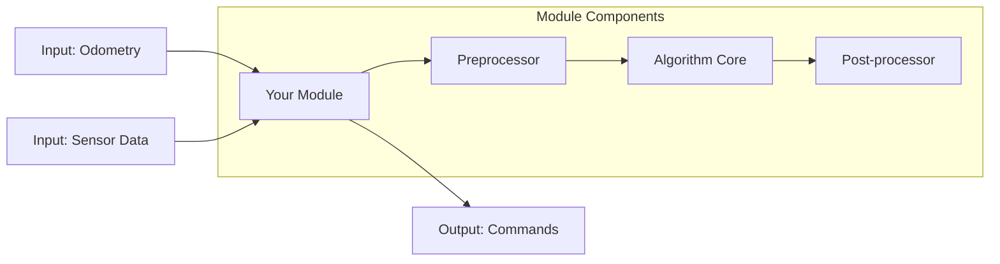

# Package Name

<!-- TODO: Replace "Package Name" with your actual package name throughout this file -->

## Overview

<!-- 
Brief description (2-3 sentences):
- What does this module do?
- Where does it fit in the autonomy stack?
- Why was it created?
-->

TODO: Add brief overview of your module.

## Algorithm

<!-- 
Detailed explanation of the algorithm or approach:
- Mathematical formulation (if applicable)
- Key concepts
- Design decisions
- Pseudocode or flowchart
-->

TODO: Explain the algorithm/approach used in this module.

### References

<!-- Link to papers (if based on research), external documentation, related implementations -->

- TODO: Add relevant references

## Architecture

Use mermaid diagrams to show component structure, data flow, and processing pipeline:



TODO: Update the architecture diagram to reflect your module's actual structure.

## Dependencies

### ROS 2 Packages

<!-- List all ROS 2 package dependencies -->

- `rclcpp` or `rclpy`: ROS 2 client library
- `airstack_msgs`: AirStack message definitions
- `airstack_common`: AirStack common utilities
- TODO: Add other ROS 2 dependencies

### External Libraries

<!-- List external (non-ROS) dependencies -->

- TODO: Add external library dependencies with versions
- Example: `opencv` (>= 4.5.0): Computer vision processing

### System Requirements

<!-- Hardware, OS, and other system requirements -->

- **Hardware:** TODO: Specify (e.g., GPU required, minimum RAM)
- **OS:** Ubuntu 22.04 (ROS 2 Jazzy)
- **Memory:** TODO: Specify RAM requirements
- **CPU:** TODO: Specify CPU requirements

## Interfaces

### Subscribed Topics

<!-- Topics that this module subscribes to -->

| Topic | Type | Description |
|-------|------|-------------|
| `odometry` | nav_msgs/Odometry | Robot state estimation |
| TODO | TODO | TODO |

**Note:** Topic names in code should be generic; actual topics are remapped in launch files.

### Published Topics

<!-- Topics that this module publishes -->

| Topic | Type | Description |
|-------|------|-------------|
| `output` | geometry_msgs/Twist | Computed commands |
| TODO | TODO | TODO |

### Services (if applicable)

<!-- Services provided by this module -->

| Service | Type | Description |
|---------|------|-------------|
| `trigger_action` | std_srvs/Trigger | Manual trigger |
| TODO | TODO | TODO |

### Actions (if applicable)

<!-- Actions provided by this module -->

| Action | Type | Description |
|--------|------|-------------|
| `execute_plan` | your_msgs/ExecutePlan | Execute planning action |
| TODO | TODO | TODO |

### Parameters

<!-- All configurable parameters -->

| Parameter | Type | Default | Description |
|-----------|------|---------|-------------|
| `update_rate` | double | 10.0 | Processing frequency (Hz) |
| `threshold` | double | 0.5 | Detection threshold |
| TODO | TODO | TODO | TODO |

## Configuration

### Default Configuration

The default configuration file is located at `config/package_name.yaml`.

```yaml
/**:
  ros__parameters:
    # Core parameters
    update_rate: 10.0
    threshold: 0.5
    
    # Algorithm-specific parameters
    # TODO: Add your parameters here
    
    # Debug options
    enable_debug: false
    verbose: false
```

TODO: Update with your actual configuration parameters.

### Configuration Guide

<!-- Explain each parameter group: What does it control? How to tune it? Performance implications? -->

TODO: Provide guidance on configuring the module.

### Example Configurations

Provide example configs for common use cases:

**High-performance mode:**
```yaml
update_rate: 30.0
enable_optimization: true
```

**Debug mode:**
```yaml
enable_debug: true
verbose: true
```

TODO: Add relevant configuration examples.

## Usage

### Standalone Launch

```bash
# Launch module standalone
ros2 launch your_package your_package.launch.xml

# With custom config
ros2 launch your_package your_package.launch.xml \
    config_file:=/path/to/custom/config.yaml

# With topic remapping
ros2 launch your_package your_package.launch.xml \
    odometry_topic:=/robot/custom_odom \
    output_topic:=/robot/custom_output
```

### Integrated in Autonomy Stack

The module is automatically launched when the autonomy stack starts:

```bash
# Full autonomy stack
airstack up robot-desktop

# Or with autolaunch
AUTOLAUNCH=true airstack up robot-desktop
```

The module is integrated in: `<layer>_bringup/launch/<layer>.launch.xml`

TODO: Specify which layer bringup includes this module.

## Building

```bash
# Build the module
docker exec airstack-robot-desktop-1 bash -c "bws --packages-select your_package"

# Build with debug symbols
docker exec airstack-robot-desktop-1 bash -c "bws --packages-select your_package --cmake-args '-DCMAKE_BUILD_TYPE=Debug'"

# Clean build
docker exec airstack-robot-desktop-1 bash -c "rm -rf build/your_package install/your_package"
docker exec airstack-robot-desktop-1 bash -c "bws --packages-select your_package"
```

## Testing

### Unit Tests

```bash
# Run unit tests
docker exec airstack-robot-desktop-1 bash -c "colcon test --packages-select your_package"

# View test results
docker exec airstack-robot-desktop-1 bash -c "colcon test-result --test-result-base build/your_package"
```

TODO: Add information about what tests exist and what they cover.

### Integration Tests

```bash
# Test with mock data
ros2 bag play test_data.bag &
ros2 launch your_package your_package.launch.xml
```

TODO: Describe integration test scenarios.

### Simulation Tests

```bash
# Test in Isaac Sim
airstack up isaac-sim robot
# Run test scenario...
```

See [test_in_simulation.md](../../.agents/skills/test_in_simulation.md) for detailed testing procedures.

## Visualization

### RViz

If the module provides visualization:

```bash
# Launch with RViz
rviz2

# Add topics:
# - /robot/your_module/debug/visualization
# - /robot/your_module/output
```

TODO: Provide RViz config file at `config/rviz_config.rviz` if visualization is provided.

### rqt Tools

```bash
# Monitor parameters
rqt

# Plugins → Configuration → Dynamic Reconfigure
# Select /robot/your_module
```

## Performance

### Computational Requirements

<!-- Measured or estimated performance metrics -->

- **CPU:** Average X%, Peak Y%
- **Memory:** Average X MB, Peak Y MB
- **Latency:** Average X ms
- **Throughput:** X Hz

TODO: Add actual performance measurements.

### Optimization Tips

<!-- How to improve performance, trade-offs, configuration for different hardware -->

TODO: Document performance optimization strategies.

## Known Issues

### Current Limitations

<!-- Known limitations of the module -->

- TODO: Document any limitations

### Known Bugs

<!-- Known bugs and workarounds -->

- TODO: Document known bugs (link to issue tracker if applicable)

### Troubleshooting

| Problem | Possible Cause | Solution |
|---------|---------------|----------|
| No output | Topic not connected | Check remapping with `ros2 topic info` |
| TODO | TODO | TODO |

TODO: Add common problems and solutions.

## Future Work

<!-- Planned improvements, research directions, requested features -->

- TODO: Document planned improvements
- TODO: List feature requests

## Contributing

Guidelines for contributing to this module:

- Follow AirStack coding standards
- Add tests for new features
- Update documentation
- Test in simulation before submitting PR

## License

Apache-2.0 (consistent with AirStack)

## Authors and Maintainers

- **Author:** Your Name (your.email@example.com)
- **Maintainer:** Your Name (your.email@example.com)
- **Contributors:** List additional contributors here

## Changelog

### Version 0.0.1 (YYYY-MM-DD)
- Initial implementation
- TODO: Add changelog entries as the module evolves
