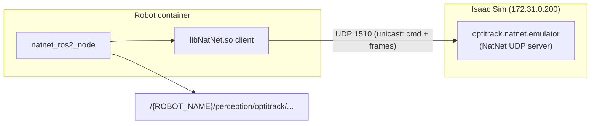

# Skill: OptiTrack / NatNet Development

## When to Use

- Implementing or debugging the **Motive emulator** in Isaac Sim
  (`simulation/isaac-sim/extensions/optitrack.natnet.emulator/`)
- Integrating or testing **`natnet_ros2`** on the robot stack
- Understanding **NatNet wire protocol** (connect, model def, frame streaming)
- Capturing what **`libNatNet.so`** actually sends on the network
- Enabling OptiTrack in sim: `LAUNCH_NATNET=true`, `natnet_config.yaml`, Docker IPs

## Architecture in AirStack



| Component | Path | Role |
|-----------|------|------|
| Robot client | [`robot/ros_ws/src/perception/natnet_ros2/`](../../../robot/ros_ws/src/perception/natnet_ros2/) | ROS 2 node; uses **official NatNet SDK** (`NatNetClient::Connect`) |
| SDK install | `natnet_ros2/lib/libNatNet.so`, `include/natnet/` | Download via `airstack setup --natnet` (proprietary, not in git) |
| Emulator (WIP) | [`simulation/isaac-sim/extensions/optitrack.natnet.emulator/`](../../../simulation/isaac-sim/extensions/optitrack.natnet.emulator/) | Python NatNet **server** for sim / integration tests |
| Planned integration tests | [`tests/sim/motive_emulator/README.md`](../../../tests/sim/motive_emulator/README.md) | End-to-end UDP tests against real SDK parser |

**Enable on robot:** `LAUNCH_NATNET=true` in `.env` → [`perception.launch.xml`](../../../robot/ros_ws/src/perception/perception_bringup/launch/perception.launch.xml) includes `natnet_ros2.launch.py`.

**Default client config:** unicast, `server_ip` → Motive/emulator (use `172.31.0.200` for Isaac container), ports 1510/1511 — see [`natnet_config.yaml`](../../../robot/ros_ws/src/perception/natnet_ros2/config/natnet_config.yaml).

## NatNet: Two UDP Channels

| Port (server default) | Channel | Direction |
|----------------------|---------|-----------|
| **1510** | Command | Client → server: `NAT_CONNECT`, `NAT_REQUEST_MODELDEF`, keepalives. Server → client: `NAT_SERVERINFO`, `NAT_MODELDEF`, `NAT_RESPONSE` |
| **1511** | Data | Server → client: `NAT_FRAMEOFDATA` (mocap frames). Multicast group `239.255.42.99` when using multicast. **libNatNet 4.4 unicast clients receive frames on the same socket/port as command traffic** (see below). |

**Critical rules (verified against libNatNet 4.4 unicast):**

- Command **responses** go to the client's endpoint from `recvfrom` on the server command listener (`1510`).
- **libNatNet 4.4 unicast uses one client UDP socket** — command send, command receive, and frame receive all share the **same ephemeral local port**. Do **not** assume `data_port = cmd_port + 1`.
- The **269-byte `NAT_CONNECT` payload does not include** the client port; the port is learned from the datagram **source address** on `NAT_CONNECT`.
- Do **not** trust `/proc`/`ss` alone for the client port — extra bound sockets may appear that do not match wire traffic. **`NAT_CONNECT` source `(ip, port)` is ground truth.**
- Do **not** parse connect payloads with in-memory `sNatNetClientConnectParams` (contains pointers). Use on-wire layouts below.

## libNatNet 4.4 `NAT_CONNECT` (verified 2025-06)

Observed against `127.0.0.1:1510` with the same unicast params as [`natnet_client_adapter.cpp`](../../../robot/ros_ws/src/perception/natnet_ros2/src/natnet_client_adapter.cpp).

### What the client sends

| Field | Observed value |
|-------|----------------|
| Message | `NAT_CONNECT` (0), `nDataBytes = 269`, total datagram 273 bytes |
| Payload layout | `sSender` (264 B) + `sConnectionOptions` (5 B) |
| `sSender.szName` | `"NatNetLib"` |
| `sSender.Version` | `[4, 4, 0, 0]` |
| `sSender.NatNetVersion` | `[4, 4, 0, 0]` |
| `subscribedDataOnly` | `0` |
| `BitstreamVersion` | `[0, 0, 0, 0]` → client defers to server version |
| Trailing port bytes | **None** (exactly 269 bytes; not PacketClient's optional +4) |
| UDP source port | Ephemeral (e.g. `41449`) — **client command + data port (same socket)** |

Example hex (payload only, after 4-byte header):

```
NatNetLib\0 ... (256-byte name field)
04 04 00 00  (Version)
04 04 00 00  (NatNetVersion)
00           (subscribedDataOnly)
00 00 00 00  (BitstreamVersion)
```

## libNatNet 4.4 unicast: single client socket (verified 2025-06)

Confirmed with wire capture on server `:1510`/`:1511`, `strace` on a minimal `NatNetClient::Connect()` binary, and `/proc/<pid>/net/udp` cross-checks against the same `libNatNet.so` used by `natnet_ros2`.

### What we observed

| Signal | Result |
|--------|--------|
| Wire capture on server `:1510` | All client packets (`NAT_CONNECT`, `NAT_KEEPALIVE`, `NAT_REQUEST_MODELDEF`) from **one** source port |
| Wire capture on server `:1511` | **No** inbound packets from the client |
| strace on minimal client | **One** `bind()`, **one** fd for all `sendto` → server `:1510` and `recvfrom` ← server `:1510` |
| `NAT_CONNECT` payload | **No** trailing client port bytes (269 B total) |

### Emulator rule (unicast + `natnet_ros2`)

For libNatNet 4.4 unicast, treat the client as **single-endpoint**:

```text
On NAT_CONNECT     → store client_endpoint = (ip, port) from recvfrom
NAT_SERVERINFO     → sendto(command_socket, client_endpoint)
NAT_MODELDEF       → sendto(command_socket, client_endpoint)
NAT_FRAMEOFDATA    → sendto(command_socket, client_endpoint)   # same port, not cmd+1
NAT_KEEPALIVE ack  → sendto(command_socket, client_endpoint)
```

The server still **binds** command (`1510`) and data (`1511`) ports per NatNet convention, but **`natnet_ros2` does not expose a separate client data port** — stream frames to the **`NAT_CONNECT` source address** from the **command socket**.

`ConnectionDataPort = 1511` in `NAT_SERVERINFO` remains required (SDK expects it); it describes the server's data port, not a second client listener in this mode.

### When two client ports may still apply

- **Multicast** clients (separate multicast data listener on `239.255.42.99:1511`)
- **PacketClient-style** samples that open explicit command + data sockets (optional +4 port bytes in connect)
- Other NatNet client implementations — always verify with protocol capture before assuming a two-socket model

Do **not** assume `data_port = cmd_port + 1` for any client without capture.

### What the server must reply (for `Connect()` + `GetServerDescription()`)

1. **`NAT_SERVERINFO` (1)** on the **command port** to the connect datagram source.
2. Payload: full packed **`sServerDescription`** ([`NatNetTypes.h`](../../../simulation/isaac-sim/extensions/optitrack.natnet.emulator/NatNetClientSDK/NatNetSDK/include/NatNetTypes.h)), including:
   - `HostPresent = true`
   - `szHostApp = "Motive"`
   - `NatNetVersion = {4, 4, 0, 0}`
   - `bConnectionInfoValid = true`, `ConnectionDataPort = 1511`, `ConnectionMulticast = false` (unicast)

Pre-built in emulator: [`NatNetServer._build_server_description()`](../../../simulation/isaac-sim/extensions/optitrack.natnet.emulator/optitrack/natnet/emulator/server/natnet_server.py).

### After connect (required for `natnet_ros2` topics)

| SDK call | Server must handle |
|----------|-------------------|
| `GetDataDescriptionList()` | `NAT_REQUEST_MODELDEF` → `NAT_MODELDEF` with rigid body name/ID (e.g. `"Drone"`) |
| Frame callback | Stream `NAT_FRAMEOFDATA` to **`NAT_CONNECT` source `(ip, port)`** via server command socket; set `rb.params & 0x01` (tracking valid) |
| Unicast keepalive | Accept `NAT_KEEPALIVE` on command port; reply on same client endpoint |

Frame delivery to the client endpoint still needs a valid `NAT_FRAMEOFDATA` serializer in the emulator; the **single-socket client model** above is confirmed via strace + wire capture.

## Wire format reference (do not confuse)

| Client type | Connect payload |
|-------------|-----------------|
| **`libNatNet` / `natnet_ros2`** | `sSender` + `sConnectionOptions` (269 B observed) |
| **PacketClient sample** | Same + optional 4 trailing bytes (often zero in sample) |
| **Python NatNetClient sample** | Legacy 270-byte `"Ping"` blob — **not** used by `natnet_ros2` |

API struct `sNatNetClientConnectParams` ([`NatNetTypes.h`](../../../simulation/isaac-sim/extensions/optitrack.natnet.emulator/NatNetClientSDK/NatNetSDK/include/NatNetTypes.h)) is for `Connect()` in process memory only — **not** the on-wire layout.

## Protocol capture (optional, for debugging)

Not part of the repo. If you need to re-verify wire behavior or debug a new client/server pairing, build a **minimal out-of-band harness**:

1. **Minimal C++ client** — tiny binary linking `libNatNet.so` from `natnet_ros2`; call `NatNetClient::Connect()` with the same params as [`natnet_client_adapter.cpp`](../../../robot/ros_ws/src/perception/natnet_ros2/src/natnet_client_adapter.cpp). Optional: `GetDataDescriptionList()`, frame callback, `--hold-seconds` sleep.
2. **Python UDP stub server** — bind `:1510` (and optionally `:1511`); reply to `NAT_CONNECT` with canned `NAT_SERVERINFO`, to `NAT_REQUEST_MODELDEF` with `NAT_MODELDEF`, to `NAT_KEEPALIVE` with ack; log every `(ip, port)` and message id.
3. **Connect capture** — run the client against the stub; hex-dump the first datagram; confirm 269-byte `sSender` + `sConnectionOptions` payload and ephemeral source port.
4. **Endpoint discovery** — during a full connect + model-def fetch:
   - `tcpdump -i any udp and host <client_ip>` or the stub's packet log
   - `strace -e trace=bind,sendto,recvfrom` on the client binary
   - `/proc/<pid>/net/udp` or `ss -uapn` (treat **`NAT_CONNECT` source port** as ground truth if they disagree)
5. **Frame delivery check** — once the emulator can emit valid `NAT_FRAMEOFDATA`, confirm the client's frame callback fires when sending to the `NAT_CONNECT` source endpoint from the server command socket.

Use the SDK's `NatNetTypes.h` and `PacketClient.cpp` for on-wire layouts — not in-memory `sNatNetClientConnectParams`.

## Emulator implementation checklist

1. **Command listener** on `0.0.0.0:1510`
2. **`NAT_CONNECT`** → register `client_endpoint` from `recvfrom`; reply `NAT_SERVERINFO`
3. **`NAT_REQUEST_MODELDEF`** → reply `NAT_MODELDEF` (match `body_name` in config)
4. **Frame loop** → `NAT_FRAMEOFDATA` to **`client_endpoint` via command socket** (libNatNet 4.4 unicast — same port as connect, not `cmd+1`)
5. **Isaac integration** → sample drone pose → `sFrameOfMocapData` → `enqueue_mocap_data()`
6. **Docker** → emulator on `172.31.0.200`; robot `server_ip` points there

## Testing levels

| Level | Approach | Validates |
|-------|----------|-----------|
| Unit (no network) | `test_natnet_logic.cpp`, `FakeNatNetClient` | Negotiation logic, topic names |
| Protocol capture | Minimal client + UDP stub (see above) | Wire-format `NAT_CONNECT`, client endpoint model |
| Integration (planned) | `tests/sim/motive_emulator/` | Full SDK parser + `natnet_ros2_node` |
| System (future) | `airstack test -m sensors` | Topic Hz on `/perception/optitrack/...` |

```bash
# Unit tests (robot container)
docker exec airstack-robot-desktop-1 bash -c "sws && colcon test --packages-select natnet_ros2 --event-handlers console_direct+"
```

## References

- OptiTrack NatNet docs: https://docs.optitrack.com/developer-tools/natnet-sdk/natnet-4.0
- SDK samples (wire format): `NatNet_SDK_*/Samples/PacketClient/`, `PythonClient/` (legacy connect in Python only)
- Integration test plan: [`tests/sim/motive_emulator/README.md`](../../../tests/sim/motive_emulator/README.md)
