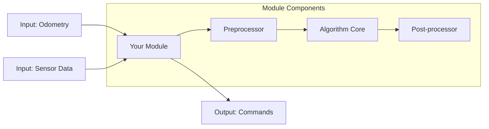
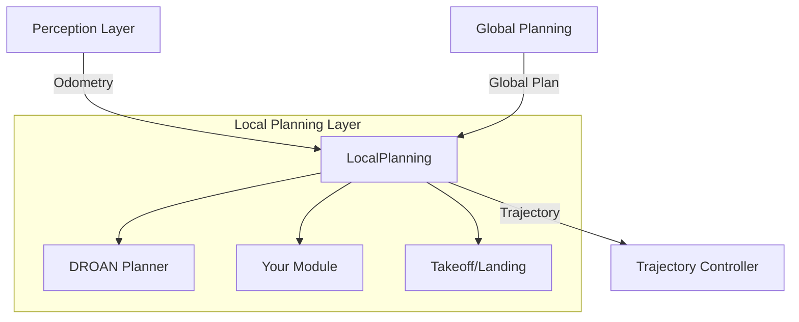
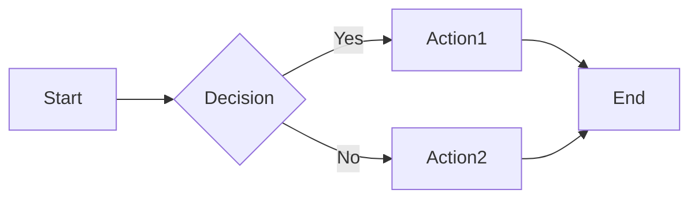

# Skill: Update Documentation After Adding a Module

## When to Use

After implementing and integrating a new module into AirStack. **Documentation is mandatory** for all new modules and features.

## Documentation Philosophy

- **Module-level docs:** README.md in the package directory (details about the module itself)
- **System-level docs:** Files in `docs/` directory (integration, tutorials, architecture)
- **Always update mkdocs navigation** to make documentation discoverable
- **Use diagrams** to explain complex concepts (mermaid syntax)
- **Keep it current:** Update docs when code changes

## Steps

### 1. Write Module README.md

Every module package must have a comprehensive README.md.

**Location:** `<package_path>/README.md`

**Use the template structure:**

```markdown
# Module Name

## Overview

Brief description (2-3 sentences):
- What does this module do?
- Where does it fit in the autonomy stack?
- Why was it created?

## Algorithm

Detailed explanation of the algorithm or approach:
- Mathematical formulation (if applicable)
- Key concepts
- Design decisions
- Pseudocode or flowchart

### References

- Link to papers (if based on research)
- External documentation
- Related implementations

## Architecture

Use mermaid diagrams to show:
- Component structure
- Data flow
- Processing pipeline



## Dependencies

### ROS 2 Packages
- `package1`: Purpose
- `package2`: Purpose

### External Libraries
- `library1` (version): Purpose
- `library2` (version): Purpose

### System Requirements
- Hardware: GPU, CPU requirements
- Memory: RAM requirements
- OS: Ubuntu version, etc.

## Interfaces

### Subscribed Topics

| Topic | Type | Description |
|-------|------|-------------|
| `odometry` | nav_msgs/Odometry | Robot state estimation |
| `sensor_data` | sensor_msgs/PointCloud2 | Input sensor data |

**Topic Naming:** Use generic names in code; topics are remapped in launch files.

### Published Topics

| Topic | Type | Description |
|-------|------|-------------|
| `output` | geometry_msgs/Twist | Computed commands |
| `debug/visualization` | visualization_msgs/MarkerArray | Debug visualization |

### Services (if applicable)

| Service | Type | Description |
|---------|------|-------------|
| `trigger_action` | std_srvs/Trigger | Manual trigger |

### Actions (if applicable)

| Action | Type | Description |
|--------|------|-------------|
| `execute_plan` | your_msgs/ExecutePlan | Execute planning action |

### Parameters

| Parameter | Type | Default | Description |
|-----------|------|---------|-------------|
| `update_rate` | double | 10.0 | Processing frequency (Hz) |
| `threshold` | double | 0.5 | Detection threshold |
| `enable_debug` | bool | false | Enable debug outputs |

## Configuration

### Default Configuration

The default configuration file is located at `config/<package_name>.yaml`.

```yaml
/**:
  ros__parameters:
    # Core parameters
    update_rate: 10.0
    threshold: 0.5
    
    # Algorithm-specific
    window_size: 100
    enable_optimization: true
    
    # Debug
    enable_debug: false
    verbose: false
```

### Configuration Guide

Explain each parameter group:
- What does it control?
- How to tune it?
- Performance implications?

### Example Configurations

Provide example configs for common use cases:

**High-performance mode:**
```yaml
update_rate: 30.0
enable_optimization: true
```

**Debug mode:**
```yaml
enable_debug: true
verbose: true
```

## Usage

### Standalone Launch

```bash
# Launch module standalone
ros2 launch your_package your_package.launch.xml

# With custom config
ros2 launch your_package your_package.launch.xml \
    config_file:=/path/to/custom/config.yaml

# With topic remapping
ros2 launch your_package your_package.launch.xml \
    odometry_topic:=/robot/custom_odom \
    output_topic:=/robot/custom_output
```

### Integrated in Autonomy Stack

The module is automatically launched when the autonomy stack starts:

```bash
# Full autonomy stack
airstack up robot-desktop

# Or with specific configuration
AUTOLAUNCH=true airstack up robot-desktop
```

The module is integrated in: `<layer>_bringup/launch/<layer>.launch.xml`

## Building

```bash
# Build the module
docker exec airstack-robot-desktop-1 bash -c "bws --packages-select your_package"

# Build with debug symbols
docker exec airstack-robot-desktop-1 bash -c "bws --packages-select your_package --cmake-args '-DCMAKE_BUILD_TYPE=Debug'"

# Clean build
docker exec airstack-robot-desktop-1 bash -c "rm -rf build/your_package install/your_package"
docker exec airstack-robot-desktop-1 bash -c "bws --packages-select your_package"
```

## Testing

### Unit Tests

```bash
# Run unit tests
docker exec airstack-robot-desktop-1 bash -c "colcon test --packages-select your_package"

# View test results
docker exec airstack-robot-desktop-1 bash -c "colcon test-result --test-result-base build/your_package"
```

### Integration Tests

```bash
# Test with mock data
ros2 bag play test_data.bag &
ros2 launch your_package your_package.launch.xml
```

### Simulation Tests

```bash
# Test in Isaac Sim
airstack up isaac-sim robot
# Run test scenario...
```

See [test-in-simulation](../test-in-simulation) for details.

## Visualization

### RViz

If module provides visualization:

```bash
# Launch with RViz
rviz2

# Add topics:
# - /robot/your_module/debug/visualization
# - /robot/your_module/output
```

Provide RViz config file: `config/rviz_config.rviz`

### rqt Tools

```bash
# Monitor parameters
rqt

# Plugins → Configuration → Dynamic Reconfigure
# Select /robot/your_module
```

## Performance

### Computational Requirements

- **CPU:** Average X%, Peak Y%
- **Memory:** Average X MB, Peak Y MB
- **Latency:** Average X ms
- **Throughput:** X Hz

### Optimization Tips

- How to improve performance
- Trade-offs between speed and accuracy
- Configuration for different hardware

## Known Issues

### Current Limitations

- Limitation 1: Description
- Limitation 2: Description

### Known Bugs

- Bug description and workaround (link to issue tracker if applicable)

### Troubleshooting

| Problem | Possible Cause | Solution |
|---------|---------------|----------|
| No output | Topic not connected | Check remapping |
| Slow performance | High update rate | Reduce `update_rate` parameter |
| Crash on start | Missing dependency | Install dependency |

## Future Work

- Planned improvements
- Research directions
- Requested features

## Contributing

Guidelines for contributing to this module:
- Code style requirements
- Testing requirements
- Documentation requirements

## License

Specify license (typically Apache-2.0 for AirStack).

## Authors and Maintainers

- **Author:** Name (email)
- **Maintainer:** Name (email)
- **Contributors:** List contributors

## Changelog

### Version X.Y.Z (YYYY-MM-DD)
- Feature: Added new capability
- Fix: Resolved issue with X
- Change: Modified behavior of Y
```

**Reference template:** `../add-ros2-package/assets/package_template/README.md`

### 2. Update mkdocs.yml Navigation

Add your module README to the navigation structure to make it discoverable.

**File:** `mkdocs.yml` (repository root)

Find the appropriate section based on your module type:

```yaml
nav:
  - Robot:
      - Autonomy Modules:
          - Local:
              - Planning:
                  # Existing modules
                  - Trajectory Library:
                      - robot/ros_ws/src/local/planners/trajectory_library/README.md
                  - DROAN Local Planner:
                      - robot/ros_ws/src/local/planners/droan_local_planner/README.md
                  # Add your module HERE
                  - Your Module Name:
                      - robot/ros_ws/src/local/planners/your_package/README.md
```

**Navigation location by module type:**

| Module Type | mkdocs.yml Path |
|------------|----------------|
| Local Planner | `Robot → Autonomy Modules → Local → Planning` |
| Local Controller | `Robot → Autonomy Modules → Local → Controls` |
| Local World Model | `Robot → Autonomy Modules → Local → World Model` |
| Global Planner | `Robot → Autonomy Modules → Global → Planning` |
| Global World Model | `Robot → Autonomy Modules → Global → World Model` |
| Perception | `Robot → Autonomy Modules → Perception` |
| Sensors | `Robot → Autonomy Modules → Sensors` |
| Behavior | `Robot → Autonomy Modules → Behavior` |

**Important:** The `same-dir` plugin allows mkdocs to include README files from anywhere in the repository, not just the `docs/` directory.

### 3. Update Layer Overview Documentation

Add a brief mention of your module in the layer's overview page.

**File:** `docs/robot/autonomy/<layer>/index.md`

Example for local planning layer:

```markdown
# Local Planning

The local planning layer is responsible for reactive obstacle avoidance and 
trajectory generation based on local sensor observations.

## Available Modules

### DROAN Local Planner
Disparity-space representation for obstacle avoidance. See [DROAN Local Planner](../../../robot/ros_ws/src/local/planners/droan_local_planner/README.md).

### Your Module Name
Brief one-sentence description of your module.
- **Type:** Local planner
- **Purpose:** Specific use case
- **Documentation:** [Your Module README](../../../robot/ros_ws/src/local/planners/your_package/README.md)

## Integration

Modules in this layer subscribe to:
- Odometry from perception layer
- Global plan from global planning layer
- Local world model (cost maps, obstacle representations)

And publish to:
- Trajectory controller in the control layer
```

### 4. Create System-Level Documentation (if needed)

For major features, complex integrations, or new subsystems, create dedicated documentation in `docs/`.

#### Tutorial Document

**File:** `docs/tutorials/your_feature.md`

```markdown
# Tutorial: Using Your Feature

## Overview
What this tutorial covers.

## Prerequisites
- Background knowledge needed
- Setup requirements

## Step 1: ...

## Step 2: ...

## Example

## Troubleshooting

## Next Steps
```

#### Integration Guide

**File:** `docs/robot/autonomy/<layer>/<topic>.md`

For cross-cutting concerns or integration patterns.

### 5. Update System Architecture Diagrams

If your module changes the data flow or adds new connections, update the architecture documentation.

**File:** `docs/robot/autonomy/system_architecture.md`

Update mermaid diagrams to include your module:

```markdown
## Local Planning Data Flow


```

### 6. Build and Verify Documentation

Test that documentation builds correctly and renders properly:

```bash
# Build documentation
airstack docs

# Or manually
docker exec airstack-docs bash -c "cd /AirStack && mkdocs serve"

# Access at http://localhost:8000
```

**Verification checklist:**
- [ ] Module README appears in navigation
- [ ] Links work correctly
- [ ] Code blocks have syntax highlighting
- [ ] Mermaid diagrams render
- [ ] Images load (if any)
- [ ] Tables format correctly
- [ ] No broken links

```bash
# Check for broken links
docker exec airstack-docs bash -c "cd /AirStack && mkdocs build --strict"

# This will fail if there are:
# - Broken internal links
# - Missing navigation entries
# - Malformed markdown
```

### 7. Test Documentation Links

```bash
# Find all markdown links in your README
grep -o '\[.*\](.*\.md)' robot/ros_ws/src/.../your_package/README.md

# Verify each linked file exists
```

### 8. Add API Documentation (Optional)

For complex C++ packages, consider adding Doxygen comments:

```cpp
/**
 * @brief Brief description of class
 * 
 * Detailed description of class purpose and usage.
 * 
 * @example
 * YourClass obj;
 * obj.process(data);
 */
class YourClass {
public:
    /**
     * @brief Process input data
     * @param input Input data to process
     * @return Processed result
     * @throws std::runtime_error If input is invalid
     */
    Result process(const Input& input);
};
```

For Python, use comprehensive docstrings:

```python
class YourClass:
    """
    Brief description of class.
    
    Detailed description of class purpose and usage.
    
    Attributes:
        param1 (int): Description of param1
        param2 (str): Description of param2
    
    Example:
        >>> obj = YourClass(param1=10)
        >>> result = obj.process(data)
    """
    
    def process(self, input_data):
        """
        Process input data.
        
        Args:
            input_data (np.ndarray): Input data to process
            
        Returns:
            np.ndarray: Processed result
            
        Raises:
            ValueError: If input_data is invalid
        """
        pass
```

### 9. Document Breaking Changes

If your module introduces breaking changes or deprecations:

**File:** `CHANGELOG.md` (repository root)

```markdown
## [Unreleased]

### Added
- New module: your_package for <purpose>

### Changed
- Modified topic structure in local planning layer

### Deprecated
- Old topic names (use new remapping)

### Breaking Changes
- **Local Planner Interface:** Changed expected input topic type
  - Migration: Update your launch files to remap to new topic type
```

### 10. Update Integration Checklist (if needed)

If your module introduces new integration patterns:

**File:** `docs/robot/autonomy/integration_checklist.md`

Add any new standard topics, message types, or integration requirements.

## Documentation Standards

### Writing Style

- **Be concise:** Get to the point quickly
- **Be specific:** Provide concrete examples
- **Be accurate:** Test all commands and code snippets
- **Be complete:** Cover common use cases and edge cases

### Markdown Conventions

```markdown
# H1 for package/page title (only one per document)
## H2 for major sections
### H3 for subsections

- Unordered lists for non-sequential items
1. Ordered lists for sequential steps

**Bold** for emphasis
*Italic* for terms
`code` for inline code
```bash
# Code blocks with language specifier
```

[Links](relative/path.md) use relative paths
 in assets directory

> Blockquotes for notes or warnings

| Tables | Should |
|--------|--------|
| Be     | Clear  |
```

### Mermaid Diagrams

Use mermaid for diagrams (renders in mkdocs):

```markdown

```

**Diagram types:**
- `graph`: Flowcharts
- `sequenceDiagram`: Sequence diagrams
- `classDiagram`: Class relationships
- `stateDiagram`: State machines

### Code Snippets

Always test code snippets before documenting:

```bash
# Commands should work as-is (copy-paste ready)
docker exec airstack-robot-desktop-1 bash -c "ros2 topic list"
```

Include expected output when helpful:

```bash
$ ros2 node list
/robot/namespace/your_node
/robot/namespace/other_node
```

## Common Pitfalls

### Documentation Issues
- ❌ **Not updating mkdocs.yml**
  - ✅ Always add new READMEs to navigation
- ❌ **Broken relative links**
  - ✅ Test all links with `mkdocs build --strict`
- ❌ **Missing code block language**
  - ✅ Specify language: ```bash, ```python, ```cpp
- ❌ **Undocumented parameters**
  - ✅ Document all configurable parameters

### Mermaid Issues
- ❌ **Wrong fence syntax**
  - ✅ Use triple backticks with `mermaid` language: ```mermaid
- ❌ **Complex diagrams that don't render**
  - ✅ Test diagram syntax at [mermaid.live](https://mermaid.live)

### Navigation Issues
- ❌ **Incorrect path in mkdocs.yml**
  - ✅ Path is relative to repository root
  - ✅ Use exact filename with correct extension (.md)

## Documentation Workflow for Agents

As an AI agent adding a module:

1. **Create module README** using template
2. **Add to mkdocs.yml** navigation
3. **Update layer overview** page
4. **Build docs** to verify
5. **Check for broken links**
6. **Commit documentation** with module code

Example commit message:
```
feat: Add YourModule local planner

- Implement algorithm based on XYZ paper
- Add configuration and launch files
- Integrate into local_bringup
- Add comprehensive README documentation
- Update mkdocs navigation
```

## References

- **MkDocs:**
  - [MkDocs Documentation](https://www.mkdocs.org/)
  - [Material for MkDocs](https://squidfunk.github.io/mkdocs-material/)
  - [same-dir plugin](https://github.com/oprypin/mkdocs-same-dir)

- **Mermaid:**
  - [Mermaid Documentation](https://mermaid.js.org/)
  - [Mermaid Live Editor](https://mermaid.live/)

- **AirStack:**
  - Documentation template: `../add-ros2-package/assets/package_template/README.md`
  - Example README: `robot/ros_ws/src/local/planners/droan_local_planner/README.md`
  - mkdocs.yml: Repository root

- **Related Skills:**
  - [add-ros2-package](../add-ros2-package)
  - [integrate-module-into-layer](../integrate-module-into-layer)
