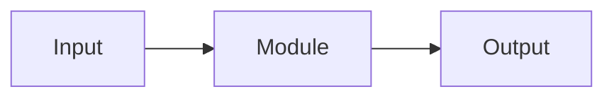
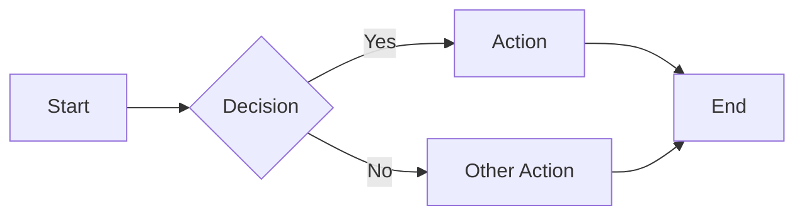
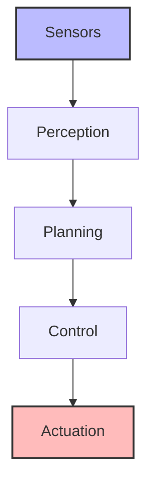
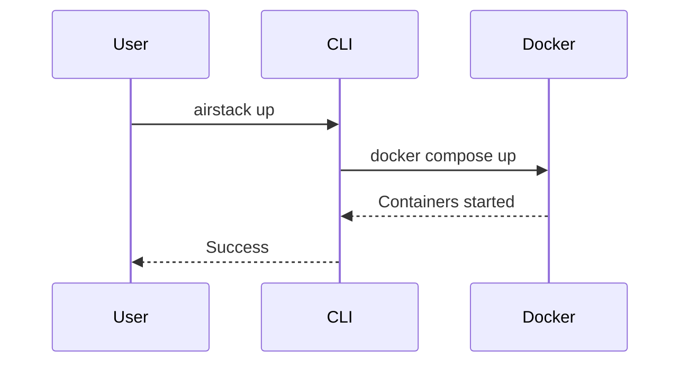

# Skill: Write MkDocs Documentation

## When to Use

- Creating new documentation pages
- Updating existing documentation
- Reorganizing documentation structure
- Adding module-level or system-level documentation
- Ensuring documentation quality and consistency

## Core Principles

### 1. Progressive Disclosure

**Organize for newcomers first, depth second:**

- Start with "what" and "why" before "how"
- Show examples before explaining syntax/theory
- Link to deeper material rather than front-loading everything
- Use "Learn more" pattern at section ends

**Example structure:**
```markdown
## Feature Name

Brief explanation (1-2 sentences).

### Quick Example
```bash
# Show it in action first
airstack command --option value
```

### How It Works

Detailed explanation for those who want to understand...

**Learn more:** [Advanced Usage Guide](advanced.md)
```

### 2. Concise Yet Complete

- Keep documentation concise to reduce onboarding time
- Provide depth through cross-references, not duplication
- One concept per section (H2 heading)
- Each section should be independently scannable

### 3. Visual Learning

Use visuals liberally but purposefully:

- **Mermaid diagrams** for architecture, workflows, data flows
- **Tables** for comparisons and reference data
- **Code examples** with language tags
- **Screenshots** sparingly (they go stale quickly)
- **Admonitions** for emphasis and context

## Critical MkDocs-Specific Requirements

### Markdown List Rendering

**⚠️ CRITICAL:** Lists require a **blank line** before them to render correctly.

❌ **Wrong** (renders as single line):
```markdown
Here are the steps:
- Step 1
- Step 2
```

✅ **Correct** (renders as list):
```markdown
Here are the steps:

- Step 1
- Step 2
```

**This applies to:**
- Unordered lists (`-`, `*`, `+`)
- Ordered lists (`1.`, `2.`, `3.`)
- Nested lists
- Lists after paragraphs, headings, or code blocks

### Navigation Structure (mkdocs.yml)

**Prefer H1 heading over title override:**

❌ **Avoid:**
```yaml
nav:
  - Overview: docs/development/beginner/key_concepts.md
```

✅ **Prefer:**
```yaml
nav:
  - docs/development/beginner/key_concepts.md
```

Then let the H1 heading in the markdown file define the title:
```markdown
# Key Concepts

Content...
```

**When to use title override:**
- When markdown filename is generic (index.md, README.md)
- When H1 heading is too long for navigation
- When you need consistent navigation across files

### Same-Dir Plugin

The `mkdocs-same-dir` plugin is enabled, allowing references to files outside `docs/`.

**Use cases:**
- Link to module READMEs: `robot/ros_ws/src/local/planners/my_planner/README.md`
- Reference code examples
- Include package documentation directly

**Navigation example:**
```yaml
nav:
  - Robot:
      - Local Planners:
          - DROAN: robot/ros_ws/src/local/planners/droan_local_planner/README.md
          - My Planner: robot/ros_ws/src/local/planners/my_planner/README.md
```

## Documentation Structure

### Module-Specific Documentation

**Location:** `<module_path>/README.md`

**Use for:**
- Individual package/module documentation
- Algorithm details
- Module-specific interfaces, parameters, configuration
- Usage examples for that specific module

**Example:** `robot/ros_ws/src/local/planners/droan_local_planner/README.md`

### System-Level Documentation

**Location:** `docs/` directory

**Use for:**
- Integration guides (how modules work together)
- Architecture overviews
- Tutorials spanning multiple modules
- Development guides
- Getting started guides

**Example:** `docs/robot/autonomy/system_architecture.md`

### Organization Pattern

```
docs/
├── getting_started/        # New user onboarding
├── development/            # Developer guides
│   ├── beginner/          # Entry-level tutorials
│   ├── intermediate/      # Testing, best practices
│   └── advanced/          # Deep dives
├── robot/                 # Robot-specific docs
│   ├── autonomy/          # Autonomy stack integration
│   └── configuration/     # Configuration guides
└── simulation/            # Simulation setup

robot/ros_ws/src/
├── local/planners/my_planner/README.md    # Module docs
└── perception/state_est/README.md         # Module docs
```

## Content Structure Guidelines

### Page Structure

Every documentation page should follow this pattern:

```markdown
# Page Title (H1 - only one per page)

Brief overview (1-2 sentences explaining what this page covers).

## Section 1 (H2)

Content...

### Subsection 1.1 (H3)

Content...

## Section 2 (H2)

Content...
```

**Heading hierarchy:**
- H1: Page title only (one per document)
- H2: Major sections
- H3: Subsections
- **Never skip levels** (don't go H2 → H4)

### Module README Template

For module-specific documentation:

```markdown
# Module Name

Brief one-sentence description.

## Overview

What it does and why it exists (2-3 sentences).

## Architecture



## Interfaces

### Subscribed Topics

| Topic | Type | Description |
|-------|------|-------------|
| `input` | sensor_msgs/PointCloud2 | Input data |

### Published Topics

| Topic | Type | Description |
|-------|------|-------------|
| `output` | nav_msgs/Path | Output path |

### Parameters

| Parameter | Type | Default | Description |
|-----------|------|---------|-------------|
| `rate` | double | 10.0 | Update rate (Hz) |

## Configuration

Example config file with comments:

```yaml
/**:
  ros__parameters:
    rate: 10.0
```

## Usage

Quick launch example:

```bash
ros2 launch my_package my_package.launch.xml
```

## See Also

- [Related Module](../other_module/README.md)
- [Integration Guide](../../../../docs/robot/autonomy/integration_checklist.md)
```

### Tutorial Structure

For tutorials and guides:

```markdown
# Tutorial: Doing Something

Brief description of what you'll learn.

## Prerequisites

- Required background knowledge
- Required setup

## Step 1: First Action

Explanation of what and why.

```bash
# Command to run
airstack command
```

Expected output or result.

## Step 2: Next Action

...

## Complete Example

Full end-to-end example.

## Troubleshooting

Common issues and solutions.

## Next Steps

- [Related Tutorial](other_tutorial.md)
- [Reference Documentation](reference.md)
```

## Visual Elements

### Admonitions

Use MkDocs Material admonitions for emphasis:

```markdown
!!! tip "Helpful Hint"
    Use this for pro tips, shortcuts, or best practices.

!!! note "Important Context"
    Use for important background information.

!!! warning "Potential Pitfall"
    Use for common mistakes or gotchas.

!!! example "Example Usage"
    Use for code examples or demonstrations.

!!! danger "Critical Warning"
    Use sparingly for breaking changes or critical issues.
```

**When to use:**
- `tip`: Shortcuts, pro tips, optimization suggestions
- `note`: Important context, background information
- `warning`: Common mistakes, potential issues, gotchas
- `example`: Code examples, usage demonstrations
- `danger`: Breaking changes, critical issues (use sparingly)

### Mermaid Diagrams

Use mermaid for technical diagrams:

**Flowcharts:**
```markdown

```

**Architecture diagrams:**
```markdown

```

**Sequence diagrams:**
```markdown

```

**Test diagrams:** Use [mermaid.live](https://mermaid.live) to test syntax before adding to docs.

### Tables

Use tables for reference data:

```markdown
| Topic | Type | Description |
|-------|------|-------------|
| `input` | sensor_msgs/Image | Camera image |
| `output` | nav_msgs/Path | Planned path |
```

**Alignment:**
```markdown
| Left aligned | Center aligned | Right aligned |
|:-------------|:--------------:|--------------:|
| Text         | Text           | Text          |
```

### Code Blocks

Always specify language for syntax highlighting:

```markdown
```bash
# Bash commands
airstack up robot-desktop
```

```python
# Python code
def process_data(input_data):
    return result
```

```yaml
# YAML configuration
ros__parameters:
  rate: 10.0
```

```cpp
// C++ code
class MyClass {
public:
    void process();
};
```
```

**Show expected output:**
```markdown
```bash
$ ros2 topic list
/robot/odometry
/robot/cmd_vel
```
```

## Cross-Referencing

### Linking Strategy

**Link liberally:**
- Link when first mentioning a concept defined elsewhere
- Link to deeper material at end of sections
- Link to related documentation in "See Also" sections

**Use descriptive link text:**

❌ **Avoid:**
```markdown
Click [here](guide.md) to see the guide.
```

✅ **Prefer:**
```markdown
See the [Integration Guide](guide.md) for details.
```

### Relative Paths

Always use relative paths for internal links:

```markdown
<!-- From docs/development/beginner/key_concepts.md to docs/development/index.md -->
[Development Guide](../index.md)

<!-- From docs/development/beginner/key_concepts.md to docs/getting_started/index.md -->
[Getting Started](../../getting_started/index.md)

<!-- From module README to docs -->
[System Architecture](../../../../docs/robot/autonomy/system_architecture.md)
```

### "Learn More" Pattern

End sections with links to deeper material:

```markdown
## Feature Overview

Brief explanation of feature.

Quick example...

**Learn more:**
- [Advanced Configuration](advanced_config.md)
- [Performance Tuning](performance.md)
- [API Reference](api_reference.md)
```

## Navigation Organization

### mkdocs.yml Structure

Organize by user journey, not technical structure:

```yaml
nav:
  - Home: docs/index.md
  - Getting Started:
      - docs/getting_started/index.md
      - Installation: docs/getting_started/installation.md
  - Development:
      - docs/development/index.md
      - Beginner Tutorials:
          - docs/development/beginner/key_concepts.md
          - docs/development/beginner/environment_setup.md
      - Intermediate Tutorials:
          - docs/development/intermediate/testing/index.md
```

### Best Practices

**Limit nesting depth:** Maximum 3 levels in navigation.

❌ **Too deep:**
```yaml
- Level1:
    - Level2:
        - Level3:
            - Level4:  # Too deep!
```

✅ **Good depth:**
```yaml
- Level1:
    - Level2:
        - Level3: docs/page.md
```

**Use index pages as hubs:**

Each major section should have an `index.md` that:
- Provides overview of section
- Links to subsections
- Helps users navigate

**Group by purpose:**
- Group by what users need to accomplish
- Not by technical structure
- Alphabetical within groups (when order doesn't matter)

## Writing Style

### General Guidelines

- **Active voice:** "Run this command" not "This command should be run"
- **Present tense:** "The module subscribes to..." not "The module will subscribe to..."
- **Second person:** "You can configure..." not "One can configure..."
- **Imperative for instructions:** "Install the package" not "You should install the package"
- **No unnecessary analogies:** Avoid analogies that don't add technical clarity. Explain things directly as they are rather than comparing them to unrelated concepts.

### Be Specific

❌ **Vague:**
```markdown
Configure the parameters as needed.
```

✅ **Specific:**
```markdown
Set `update_rate` to 20.0 for high-frequency updates:

```yaml
ros__parameters:
  update_rate: 20.0
```
```

### Examples First

Show before explaining:

❌ **Explanation first:**
```markdown
The launch command accepts several arguments including config_file
for custom configuration and debug for verbose output.

```bash
ros2 launch package file.launch.xml config_file:=config.yaml debug:=true
```
```

✅ **Example first:**
```markdown
```bash
# Launch with custom config and debug output
ros2 launch package file.launch.xml config_file:=config.yaml debug:=true
```

The launch command accepts `config_file` for custom configuration
and `debug` for verbose output.
```

## Quality Checks

### Before Committing

**Always perform these checks:**

1. **Build documentation:**
   ```bash
   airstack docs
   # Or: docker exec airstack-docs bash -c "cd /AirStack && mkdocs build --strict"
   ```

2. **Check for broken links:**
   ```bash
   # --strict flag fails on broken links
   mkdocs build --strict
   ```

3. **Verify rendering:**
   - Tables format correctly
   - Code blocks have syntax highlighting
   - Mermaid diagrams render
   - Lists display as lists (not single lines)
   - Admonitions render with correct styling

4. **Test navigation:**
   - Page appears in navigation
   - All cross-references work
   - No orphaned pages

5. **Validate markdown:**
   ```bash
   # Check for common markdown issues
   grep -n "^- " docs/**/*.md  # Lists without preceding blank line
   ```

### Cross-Documentation Updates

**⚠️ CRITICAL:** When code changes, update ALL affected documentation:

**Check these locations:**
- Module README.md files
- System architecture docs
- Integration guides
- API references
- Tutorial examples
- mkdocs.yml navigation
- Related module documentation

**Use grep to find references:**
```bash
# Find all references to a topic, function, or module
grep -r "topic_name" docs/
grep -r "function_name" robot/ros_ws/src/
```

### Link Validation

```bash
# Find all markdown links
grep -r '\[.*\](.*\.md)' docs/

# Check if linked files exist
# (manually verify or use a script)
```

### Spell Check

Run spell check before committing:
```bash
# Use aspell or your IDE's spell checker
aspell -c docs/your_file.md
```

## Common Pitfalls

### Markdown Rendering Issues

❌ **List without blank line:**
```markdown
Here are the steps:
- Step 1
- Step 2
```

✅ **List with blank line:**
```markdown
Here are the steps:

- Step 1
- Step 2
```

---

❌ **Code block in list without proper indentation:**
```markdown
- Step 1
```bash
command
```
```

✅ **Code block in list with 4-space indent:**
```markdown
- Step 1
    ```bash
    command
    ```
```

---

❌ **Missing language tag:**
```markdown
```
command here
```
```

✅ **With language tag:**
```markdown
```bash
command here
```
```

### Navigation Issues

❌ **Incorrect path (absolute):**
```yaml
nav:
  - Page: /docs/page.md  # Wrong!
```

✅ **Correct path (relative to repo root):**
```yaml
nav:
  - Page: docs/page.md
```

---

❌ **Wrong file extension:**
```yaml
nav:
  - Page: docs/page  # Missing .md
```

✅ **With extension:**
```yaml
nav:
  - Page: docs/page.md
```

### Mermaid Issues

❌ **Wrong fence syntax:**
```markdown
```
mermaid
graph LR
  A --> B
```
```

✅ **Correct fence:**
```markdown

```

### Cross-Reference Issues

❌ **Absolute path:**
```markdown
[Link](/docs/page.md)
```

✅ **Relative path:**
```markdown
[Link](../page.md)
```

---

❌ **Broken link (file moved):**
```markdown
[Old Link](old_location/page.md)
```

✅ **Updated link:**
```markdown
[Updated Link](new_location/page.md)
```

### Accessibility Issues

❌ **Missing alt text:**
```markdown

```

✅ **With alt text:**
```markdown

```

---

❌ **"Click here" links:**
```markdown
Click [here](guide.md) for more info.
```

✅ **Descriptive links:**
```markdown
See the [Integration Guide](guide.md) for more details.
```

## Formatting Standards

### AirStack-Specific Conventions

**ROS 2 topics:**
```markdown
Subscribe to `/{robot_name}/odometry` topic.
```

**Environment variables:**
```markdown
Set `$ROBOT_NAME` to configure the robot namespace.
```

**File paths:**
```markdown
Edit `robot/ros_ws/src/local/planner/config.yaml`
```

**Commands:**
```bash
# Always include comments for clarity
airstack up robot-desktop  # Start robot container
```

**Launch arguments:**

| Argument | Type | Default | Description |
|----------|------|---------|-------------|
| `robot_name` | string | robot_1 | Robot namespace |
| `config_file` | path | config/default.yaml | Configuration file |

### Nested Content Indentation

**Lists:**
```markdown
- Level 1
    - Level 2 (4 spaces)
        - Level 3 (8 spaces)
```

**Code in lists:**
```markdown
- Step description

    ```bash
    # 4-space indent for code block in list
    command here
    ```

    Explanation continues (4-space indent)
```

**Admonitions in lists:**
```markdown
- Main point

    !!! note
        4-space indent for admonition in list
```

## Maintenance Workflow

### When Adding New Features

1. **Write module README** (if module-level change)
2. **Update affected system docs** (if integration change)
3. **Add to mkdocs.yml navigation**
4. **Update related documentation** (cross-references)
5. **Build and verify** (`mkdocs build --strict`)
6. **Check for broken links**
7. **Commit with descriptive message**

### When Refactoring Code

1. **Identify affected documentation:**
   ```bash
   grep -r "old_function_name" docs/
   grep -r "old_topic_name" docs/
   ```

2. **Update all references**
3. **Update diagrams** (if architecture changed)
4. **Add migration notes** (if breaking change)
5. **Update CHANGELOG.md**
6. **Verify all links still work**

### Periodic Reviews

**Monthly checks:**
- Validate all external links still work
- Update version-specific information
- Check for outdated screenshots
- Review and update "Current Limitations" sections

## Agent Workflow

### Documentation Checklist for AI Agents

When creating or updating documentation:

- [ ] Content follows progressive disclosure (concept → example → depth)
- [ ] All lists have blank line before them
- [ ] Code blocks have language tags
- [ ] Mermaid diagrams tested and render correctly
- [ ] All links use relative paths
- [ ] Tables format correctly
- [ ] Admonitions used appropriately
- [ ] Module README uses standard structure
- [ ] mkdocs.yml navigation updated (prefer no title override)
- [ ] Cross-references added to related docs
- [ ] Documentation builds without errors (`mkdocs build --strict`)
- [ ] All links validated
- [ ] No orphaned pages
- [ ] Spell-checked
- [ ] Follows AirStack formatting conventions

### Example Commit Message

```
docs: Add comprehensive guide for new feature

- Create feature overview in docs/tutorials/
- Add module README for feature_package
- Update system architecture diagram
- Add to mkdocs.yml navigation
- Cross-reference from related guides
- Verify all links and rendering
```

## References

**MkDocs:**
- [MkDocs Documentation](https://www.mkdocs.org/)
- [Material for MkDocs](https://squidfunk.github.io/mkdocs-material/)
- [same-dir plugin](https://github.com/oprypin/mkdocs-same-dir)

**Mermaid:**
- [Mermaid Documentation](https://mermaid.js.org/)
- [Mermaid Live Editor](https://mermaid.live/)

**Markdown:**
- [CommonMark Spec](https://commonmark.org/)
- [GitHub Flavored Markdown](https://github.github.com/gfm/)

**AirStack Examples:**
- Module README: `robot/ros_ws/src/local/planners/droan_local_planner/README.md`
- System docs: `docs/robot/autonomy/system_architecture.md`
- Tutorial: `docs/development/beginner/key_concepts.md`

**Related Skills:**
- [update-documentation](../update-documentation) - Workflow for updating docs after adding modules
- [add-ros2-package](../add-ros2-package) - Creating new ROS 2 packages (includes README template)
