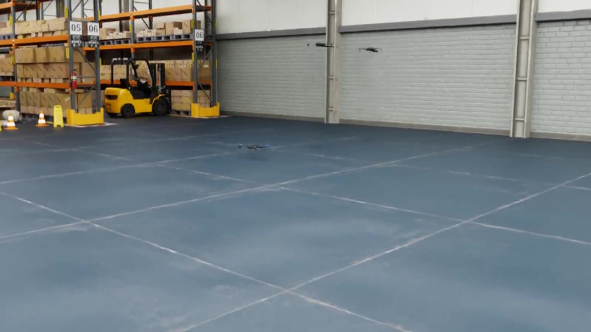

# AirStack

<div align="center">
  

**Build the autonomy, not the scaffolding.**

AirStack is an open ROS 2 stack for aerial robots — simulator, ground control,
and layered onboard autonomy that launch as one system. Developed by the
[AirLab](https://theairlab.org) at Carnegie Mellon University's Robotics Institute.

[](LICENSE)
[](https://docs.theairlab.org)

<a href="https://docs.theairlab.org">
  
</a>

*Three drones flying the real stack in Isaac Sim, the Foxglove GCS, and MS AirSim —
recorded from this repo, unstaged. Watch the live demos on the
[documentation home page](https://docs.theairlab.org).*

</div>

## Zero → drones flying in sim

```bash
git clone --recursive -j8 git@github.com:castacks/AirStack.git && cd AirStack
./airstack.sh install && ./airstack.sh setup
airstack up --play --wait
```

Then follow the [Getting Started guide](https://docs.theairlab.org/main/docs/getting_started/)
and the [Modular AirStack Walkthrough](docs/getting_started/modular_airstack.md).
No Linux box or GPU? [Run AirStack on OSMO](docs/tutorials/airstack_on_osmo.md)
from any laptop.

## One command brings up sim, robots, and ground control

`airstack up` starts the simulator, one container per robot, and a
Foxglove-based ground control station, wired together over ROS 2. Flags select
the simulator, scene, and fleet size — no launch-file surgery:

```bash
airstack up --sim airsim --scene neighborhood
airstack up --sim isaac --robots 3 --scene full-warehouse
airstack up --fleet sim_three_mixed
```

`airstack ready` blocks until the stack is flight-ready — containers running,
sim publishing `/clock`, autonomy nodes up, PX4 EKF armable — so scripts and CI
know exactly when takeoff is available.

## Same code in sim and on the vehicle

The desktop dev container and the Jetson (L4T) onboard container extend one
base service and launch the same stack entry point
(`stacks/full_default/launch/stack.launch.xml`). What you test in simulation is
what the vehicle runs.

## CI flies the whole stack, not just unit tests

Pull requests run pytest campaigns against the live simulators on ephemeral GPU
runners: image builds, `colcon` builds in every container, bring-up liveliness,
sensor topic rates, takeoff–hover–land, fixed trajectories with cross-track
error, and waypoint navigation judged on the odometry track. Run them yourself,
or comment `/pytest` on a PR:

```bash
airstack test -m takeoff_hover_land --sim isaacsim --num-robots 1 -v
```

Marks are defined in [`tests/`](tests/); metrics regressions fail the report.

## AI agents can drive this repo

Module boundaries, an [`AGENTS.md`](AGENTS.md) contract, and 23 step-by-step
skills under [`.agents/skills/`](.agents/skills/) give coding agents the same
on-ramp as humans: scaffold a package, wire it into a stack, fly it in sim,
document it. Every demo video on the documentation home page was captured by an
AI agent — it brought the stack up, scripted the flights, implemented the
follow-camera it filmed with, and edited the clips.

## Modular architecture

AirStack follows a layered autonomy architecture:

```
Robot
├── Interface Layer: Communication with robot controllers
├── Sensors Layer: Data acquisition from various sensors
├── Perception Layer: State estimation and environment understanding
├── Local Layer:
│   ├── World Models: Local environment representation
│   ├── Planners: Trajectory generation and obstacle avoidance
│   └── Controls: Trajectory following
├── Global Layer:
│   ├── World Models: Global environment mapping
│   └── Planners: Mission-level path planning
└── Behavior Layer: High-level decision making
```

The topology that actually launches is selected by a **stack** — a
self-contained folder under [`stacks/`](stacks/) with pinned `modules.repos`
and a CI-observed `wiring.md`. Capabilities beyond the trunk live in
**modules** — thin external repos with a small `module.yaml`, pulled on demand
(`airstack module add <url> --version <pin>`) and discovered through the
[module registry](https://github.com/castacks/airstack-modules-index).
Multi-robot deployments are declared by **fleets** under
[`config/fleets/`](config/fleets/): who exists, which vehicle, which stack, and
which ground hosts run split-stack offboard halves.

## Repository map

- [`robot/`](robot/) — onboard ROS 2 (Jazzy) autonomy stack (interface, sensors, perception, local, global, behavior)
- [`stacks/`](stacks/) — reference autonomy stacks (launch topology + pinned modules + wiring baselines)
- [`config/`](config/) — fleet and vehicle definitions
- [`simulation/`](simulation/) — Isaac Sim (Pegasus) and Microsoft AirSim (legacy)
- [`gcs/`](gcs/) — Ground Control Station
- [`common/`](common/) — shared ROS packages and the [`module_schema/`](common/module_schema/) for `module.yaml`
- [`tools/`](tools/) — repo tooling (docs catalog generator, fleet resolver, wiring/DDS generators)
- [`tests/`](tests/) — pytest system tests, integration tests, and contract tests
- [`docs/`](docs/) — MkDocs documentation source

## System requirements

- **Docker** with the NVIDIA Container Toolkit
- **NVIDIA GPU**: RTX 3070 minimum, RTX 4080 or better recommended (for local Isaac Sim)
- **Storage**: Docker images take ~25 GB; 100 GB free disk space recommended
- **OS**: Ubuntu 22.04 or 24.04

## Documentation

Full documentation lives at **<https://docs.theairlab.org>** (built from
[`docs/`](docs/) with MkDocs — `airstack docs` serves it locally).

## Community & license

Contributions are welcome — see the
[Contributing guide](docs/development/intermediate/contributing.md) and open
issues/discussions on GitHub. AirStack is developed at Carnegie Mellon
University's [AirLab](https://theairlab.org) (PI:
[Sebastian Scherer](https://theairlab.org/team/sebastian/)); contact the team
via [theairlab.org](https://theairlab.org). Licensed under the BSD 3-Clause
Clear License — see [LICENSE](LICENSE).
