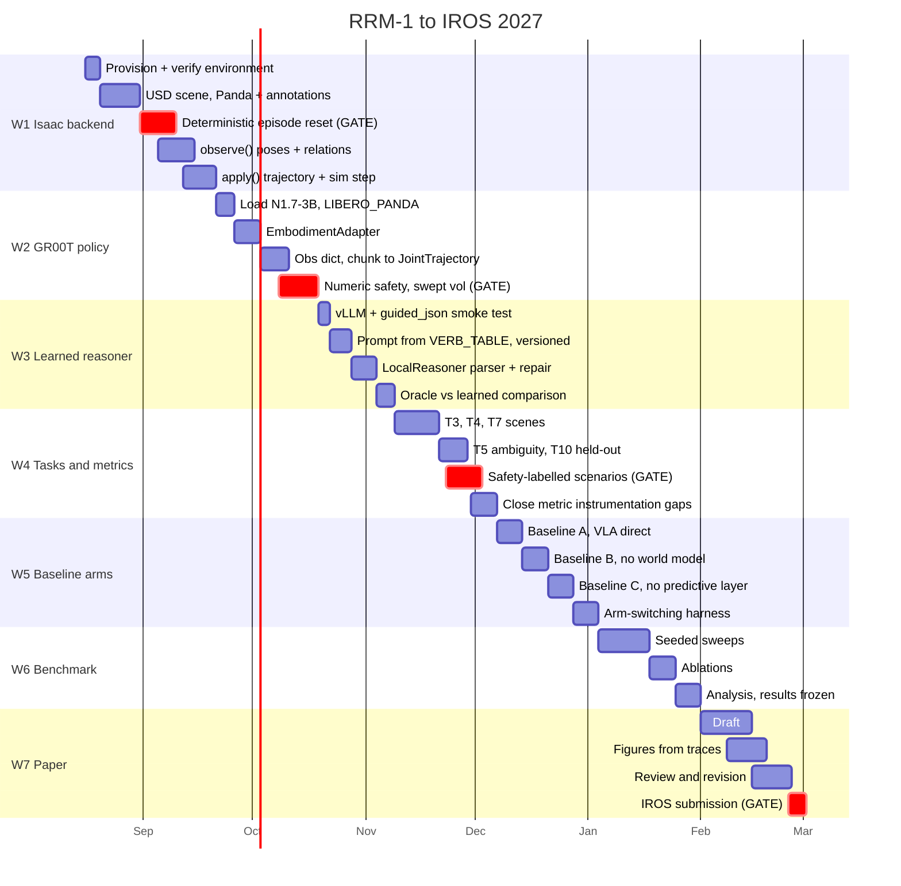

# RRM-1 Roadmap

Anchored to **IROS 2027 — 1 March 2027**. 197 days from a working mock loop to submission.

## Why not ICRA 2027

ICRA 2027's main track closes **15 September 2026**. With Isaac Sim unwired, that is not a
full paper. Treat it as a possible workshop outlet for the architecture (matching the
brief's §23 "early stage: architecture + simulation results") and aim the complete result
at IROS. Secondary: CoRL 2027, ~April 2027.

## Schedule

## Gates

Slippage here propagates to the submission date rather than being absorbed. Each is
scheduled early inside its stream for that reason.

| When | Gate | Why it blocks |
|---|---|---|
| 31 Aug – 9 Sep | **Deterministic episode reset** | Isaac physics is not reproducible by default and every reported number needs seeded episodes. Nothing in W4–W6 is publishable without it — which is why it precedes `observe()` despite being the less interesting task. |
| 8 – 18 Oct | **Swept-volume collision** | Safety #2 checks scalars against placeholder ranges today: structurally correct, numerically fake. Collision rate and safety violation rate are both meaningless until it is real. Most likely item to be underestimated. |
| 23 Nov – 2 Dec | **Safety-labelled scenarios** | Verifier precision, recall and false-negative rate cannot come from traces — traces record what the verifier *decided*, never whether it was *right*. Scenarios must carry known-unsafe actions labelled in advance. Retrofitting invalidates every episode collected before the change. |
| 25 Feb – 1 Mar | **Submission** | Four days of buffer is thin. The mitigation is freezing results on 31 January and refusing to re-run sweeps during write-up. |

## Metric instrumentation status

45 target metrics (`docs/evaluation_matrix.md`) against 10 instrumented. Grouped by what
unblocks them, since that ordering is what the schedule is built from.

| Group | Count | Unblocked by |
|---|---:|---|
| Live now — computed from traces, needs naming only | 7 | — |
| Unlocked by the Isaac backend | 6 | W1, W2 |
| Free from the Oracle — reference plans, no labelling | 4 | W3 |
| New instrumentation, straightforward | 6 | W3, W4 |
| **Needs labelled ground truth** | 5 | **W4 gate** |
| Deferred past submission | 4+ | Phase 6 / post-IROS |

Two things worth carrying forward:

**The Oracle pays for itself here.** Task Decomposition Accuracy, Step Ordering Accuracy,
Action Efficiency and Plan Validity all become computable by diffing a learned reasoner's
task graph against the Oracle's on the same scenario — four reasoning metrics with no
hand-labelling, because the Oracle was kept as a permanent reference ceiling.

**No weighted composite until the weights are validated.** `docs/evaluation_matrix.md`
specifies 25/15/15/15/10/10/10; those are a hypothesis. A single number from unvalidated
weights invites a reviewer to reject the framing instead of engaging with the result.
Report the per-metric table. Safety is never averaged away — any hard violation fails the
run regardless of task success.

## Beyond submission

Phase 6 perception (real detector + depth, and the VRAM upgrade that implies), sim-to-real
on a physical Panda, then cross-embodiment via `UNITREE_G1` — which needs only an
`EmbodimentAdapter` swap, since it is pre-registered in GR00T and requires no fine-tuning.
