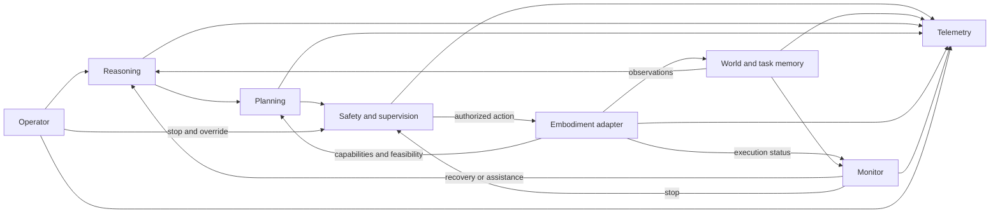

# Architecture and requirement allocation

## Boundary and responsibilities

The task-level core interprets objectives and plans over entity IDs, predicates and declared resources. It never selects behavior by robot product name, generates actuator coordinates or grants itself permission. Different capability declarations may yield different valid plans from the same reasoning behavior.

| Owner | Responsibility and decision authority | Requirement support |
| --- | --- | --- |
| O — Operator/task interface | Receive objective, constraints, clarification and authenticated interventions; expose progress and reason for assistance | 001, 007, 009, 011 |
| R — Reasoning | Interpret context, ground entities, return intent or unresolved ambiguity; propose recovery goals | 001, 003, 006, 007, 010 |
| W — World/task state and memory | Ingest observations; version task belief, evidence, progress and dialogue context; retain provenance and uncertainty | 001, 002, 005, 006, 007, 011 |
| P — Planning | Decompose permitted goals using authored action semantics; query feasibility; propose versioned plans and alternatives | 003, 004, 006, 008, 010 |
| S — Safety/permission authority and supervision | Evaluate constraints independently; own dispatch admission, stop latch and approval validity; never let reasoner override rejection | 004, 006, 007, 008, 009 |
| M — Execution monitoring | Compare expected effects with fresh observed evidence; own divergence classification and bounded recovery/escalation choice | 002, 005, 006, 009, 011 |
| E — Embodiment boundary | Declare actions/resources/limits; ground abstract actions; perform numeric validation, motion/control; report actual outcomes and safe-state evidence | 004, 005, 008, 009, 010 |
| T — Telemetry/evaluation | Record causal events and immutable referenced payloads; assess completeness; produce reproducible measures | 011, all verification |

These are logical responsibilities, not eight required processes or new ROS packages. Perception and sensing enter W through E's observation boundary. Manipulation, navigation, motion generation and control stay behind E. The simulator supplies observations and receives actuation through the same contracts; evaluation ground truth is a separate evidence channel. Memory is W's task/context history. Learning is an offline candidate-production/evaluation activity supporting R/P/E, not an authorized online mutation of safety rules or action semantics. This accounts for all capability blocks in the architecture outline without inventing a requirement for a learner or humanoid deployment.

## Complete allocation

IDs in the first column have prefix `RRM-SYS-REQ-`; stakeholder parents have prefix `RRM-STK-REQ-`. Full requirement wording remains in the linked Phase 1 baseline and HANDOFF.md. Contract IDs are defined in [interfaces](interfaces.md); scenario IDs and evidence contents in [evaluation](evaluation.md). Evidence targets are planned files under an exported run bundle, not existing passing tests.

| ID | Required behavior | Parent/source | Primary owner | Supporting owners | Contracts | Verification/scenarios | Evidence target |
| --- | --- | --- | --- | --- | --- | --- | --- |
| 001 | Interpret contextual objective | STK-001 | R | O, W | C01, C02, C04 | Demonstration/test S01, S03 | S01/intent.json, S03/dialogue.jsonl |
| 002 | Maintain current task/world state | STK-002 | W | E, M | C02, C07, C09 | Inspection/test S01, S02, S10 | S02/states.jsonl |
| 003 | Decompose permitted multi-step task | STK-002 | P | R, S | C04, C05 | Test S01 | S01/plans.jsonl |
| 004 | Check capabilities/limits before dispatch | STK-004 | S | P, E | C03, C05, C06, C07 | Test S04, S09 | S04/admission.jsonl |
| 005 | Compare outcomes against expected effects | STK-002 | M | W, E | C02, C05, C07 | Test S02, S07, S10 | S07/effect-comparisons.jsonl |
| 006 | Recover, assist or reach safe condition | STK-002, STK-003 | M | R, P, S, O, E | C04–C08 | Off-nominal S02, S06–S08, S10 | S08/recovery.jsonl |
| 007 | Clarify or obtain approval under material uncertainty | STK-003 | O | R, W, S | C01, C02, C04, C06 | Scenario S03, S05, S10 | S03/interventions.jsonl |
| 008 | Check safety and permissions before dispatch | STK-003 | S | O, P, E | C01, C03, C06, C07 | Safety test S05, S06, S10 | S05/decisions.jsonl |
| 009 | Support stop/override before and during execution | STK-003 | S | O, M, E | C07, C08 | Demonstration/test S06 | S06/stop-timeline.jsonl |
| 010 | Reuse reasoning across declared embodiments | STK-004 | R | P, E | C02–C05, C07 | Demonstration/inspection S04, S09 | S09/core-and-profile-hashes.json |
| 011 | Reconstruct objectives through failures/interventions | CONOPS success criteria | T | All | C01–C09 | Inspection/replay S01–S10 | replay-report.json, manifest.json |

## Operational ordering and authority

1. O accepts a task revision and explicit permission context. R binds intent against W's snapshot, or requests clarification. Unresolved material ambiguity blocks motion.
2. P produces a plan from the intent, authored semantics and declared capabilities. A feasibility result is neither permission nor a guarantee of successful effects.
3. Immediately before each attempt, S checks current task/state/capability/permission/approval revisions, limits, uncertainty, stop status and E's grounding/numeric check. All must permit the exact payload. Changes invalidate authorization.
4. S admits a single dispatch attempt. E reports acceptance separately from progress and completion. M requires fresh effect evidence for task success; an adapter success response alone is insufficient.
5. On divergence, M invalidates the plan, cancels remaining work and requests a bounded alternative, assistance or stop. A rejected action is not resubmitted against unchanged context merely to spend the retry budget. Budgets and deadlines are explicit run configuration.
6. Stop has an independent path that never waits for reasoning. Admission closes before cancellation is requested. Loss of acknowledgment or observation means safe state is unconfirmed. Resume needs explicit authorized reset and renewed context checks.

The adapter owns physical protective behavior when upstream communication fails. A software timeout or ABORT event is not proof that a moving robot has stopped. The initial prototype remains simulation-only.

## Embodiment portability and staged realization

Use resource IDs and supported operation semantics: a hand can expose one or more grasp resources, an arm may additionally reposition them, a bimanual system can expose concurrent resources, and a mobile manipulator can add navigation. A humanoid adds validated mobility/balance contracts behind E. No core `one gripper` or `radial reach` assumption is allowed in the new contracts. Support for a verb alone is insufficient: resource availability, target grounding, numeric limits and task constraints must also pass.

Initial SIL should implement a dexterous-hand-compatible structured manipulation scenario against the CONOPS progression. Which hand asset/controller can achieve the representative multi-step task remains a feasibility selection, not a hidden Panda substitution. Profile-only tests can test portability logic but cannot demonstrate cross-robot execution.

Implementation sequence: contract foundation → world/task evidence and operator interaction → capability-aware planning and real supervision/telemetry → conforming deterministic simulator adapter → integrated SIL → matched candidate model experiments. Keep the old oracle suite as a regression baseline throughout. Before AirStack launch changes, follow its module/stack skills and choose a manipulation test stack; the default drone scene is not the RRM scenario.

## Open decisions and closure gates

Logical allocation is complete. Implementation still needs a selected hand scene and observable safe condition, freshness/deadline/retry values justified by hazards and experiments, transport/QoS and authenticated operator binding, persistent remote artifacts/cache, and working GPU access. Those are owned by E/S, S/M, O/S, T and remote infrastructure respectively. SCRUM-8 closure requires review of this design against the live requirements; SCRUM-9 needs actual integrated evidence. No model selection, operational performance acceptance or Jira Done status is implied.
