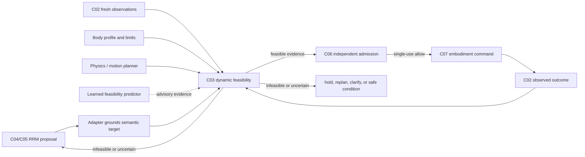

# Dynamic embodiment feasibility and admission workflow

This design preserves RRM's body-agnostic task reasoning while making execution
decisions depend on the current body, scene, and physics. It refines C03, C05, C06,
and C07; it does not make a learned model a safety authority or permit a proposal to
dispatch by itself.

## Core separation

The RRM core reasons over semantic actions, objects, constraints, expected effects,
and declared resources. It never selects a joint target, a flight waypoint, a grasp
pose, or a controller gain. An embodiment adapter owns those representations.

For every proposed semantic action, the adapter evaluates this question against a
fresh state snapshot:

> Can this embodiment perform this exact grounded action within its current physical,
> control, resource, and safety limits?

The answer is a versioned **feasibility result**, not a permission. C06 independently
uses that result, current safety/permission context, and the stop generation to decide
whether one exact action may enter C07 dispatch.

`L` may make the system faster or more capable; it cannot replace the evidence-bearing
checks in `F`, and it has no route to `E`.

## Required records and dependencies

Each feasibility result is immutable and binds the following inputs by identity and
digest:

| Dependency | Supplied by | Why it is required |
| --- | --- | --- |
| Semantic action and authored effect | C05 plan | Prevents checking one action and dispatching another. |
| Grounded command candidate | Embodiment adapter | Associates semantic targets with body-local geometry only at the embodiment boundary. |
| Fresh state / transform / scene evidence | C02 | Captures current body pose, relevant object state, clock episode, and observation gaps. |
| Capability profile and numeric limit revision | C03 declaration | Determines whether the operation, resources, controller, stop channel, and limit model exist. |
| Physics or motion-plan result | Simulator/adapter | Establishes collision, reachability, dynamics, or planner feasibility for the exact grounded command. |
| Resource reservation | Adapter/supervisor | Prevents conflicting use of an arm, gripper, airframe, or controller. |
| Optional learned prediction | Learned E/P component | Records predicted success/risk and uncertainty; never upgrades unknown evidence to feasible. |
| Configuration and scene revision | Adapter deployment | Makes a feasibility result invalid if the controller, world geometry, calibration, or scene changes. |

The result contains one of `FEASIBLE`, `INFEASIBLE`, or `UNCERTAIN`; reason codes;
the checked action digest; all input revisions; evidence references; a short expiry;
and any approved command adjustment. Missing, stale, contradictory, nonfinite, or
unavailable inputs produce `UNCERTAIN`, which blocks dispatch.

An adapter may clamp or alter a grounded command only by emitting a new grounded
command digest. That change creates a new feasibility query and invalidates the old
one. A feasibility result cannot be reused after a simulator reset, changed scene,
changed state/profile revision, expired evidence, released reservation, or stop
generation change.

## What is learned, and what is authoritative

Learning belongs in the **prediction** and **candidate-generation** layer:

- A vision-language model can identify a likely target, candidate contact, route, or
  potential obstruction.
- A learned feasibility model can estimate reachability, grasp likelihood, traversal
  risk, success probability, or uncertainty from prior data.
- It may choose which deterministic checks to request first, propose alternatives, or
  cause RRM to seek clarification when its uncertainty is material.

Learning is not the sole authority for a dispatch-critical fact. The adapter must
obtain the applicable current evidence before C06 can allow motion: a collision/path
query for navigation, IK plus collision and contact constraints for manipulation,
controller/state limits for both, and an independently observable stop path. If a
learned estimate conflicts with runtime physics, runtime physics wins. If physics is
unavailable, the result is `UNCERTAIN`; the system holds or replans rather than
assuming success.

This division enables a learned model to improve online behavior as observations and
outcomes accumulate without silently changing the task semantics, safety rules, or
command authority. Model revision, training-data scope, calibration, uncertainty
measure, and observed prediction error are C09 evidence, not implicit controller
configuration.

## Continuous workflow

Feasibility is an online loop, not a one-time planning annotation.

1. **Observe and reconcile.** The adapter obtains fresh C02 body, world, transform,
   controller, and resource evidence. A simulator reset creates a new episode.
2. **Interpret and propose.** RRM emits only a C05 semantic plan. It may retain a
   multi-action plan, but the next action is selected individually.
3. **Ground.** The adapter binds the selected semantic targets to current body-local
   command candidates. It reports missing or ambiguous bindings rather than inventing
   coordinates.
4. **Evaluate dynamic feasibility.** The adapter checks the exact candidate against
   limits, current state, resource availability, and a body-appropriate physics or
   motion-planning query. Learned predictions can inform alternatives but do not
   decide an allow.
5. **Admit once.** C06 revalidates every referenced input, reserves resources, checks
   the stop generation and policy, writes the decision, and grants one short-lived,
   single-use C07 authorization for the exact command digest.
6. **Execute in bounded chunks.** C07 verifies the digest/generation at its own
   boundary. Before each motion chunk, changed state or a newly unsafe observation
   requires a fresh feasibility result; it cannot continue on an old PASS.
7. **Verify outcome.** Monitoring compares a fresh observed state with the authored
   expected effect. Controller success alone is not an achieved task effect.
8. **Re-evaluate.** A verified effect yields a new observation and feasibility query
   for the next action. An unmet effect, collision warning, stale evidence, resource
   loss, or uncertainty triggers hold, replan, clarification, recovery, or C08 safe
   condition. It never silently resumes an earlier command.

## Embodiment-specific implementations

The contract is shared; the evidence source is not.

| Embodiment | Typical dynamic feasibility evidence | Example hard blockers |
| --- | --- | --- |
| Aerial vehicle | Estimator state, map/obstacle clearance, flight corridor or trajectory planner, controller/vehicle status, geofence, energy, stop/landing channel | disconnected estimator, stale transform, route collision, unavailable action server, outside envelope, insufficient energy |
| Mobile base | localization, footprint/costmap, route planner, velocity/acceleration limits, braking distance, traffic/resource reservations | stale localization, occupied route, no braking margin, blocked corridor |
| Arm / hand | object and robot poses, IK, self/environment collision, joint/torque limits, grasp/contact model, workspace and fixture state | no IK solution, collision, limit violation, unknown object pose, incompatible grasp |
| Humanoid / bimanual | all relevant limb checks plus balance, support polygon, synchronized resource reservation, human proximity and safe hold state | balance loss risk, incompatible concurrent arm use, missing stop/hold proof |

These checks live behind the adapter profile. The task-level RRM code and authored
verb semantics remain unchanged when, for example, `PLACE(object, surface)` is
evaluated for an arm instead of a humanoid. Different adapters may return different
feasibility outcomes for the same semantic proposal; that is intended portability,
not divergent task reasoning.

## Current AirStack Office increment

The current command console now captures a fresh image, calls the private worker for
catalog-bound visual entity evidence, and asks RRM for a C05 proposal. That is C02
visual grounding plus C04/C05 proposal generation; it is not a physics feasibility
result and remains motion-inhibited.

The bundled AirStack C03 adapter now binds a proposed single-waypoint navigation
command to:

1. canonical fresh `map -> base_link` odometry, MAVROS state, airborne/control state,
   and live action-server availability;
2. a read-only Ouster point-cloud check of the exact straight 3D corridor, transformed
   into `map`, with minimum point/range coverage and 0.4 m clearance;
3. declared waypoint altitude, distance and tolerance limits;
4. the exact grounded navigation digest, current planner/resource state and the live
   Navigate/Land stop path; and
5. a canonical inline evidence payload whose SHA-256 is carried through the
   short-expiry, single-use admission record.

The current profile accepts only `aerial-eval` / `office-airframe-v1` /
`office-bounded-nav-v1`. It additionally requires canonical `map -> base_link`
odometry, a live corridor start within 0.25 m of the checksum-bound camera pose, and a
corridor target equal to the compiled waypoint. This prevents a physically valid
check for one state or target from admitting a different command. A profile change,
stale channel, or detached corridor produces a blocking result.

The existing public AirStack ActionClient remains the only C07 execution seam. It must
receive an admitted exact digest; it is not itself a feasibility oracle. No direct
PX4/MAVROS interface is introduced.

The implementation now provides `DynamicFeasibilityResult`, an injected evaluator,
and an in-process single-use admission guard in `rrm/dynamic_feasibility.py`.
`AuthorizedLiveMission` executes the complete composition in this order: fresh capture
and entity verification, learned proposal, deterministic embodiment compilation,
dynamic feasibility evaluation, dependency-bound single-use admission,
append-before-dispatch intent, public adapter execution, independent effect
verification, then fresh observation and replan. Every action repeats the feasibility
and admission stages. The default evaluator returns `UNCERTAIN`, so missing physics
integration cannot move the robot.

The explicit simulator runner accepts an adapter-owned executable through
`--feasibility-provider`. It sends a versioned JSON query on stdin and accepts only a
valid typed result on stdout. Execution mode requires that provider in addition to
`--execute --simulator-only`. The configured Office provider is
`scripts/airstack_drone_feasibility_provider.py`; its ROS-side observer is
`scripts/airstack_feasibility_observer.py`. Both are read-only until a separate,
single-use admission reaches the existing public ActionClient dispatcher.

This first profile is intentionally narrow: it supports one `NAVIGATE` waypoint,
requires the aircraft already to be armed, airborne, in control and nearly stationary,
and evaluates only the currently observed straight corridor. It does not synthesize a
takeoff sequence, predict around occlusion, reserve energy, or claim global route
planning. Any missing/stale channel, insufficient sensor coverage, obstacle, planner
stuck state, grounded vehicle, or absent stop endpoint blocks admission. A learned
sensor model may later contribute advisory risk or route candidates, but is not needed
for this deterministic profile and cannot turn unknown physical evidence into PASS.

The live read-only validation on 2026-09-20 observed every required channel and the
Navigate/Land task endpoints. It correctly rejected the current state: connected but
grounded, disarmed and without control; planner-stuck true; and 0.391 m measured
minimum corridor clearance against the 0.4 m requirement. The probe created no
publisher, service client or ActionClient and sent no task or vehicle command. The
complete repository suite passed 148 tests after this integration.

## Acceptance tests

- Same semantic proposal under two capability profiles produces profile-appropriate
  feasible/infeasible results without changes to RRM core logic.
- Every feasibility input mutation (scene, state, transform, profile, grounded command,
  reservation, or stop generation) invalidates a previous result.
- A learned positive prediction cannot override a collision, IK, limit, or stale-data
  rejection.
- A feasible result cannot be reused after simulator reset or action-digest change.
- A mid-action obstacle/state change interrupts or revalidates before the next motion
  chunk; no stale command resumes automatically.
- Every C07 dispatch has one causally linked C03 result, C06 allow, C08 generation,
  and independently verified terminal outcome.
