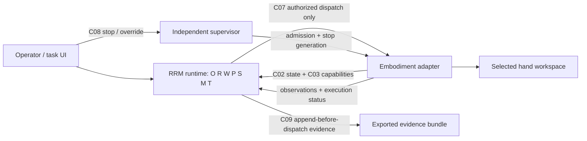

# RRM SIL integration plan

Status: implementation plan as of 2026-09-17. This turns the SCRUM-8 logical
allocation into an ordered, testable integration programme. It does not grant RRM
control authority or mark SCRUM-8 complete.

## Starting point and non-negotiable boundary

AirStack and RRM have proven **one-way observation compatibility**: the committed
shadow observer reads canonical MAVROS odometry/state, `map -> base_link` TF, and
AirStack task status, and observed a user/GCS-initiated takeoff and land. It created no
action client, publisher, service client, trajectory, or PX4 command. That is not yet
bidirectional RRM communication and must not be described as it.

The current AirStack drone/PX4 scene is useful for transport, timing and telemetry
prototyping. It is not the CONOPS manipulation embodiment. Integrated RRM evaluation
therefore needs a selected simulated dexterous-hand workspace before task execution is
introduced. RRM keeps task-level intent, entities and authored action semantics
embodiment-independent; every coordinate, controller limit and protective action stays
inside the selected embodiment adapter.

Initial read-only asset discovery on 2026-09-17 found the running
`v0.20.8_isaac-sim` image but no local hand, dexterous-hand, Shadow Hand, Allegro, or
Franka USD asset under its standard local asset paths. This is not proof that an asset
is unavailable: the configured asset root is
`omniverse://airlab-nucleus.andrew.cmu.edu/NVIDIA/Assets/Isaac/5.1`, and the installed
Kit configuration enables Isaac's Franka extensions. The standalone Python environment
does not expose an `omni.client` module, so no Nucleus browse was attempted by starting
Kit or opening a scene. Phase 1 must query the configured asset source and controller
availability, then either select a suitable existing asset or explicitly scope/import a
versioned asset.

The live process inspection after the user intentionally started Isaac confirmed that
the active command is `example_one_px4_pegasus_launch_script.py` with a Pegasus Iris
and PX4 backend. It is an aerial transport baseline, not a latent manipulation scene;
do not modify it in place. The image contains Isaac robot-motion/Lula infrastructure,
but that establishes only controller framework availability, not a compatible hand asset
or a validated manipulation controller. A separate, controlled hand-scene launch is
required after the Phase-1 selection record is complete.

No RRM route to live hardware, PX4, AirStack task action, trajectory topic, service or
actuator publisher is added before the relevant phase's acceptance criteria are met and
the user authorizes that controlled change.

## Target integration shape

Start as one RRM runtime process rather than splitting every logical responsibility
into a ROS node. The interfaces—not process count—are the architecture boundary. The
embodiment adapter is the only component that knows ROS transport, scene frames,
resources, controller commands and physical safe-state semantics.

The safety/permission authority (`S`) owns the only dispatch admission point. It binds
the exact action digest, state, capability, permission, approval, constraint, authority
epoch and stop generation. The adapter must independently reject stale generations and
deduplicate a `dispatch_id`; a local RRM lock alone is insufficient.

## Work packages and gates

| Phase | Deliverable | Implementation scope | Exit criteria |
| --- | --- | --- | --- |
| 0. Freeze the baseline | Reproducible shadow baseline | Record source/image hashes, container mounts, live topic inventory and exported evidence location. Preserve the current observer-only tests and GCS takeoff/land record. | Clean regression suite; source and raw evidence persisted outside the ephemeral workflow. |
| 1. Select the actual SIL embodiment | Hand-workspace decision record and capability profile | Evaluate available Isaac hand assets/controllers against S01's contextual two-step task, observation access, measurable safe condition, reset determinism and stop behavior. Define semantic resources/actions and explicitly reject unsupported operations. | A selected hand/controller can reset deterministically, publish required observations, support a bounded task, and report a testable safe state. |
| 2. Make C01–C05 executable in shadow | Task/context/state/plan pipeline | Add versioned task request, clarification/approval, three-valued state evidence, capability/feasibility, interpreted intent and versioned plan records. Keep action output in `PROPOSED`; no ROS execution request exists. | S01–S05 run against the simulator/mock adapter with immutable correlation IDs, stale/unknown data blocking progress, and complete evidence records. |
| 3. Build the conforming adapter | C02/C03/C07 observation and dry-run adapter | Map scene observations to state snapshots; map an abstract action only to a typed grounded-command proposal. Add numeric feasibility, resource reservations, command-adjustment reporting, dispatch deduplication and status reconciliation. Dry-run accepts nothing physical. | Grounding never fabricates a pose; unsupported/stale/unknown cases are rejected; S02, S04 and S10 pass in dry-run. |
| 4. Implement independent supervision | C06/C08 supervisor and safe-state proof | Implement permission/approval validation, single-use admission, expiry, stop generation, independent cancellation and reset. Define adapter-specific `received`, `cancel_accepted`, `motion_stopped`, and `safe_confirmed` evidence. | S05 and all S06 injections pass: no new admission after stop, stalled reasoner cannot block stop, and missing acknowledgement is `SAFE_UNCONFIRMED`. |
| 5. Controlled simulated execution | Narrow C07 command path | Enable only the selected hand simulator adapter, only the declared verb/resource profile, only after C06 admission. Numeric validation occurs after grounding and before each motion chunk. Monitor verifies effects from fresh observations. | S01, S02, S07 and S08 pass with generated evidence; every dispatch has one allow decision and one resolved outcome. No drone/PX4 authority is added. |
| 6. Measurement campaign | Frozen S01–S10 protocol | Freeze scenes, seeds, run configuration, metrics and acceptance rules; run deterministic Oracle then matched model candidates. Include 30 seeds per supported profile and three repetitions for stochastic models. | Bundles replay causally; numerator/denominator, confidence intervals, latency percentiles and all failures are reported. Safety failures remain disqualifying. |
| 7. Portability and expansion | Second actual embodiment and model comparison | Reuse the task-level core unchanged with a second adapter/profile; then compare candidate reasoners/policies under identical inputs and resources. | S09 demonstrates unchanged core/semantics hashes and capability-dependent outcomes. Model reports identify revision, license, precision, resource use and failure modes. |

## Concrete implementation order

1. Create a feature notebook and a dedicated RRM integration branch; retain the current
   Oracle, contract and shadow tests as required regressions.
2. Inspect the live Isaac installation and installed assets, then choose the hand scene
   with a short feasibility matrix. Do not silently substitute Panda or reuse the drone.
3. Define a versioned adapter profile: embodiment ID; operation semantic revision;
   resources and availability; typed limit reference; observation channels/freshness;
   stop/observe support; safe-state predicate; reset procedure.
4. Serialize C01–C05 in Python first, with JSON Schema and deterministic unit tests;
   use ROS message/action definitions only after payload semantics and causal identifiers
   are stable.
5. Implement an adapter in observation/dry-run mode. It emits C02/C03 and receives C07
   proposals but never forwards a command to the controller.
6. Add C09 evidence before dispatch: task/context revisions, snapshots and provenance,
   profile/feasibility, plan, safety decision, admission, command digest, status,
   effect comparison, recovery and intervention must be causally linked.
7. Implement the supervisor and test stop/cancel/reset independently from planning.
   Then conduct a controlled review before adding the sole simulator command publisher.
8. Add the physical simulator command path behind the adapter's stale-generation,
   deduplication and numeric checks. Start with one action at a time and an explicitly
   bounded scene; no live drone path is in scope.
9. Run the frozen deterministic campaign before downloading or selecting learned models.
   A candidate model is a replaceable R/P/E proposal source, never a safety authority.

## Required contract-to-runtime mapping

| Contract | First runtime component | Must block when |
| --- | --- | --- |
| C01 Task / interaction | operator/task boundary | authority, clarification or scoped approval is missing/stale |
| C02 State snapshot | world/task state | required evidence is stale, missing, contradictory or UNKNOWN |
| C03 Capability / feasibility | embodiment profile + planner | operation/resource/limits/grounding/stop channel is unavailable or unknown |
| C04 Reasoning result | reasoner | intent is ambiguous, ungrounded or unsupported |
| C05 Plan proposal | planner | action semantics, dependencies, feasibility or effect window are invalid |
| C06 Safety decision | independent supervisor | context changes, allow expires, a decision was consumed, or stop generation changes |
| C07 Dispatch / status | adapter | decision/action digest is detached, duplicate or stale; adapter acceptance is absent |
| C08 Stop / reset | supervisor + adapter | safe state has not been independently confirmed |
| C09 Trace / manifest | evidence service | append-before-dispatch durability or causal reconstruction fails |

## Definition of done and explicit exclusions

SCRUM-8 design is complete only after the live requirements review confirms this
allocation and the selected embodiment/profile decisions. Integrated S01–S10 evidence
belongs to SCRUM-9; mock and drone-shadow successes do not close either item.

This plan excludes physical robots, PX4 task dispatch, direct trajectory control of the
current drone, automatic model downloads, model fine-tuning, and any safety bypass.
Those require separate user authorization and a relevant completed simulator gate.
