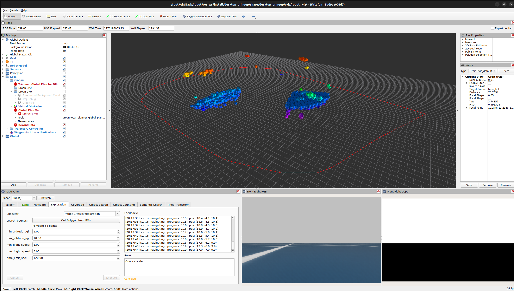
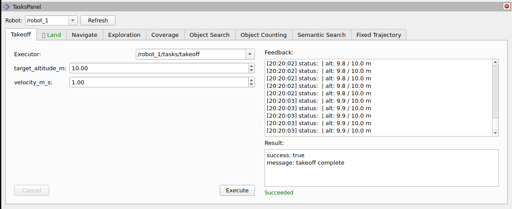
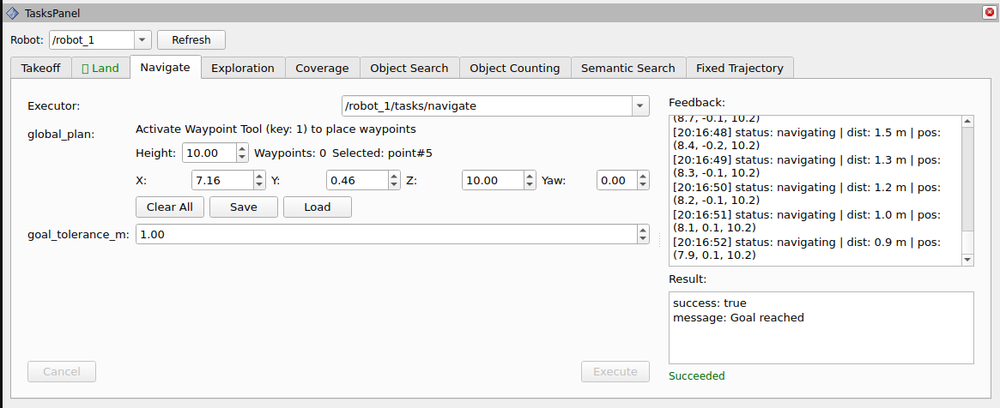

# RViz Tasks Panel

RViz2 panel plugin for dispatching and monitoring ROS 2 task
action goals. Provides a tabbed GUI where operators can
parameterize, execute, and cancel tasks on any discovered robot,
with live feedback and result display.





## Overview

The Tasks Panel replaces CLI-based action goal dispatch with a
graphical interface for all 9 AirStack task types. Each task type
gets its own tab with auto-generated parameter widgets, an
executor selector, and a feedback/result view.

The **Navigate** tab integrates directly with the
`waypoint_rviz2_plugin` package's shared `WaypointManager`
singleton, providing inline controls for placing, editing,
saving/loading, and executing waypoint-based navigation -- no
separate waypoint panel needed.

```text
+-----------------------------------------------------+
|  Tasks Panel                      Robot: [robot_1]   |
+-----------------------------------------------------+
| [Takeoff] [Land] [Navigate] [Exploration] [Coverage] |
+-----------------------------------------------------+
|  +- Goal Parameters -----+  +- Feedback & Result -+ |
|  | Executor: [/robot1/..] |  | Feedback:           | |
|  | Height: [2.0]  Wp: 3   |  | [live stream]       | |
|  | X:[1] Y:[2] Z:[2] Y:[0]|  |                     | |
|  | [Clear] [Save] [Load]  |  | Result:             | |
|  | goal_tolerance_m: [1.0] |  | [goal outcome]      | |
|  | [Cancel]     [Execute]  |  |                     | |
|  +-------------------------+  +---------------------+ |
+-----------------------------------------------------+
```

## Features

- **9 task tabs** with auto-generated goal parameter widgets
- **Executor discovery** -- scans ROS 2 topics every 5 seconds
  to find running action servers
- **Robot namespace selector** -- auto-populated from discovered
  action server namespaces
- **Polygon input** -- integrates with
  `rviz_polygon_selection_tool` to capture 3D polygon selections
- **Integrated waypoint controls** -- the Navigate tab embeds
  waypoint management (height, X/Y/Z/Yaw editing, Clear, Save,
  Load) via the shared `WaypointManager` singleton from
  `waypoint_rviz2_plugin`
- **Fixed Trajectory editor** -- type dropdown with
  auto-populated default attributes in an editable key-value
  table
- **Live feedback** -- timestamped feedback messages stream in
  real time
- **Result display** -- color-coded status (green = succeeded,
  red = aborted, orange = canceled)
- **Config persistence** -- robot and executor selections are
  saved/restored with the RViz config
- **Single-task lock** -- only one action may execute at a time
  to prevent conflicts
- **Airborne-only tasks** -- Land, Navigate, and all mission
  tasks are disabled until the drone is airborne (subscribes to
  `is_airborne` from `takeoff_landing_planner`); Takeoff is
  always available while idle

## Supported Task Types

Tasks marked **airborne-only** are disabled until the drone is
in the air.

| Tab | Action Type | Key Parameters | Airborne-only |
|-----|-------------|----------------|---------------|
| Takeoff | `TakeoffTask` | `target_altitude_m`, `velocity_m_s` | |
| Land | `LandTask` | `velocity_m_s` | ✓ |
| Navigate | `NavigateTask` | `global_plan` (Path), `goal_tolerance_m` | ✓ |
| Exploration | `ExplorationTask` | `search_bounds` (Polygon), altitude/speed, `time_limit_sec` | ✓ |
| Coverage | `CoverageTask` | `coverage_area` (Polygon), `line_spacing_m`, `heading_deg` | ✓ |
| Semantic Search | `SemanticSearchTask` | `query`, `search_area`, `confidence_threshold`, `target_count` | ✓ |
| Chat | `ChatTask` | `text`, `images` (file upload) | |
| Fixed Trajectory | `FixedTrajectoryTask` | `trajectory_spec`, `loop` | ✓ |

## Widget Type Mapping

| ROS Type | Widget | Notes |
|----------|--------|-------|
| `float32`/`float64` | `QDoubleSpinBox` | Range from registry |
| `int32` | `QSpinBox` | Range from registry |
| `string` | `QLineEdit` | Free-text input |
| `bool` | `QCheckBox` | Toggle |
| `geometry_msgs/Polygon` | `QPushButton` | Calls `get_selection` service |
| `nav_msgs/Path` | Waypoint controls | Inline height/pose/buttons via WaypointManager |
| `airstack_msgs/FixedTrajectory` | `QComboBox` + `QTableWidget` | Type + attributes |

## Dependencies

- `rviz_common` -- RViz2 panel base class
- `pluginlib` -- plugin loading
- `rclcpp` / `rclcpp_action` -- ROS 2 node and action client
- `task_msgs` -- action definitions for all 9 task types
- `airstack_msgs` -- `FixedTrajectory` message
- `geometry_msgs` / `nav_msgs` / `std_msgs` -- standard message types
- `diagnostic_msgs` / `action_msgs` -- status introspection
- `rviz_polygon_selection_tool` -- polygon selection service
- `waypoint_rviz2_plugin` -- shared `WaypointManager` singleton
- Qt5 (Core, Widgets, Gui)

## Build

```bash
colcon build --packages-select waypoint_rviz2_plugin rviz_tasks_panel
```

## Usage

1. Launch RViz2
2. Go to **Panels > Add New Panel**
3. Select **rviz_tasks_panel / TasksPanel**
4. The panel auto-discovers running task action servers and
   populates the Robot dropdown
5. Select a tab, configure goal parameters, and click **Execute**
6. Monitor feedback in the right pane; click **Cancel** to abort

### Waypoint Navigation (Navigate tab)

1. Activate the **Waypoint Tool** (key **1**) in the RViz toolbar
2. Left-click in the 3D viewport to place waypoints
3. In the Navigate tab, adjust **Default Height**, or edit the
   selected waypoint's **X/Y/Z/Yaw** spinboxes
4. Use **Save** / **Load** to persist waypoints as `.db3` files
5. Use **Clear All** to remove all waypoints
6. Set **goal_tolerance_m** and click **Execute** to navigate

### Polygon Selection

For tasks requiring a polygon boundary:

1. Activate the **Polygon Selection Tool** in the toolbar
2. Draw a polygon in the 3D viewport
3. Click **Get Polygon from RViz** in the relevant task tab

### Fixed Trajectory

1. Select a trajectory type from the dropdown
2. Edit default attributes in the key-value table
3. Click **Execute**

## Executor Discovery

The panel scans `get_topic_names_and_types()` for topics matching
`*/<action_topic_suffix>/_action/status`. For each match, it
extracts the robot namespace and populates:

- The top-level **Robot** dropdown
- Each tab's **Executor** dropdown

Discovery runs every 5 seconds and can be triggered manually with
the **Refresh** button.

## Architecture

- **Compile-time task registry**: `getTaskDefs()` returns a
  static vector of `TaskTypeDef` structs defining all task types
- **Shared waypoint state**: The Navigate tab holds a
  `shared_ptr<WaypointManager>` (singleton from
  `waypoint_rviz2_plugin`), the same instance used by
  `WaypointTool` for 3D mouse interaction
- **Type-erased action clients**: `std::any` stores templated
  `rclcpp_action::Client` instances per tab
- **Thread safety**: ROS 2 callbacks use
  `QMetaObject::invokeMethod` with `Qt::QueuedConnection` to
  marshal UI updates to the Qt main thread
- **Airborne gate**: subscribes to `{robot}/is_airborne`
  (std_msgs/Bool from `takeoff_landing_planner`); per-tab Execute
  buttons are enabled only when `task_idle && airborne_ok`, where
  `airborne_ok = !requires_airborne || is_airborne_`

## License

MIT -- Carnegie Mellon University
