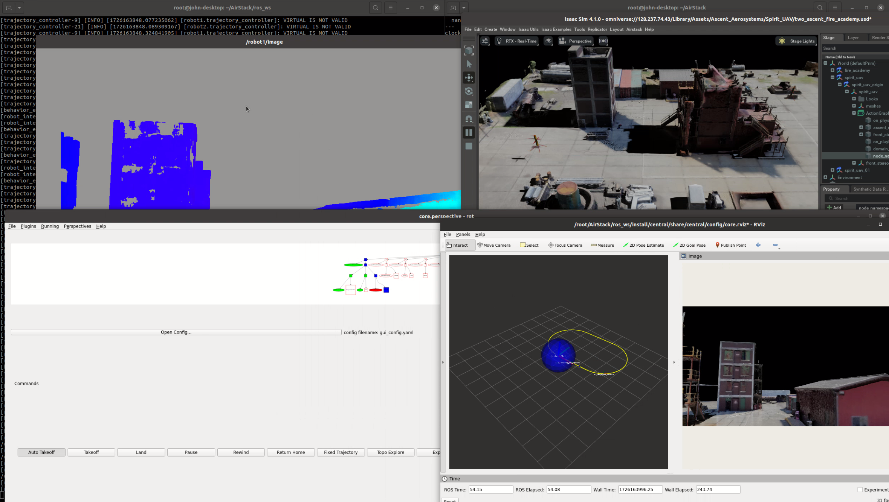

# AirStack Boilerplate

Welcome to the AirStack Boilerplate! This repository template serves to kickstart the development of your own robotics autonomy stack. You're encouraged to customize your version in any way to best suit your project's needs.

This boilerplate is maintained by the [AirLab](https://theairlab.org) at Carnegie Mellon University's Robotics Institute.

Please head to our [Getting Started](getting_started.md) page to start.

*AirStack*

