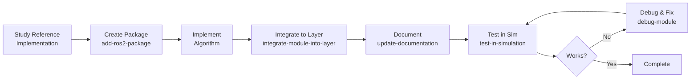

# AI Agent Quick Reference Guide

This guide provides a concise reference for AI agents working with AirStack. For comprehensive documentation, see [AGENTS.md](../../AGENTS.md).

## Quick Start

1. **Understand the architecture:** Review [System Architecture](../robot/autonomy/system_architecture.md)
2. **Choose a workflow:** Select appropriate skill from [.agents/skills/](../../.agents/skills/)
3. **Follow the skill:** Execute step-by-step instructions
4. **Test and document:** Verify functionality and update docs

## Common Tasks

| Task | Skill | Time Estimate |
|------|-------|---------------|
| Add new planner | [add-ros2-package](../../.agents/skills/add-ros2-package) → [integrate-module-into-layer](../../.agents/skills/integrate-module-into-layer) | 2-4 hours |
| Debug module | [debug-module](../../.agents/skills/debug-module) | 30 min - 2 hours |
| Create test scenario | [write-isaac-sim-scene](../../.agents/skills/write-isaac-sim-scene) | 1-2 hours |
| Add behavior tree node | [add-behavior-tree-node](../../.agents/skills/add-behavior-tree-node) | 1-3 hours |
| Update documentation | [update-documentation](../../.agents/skills/update-documentation) | 30 min - 1 hour |

## Development Workflow



## Essential Commands

### Container Management
```bash
# Start robot container (no autolaunch)
AUTOLAUNCH=false airstack up robot-desktop

# Build specific package
docker exec airstack-robot-desktop-1 bash -c "bws --packages-select <package>"

# Source workspace
docker exec airstack-robot-desktop-1 bash -c "sws"

# Run launch file
docker exec airstack-robot-desktop-1 bash -c "sws && ros2 launch <package> <launch_file>"
```

### Debugging
```bash
# Check if node is running
docker exec airstack-robot-desktop-1 bash -c "ros2 node list | grep <node>"

# Check topic connections
docker exec airstack-robot-desktop-1 bash -c "ros2 topic hz <topic>"
docker exec airstack-robot-desktop-1 bash -c "ros2 topic echo <topic> --once"

# View logs
docker logs airstack-robot-desktop-1 2>&1 | grep -i <module>
```

### Testing
```bash
# Launch full stack with simulation
airstack up isaac-sim robot

# Record test data
docker exec airstack-robot-desktop-1 bash -c "ros2 bag record -a -o /tmp/test"
```

## Key Concepts

### Layered Architecture
- **Interface:** Hardware abstraction
- **Sensors:** Sensor processing
- **Perception:** State estimation
- **Local:** Reactive planning & control
- **Global:** Strategic planning & mapping
- **Behavior:** Mission execution

### Topic Naming Convention
```
/[robot_name]/[layer]/[module]/[data_type]
```

Example: `/drone1/local_planner/droan/trajectory`

### Standard Topics
- `/[robot]/odometry` - State estimate
- `/[robot]/global_plan` - Path from global planner
- `/[robot]/trajectory_controller/trajectory_segment_to_add` - Local trajectory
- `/[robot]/trajectory_controller/look_ahead` - Tracking reference

See [Integration Checklist](../robot/autonomy/integration_checklist.md) for complete list.

## Integration Checklist

Quick checklist when adding a module:

- [ ] Package in correct layer directory
- [ ] `package.xml` with all dependencies
- [ ] CMakeLists.txt / setup.py configured
- [ ] Launch file with topic remapping
- [ ] Config file with parameters
- [ ] README.md with documentation
- [ ] Added to layer bringup
- [ ] Added to mkdocs.yml navigation
- [ ] Tested standalone
- [ ] Tested in full stack
- [ ] Tested in simulation

Full details: [Integration Checklist](../robot/autonomy/integration_checklist.md)

## Reference Implementations

Study these before implementing similar modules:

| Module Type | Reference | Location |
|------------|-----------|----------|
| Local Planner | DROAN | `robot/ros_ws/src/local/planners/droan_local_planner` |
| Controller | Trajectory Controller | `robot/ros_ws/src/local/c_controls/trajectory_controller` |
| World Model | Disparity Expansion | `robot/ros_ws/src/local/world_models/disparity_expansion` |
| Global Planner | Random Walk | `robot/ros_ws/src/global/planners/random_walk` |
| Behavior Node | Example Actions | `robot/ros_ws/src/behavior/behavior_tree_example` |

## Autonomous Debugging Strategy

When a module doesn't work:

1. **Verify node is running:** `ros2 node list`
2. **Check topic connections:** `ros2 topic info <topic>`
3. **Check data flow:** `ros2 topic hz <topic>`
4. **Inspect data quality:** `ros2 topic echo <topic> --once`
5. **Check parameters:** `ros2 param list <node>`
6. **Review logs:** `docker logs airstack-robot-desktop-1`
7. **Compare with reference:** Study working similar module
8. **Add instrumentation:** Debug publishers/logging
9. **Create minimal test:** Isolate the problem

Full strategy: [debug-module skill](../../.agents/skills/debug-module)

## Package Template

Use the template when creating new packages:

**Location:** `../../.agents/skills/add-ros2-package/assets/package_template/`

**Includes:**

- `package.xml` - Dependency template
- `CMakeLists.txt` - C++ build template
- `setup.py` - Python build template
- `config/template.yaml` - Parameter template
- `launch/template.launch.xml` - Launch template
- `README.md` - Documentation template
- Example C++ and Python nodes

## Documentation Standards

### Module README Structure
1. Overview
2. Algorithm description
3. Architecture diagram (mermaid)
4. Dependencies
5. Interfaces (topics, services, parameters)
6. Configuration
7. Usage
8. Testing
9. Known issues

### Update mkdocs.yml
Add module README to navigation:
```yaml
nav:
  - Robot:
      - Autonomy Modules:
          - <Layer>:
              - Your Module:
                  - robot/ros_ws/src/<layer>/<module>/README.md
```

Full documentation workflow: [update-documentation skill](../../.agents/skills/update-documentation)

## Common Pitfalls

### Build Issues
- ❌ Missing dependencies in `package.xml`
- ❌ Not installing launch/config in `CMakeLists.txt`
- ✅ Check `colcon build` output for errors

### Runtime Issues
- ❌ Hardcoded topic names
- ❌ Missing `$(env ROBOT_NAME)` in launch files
- ❌ Parameters not loading (missing `allow_substs="true"`)
- ✅ Use launch arguments for all topics

### Integration Issues
- ❌ Not adding module to bringup package
- ❌ Not updating bringup `package.xml` dependencies
- ✅ Follow [integrate-module-into-layer](../../.agents/skills/integrate-module-into-layer)

### Documentation Issues
- ❌ Not updating `mkdocs.yml`
- ❌ Broken links in README
- ✅ Test docs with `airstack docs`

## Performance Guidelines

### Update Rates
- Interface: 50 Hz
- Sensors: 15-30 Hz  
- Perception: 20-30 Hz
- Local Planning: 10 Hz
- Controllers: 50 Hz
- Global Planning: 1 Hz
- Behavior: 10 Hz

### Resource Targets
- CPU: <20% per module (desktop)
- Memory: <500 MB per module
- Latency: <100 ms (local), <500 ms (global)

## Links

### Primary References
- [AGENTS.md](../../AGENTS.md) - Main agent guide
- [System Architecture](../robot/autonomy/system_architecture.md) - Architecture diagrams
- [Integration Checklist](../robot/autonomy/integration_checklist.md) - Integration requirements

### Skills
- [add-ros2-package](../../.agents/skills/add-ros2-package)
- [integrate-module-into-layer](../../.agents/skills/integrate-module-into-layer)
- [write-isaac-sim-scene](../../.agents/skills/write-isaac-sim-scene)
- [debug-module](../../.agents/skills/debug-module)
- [update-documentation](../../.agents/skills/update-documentation)
- [test-in-simulation](../../.agents/skills/test-in-simulation)
- [add-behavior-tree-node](../../.agents/skills/add-behavior-tree-node)

### Package Template
- [../../.agents/skills/add-ros2-package/assets/package_template/](../../../../.agents/skills/add-ros2-package/assets/package_template/)

### ROS 2 Documentation
- [ROS 2 Jazzy](https://docs.ros.org/en/jazzy/)
- [Creating Packages](https://docs.ros.org/en/jazzy/Tutorials/Beginner-Client-Libraries/Creating-Your-First-ROS2-Package.html)
