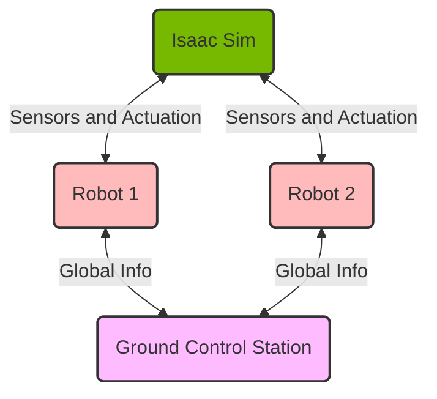

# Launch Workflow with Docker and Docker Compose

At its core, the `airstack` CLI is simply a wrapper around Docker Compose. `airstack up` is equivalent to `docker compose up -d`, and `airstack down` is equivalent to `docker compose down`.

Docker Compose is useful to mimic interacting with multiple robots in a simulated environment, such as Isaac Sim, while isolating each robot's environment and the ground control station.

The details of the docker compose setup is in the project root's `docker-compose.yaml`.

In essence, the compose file launches:

- Isaac Sim
- ground control station
- robots

all get created on the same default Docker bridge network.
This lets them communicate with ROS2 on the same network.

Each robot has its own ROS_DOMAIN_ID, which is extracted from the container name, e.g. `airstack-robot-1` has `ROS_DOMAIN_ID=1`. See the robot `.bashrc` for details.

## Pull Images

To use the AirLab docker registry:

```bash
cd AirStack/
docker login airlab-storage.andrew.cmu.edu:5001
## <Enter your andrew id (without @andrew.cmu.edu)>
## <Enter your andrew password>

## Pull the images in the docker compose file
docker compose pull
```

The available image tags are listed [here](https://airlab-storage.andrew.cmu.edu:5001/v2/shared/airstack/tags/list).

## Build Images From Scratch

```bash
docker compose build
```

## Start, Stop, and Remove

Start

```bash
airstack up  # or equivalently: docker compose up -d

# see running containers
airstack status  # or equivalently: docker ps -a
```

Remove

```bash
airstack down  # or equivalently: docker compose down
```

Launch only specific services:

```bash
# only robot
airstack up robot  # or equivalently: docker compose up robot -d
# only isaac
airstack up isaac-sim  # or equivalently: docker compose up isaac-sim -d
# only ground control station
airstack up gcs  # or equivalently: docker compose up gcs -d
```


### Isaac Sim

Start a bash shell in the Isaac Sim container:

```bash
# if the isaac container is already running, execute a bash shell in it
airstack connect isaac-sim  # or equivalently: docker exec -it isaac-sim bash
```

Within the isaac-sim Docker container, the alias `runapp` launches Isaac Sim.
The `--path` argument can be passed with a path to a `.usd` file to load a scene.

It can also be run in headless mode with `./runheadless.native.sh` to stream to [Omniverse Streaming Client](https://docs.omniverse.nvidia.com/streaming-client/latest/user-manual.html) or `./runheadless.webrtc.sh` to [stream to a web browser](https://docs.omniverse.nvidia.com/extensions/latest/ext_livestream/webrtc.html).

The container also has the isaacsim ROS2 package within that can be launched with `ros2 launch isaacsim run_isaacsim.launch.py`.

### Robot

Start a bash shell in a robot container, e.g. for robot_1:

```bash
airstack connect robot  # or equivalently: docker exec -it airstack-robot-1 bash
```

To launch more than one robot, prepend with the `NUM_ROBOTS=[NUM]` environment variable, e.g. to launch 2 robots (along with the ground control station and Isaac Sim):
```bash
NUM_ROBOTS=2 airstack up
airstack connect robot-1  # to connect to robot 1
airstack connect robot-2  # to connect to robot 2
```

The previous `docker compose up` launches robot_bringup in a tmux session. To attach to the session within the docker container, e.g. to inspect output, run `tmux a`.

The following commands are available within the robot container:

```bash
# in robot docker
cws  # cleans workspace
bws  # builds workspace
bws --packages-select [your_packages] # builds only desired packages
sws  # sources workspace
ros2 launch robot_bringup robot.launch.xml  # top-level launch
```

These aliases are defined in `AirStack/robot/.bashrc`.

Each robot has `ROS_DOMAIN_ID` set to its ID number. `ROBOT_NAME` is set to `robot_$ROS_DOMAIN_ID`.

### Ground Control Station

Currently the ground control station uses the same image as the robot container. This may change in the future.

Start a bash shell in a robot container:

```bash
airstack connect gcs  # or equivalently: docker exec -it ground-control-station bash
```

The available aliases within the container are currently the same.

On the GCS `ROS_DOMAIN_ID` is set to 0.

## SSH into Robots

The containers mimic the robots' onboard computers on the same network. Therefore we intend to interface with the robots through ssh.

The `ground-control-station` and `docker-robot-*` containers are setup with ssh daemon, so you can ssh into the containers using the IP address.

You can get the IP address of each container by running the following command:

```bash
docker inspect -f '{{range.NetworkSettings.Networks}}{{.IPAddress}}{{end}}' [CONTAINER-NAME]
```

Then ssh in, for example:

```bash
ssh root@172.18.0.6
```

The ssh password is `airstack`.

## Container Details



## Automated Testing

To perform automated tests for the configured packages, please use the `autotest` service which
extends the `robot` service with testing specific commands. Presently only `takeoff_landing_planner`
is configured to be tested.

```bash
# On your development PC, do:

docker compose up autotest
```

This command will spin up a `robot` container, build the ROS2 workspace, source the workspace and run all the configured tests for the provided packages using `colcon test`. Excessive output log from the build process is presently piped away to preserve readability.

## Docker Compose Variable Overrides
As mentioned above, the `airstack` CLI is a wrapper around Docker Compose.
Therefore, it supports [variable interpolation](https://docs.docker.com/compose/how-tos/environment-variables/variable-interpolation/) in the `docker-compose.yaml` file, allowing you to adjust project settings by modifying environment variables.

For example, to disable playing the simulation on startup, you can set the `PLAY_SIM_ON_START` variable to `false`:
```bash
PLAY_SIM_ON_START=false airstack up 
```

To change the Isaac Sim scene:
```bash
ISAAC_SIM_SCENE=path/to/your_scene.usd airstack up
```

To disable autolaunching the stack and simply spawn idle docker containers (useful for debugging):
```bash
AUTOLAUNCH=false airstack up
```

A list of all available environment variables is in the default `.env` file in the project root directory, which allows specifying all the variables in one place.
When no `--env-file` argument is passed to `docker compose`, it automatically uses this default `.env` file.

The default `.env` file is reproduced below:
```bash
--8<-- ".env"
```

To override the default `.env` file, you can pass the `--env-file` argument with the syntax `airstack --env-file [env_file] up` (or `docker compose --env-file [env_file] up -d`).

Multiple `--env-file` arguments can be passed to compose overriding sets of `variables.env` files.
All subsequent `--env-file` arguments override the previous ones, allowing you to layer configurations.
