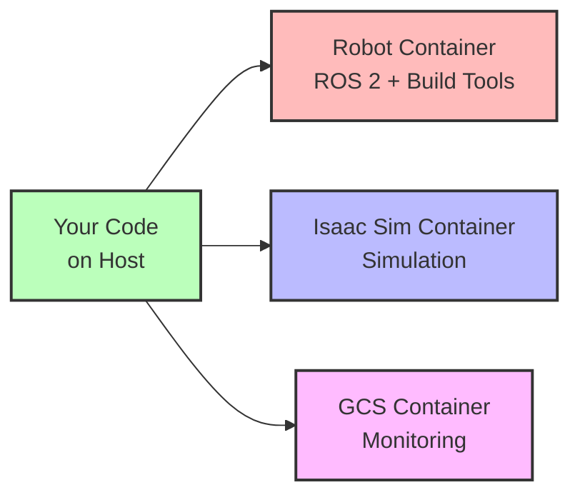
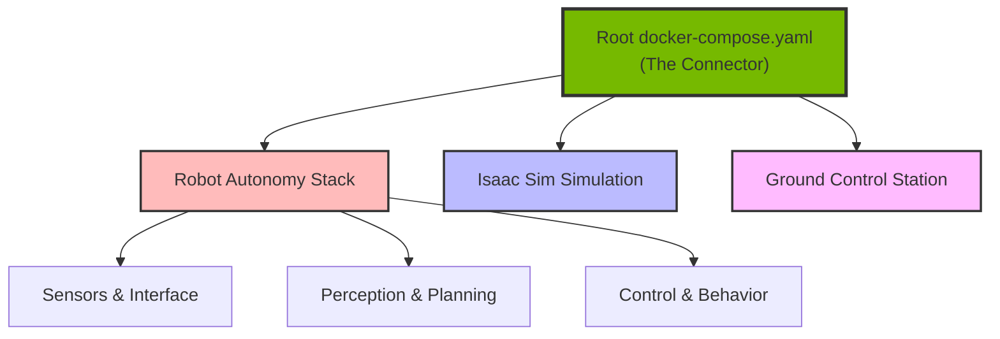

# Key Concepts

Understanding a few core concepts will help you work effectively with AirStack. This document provides the essential mental models to the AirStack way of doing things.

## The AirStack Philosophy

### CLI-First Development

AirStack development centers around the **`airstack` CLI tool** - your single interface for all development tasks.

```bash
airstack up           # Launch the system
airstack connect robot # Jump into a container
airstack down         # Shut everything down
```

!!! tip "First Step"
    Run `airstack setup` after installation to add the CLI to your PATH.

**Why a CLI?** It provides consistency and simplicity. Under the hood, it's a lightweight wrapper around Docker Compose, so you can always drop down to `docker compose` commands if needed.

**Learn more:** [CLI Command Reference](airstack-cli/index.md)

### Containerized Everything

**All development happens inside Docker containers.** This isn't just a deployment detail - it's how you develop, build, and test your code every day.



**Why containers?**

- **Reproducible**: Everyone has the same environment
- **Isolated**: Doesn't mess with your host system
- **Multi-robot ready**: Run multiple robots on one machine
- **Dev-prod parity**: Same containers in simulation and on real hardware

**Learn more:** [Docker Workflow Details](airstack-cli/docker_usage.md)

## How AirStack is Composed

Think of AirStack as a set of **Lego blocks** that snap together through Docker Compose:



When you run `airstack up`, here's what happens:

1. **Root compose file** (`docker-compose.yaml`) includes all component-specific compose files:
   ```yaml
   include:
     - simulation/isaac-sim/docker/docker-compose.yaml
     - robot/docker/docker-compose.yaml
     - gcs/docker/docker-compose.yaml
   ```

2. **Shared network** connects all containers (subnet `172.31.0.0/24`)

3. **Independent launch** - each component's `command:` attribute starts its main process:
   - **Robot**: Builds workspace → Launches ROS 2 autonomy stack
   - **Isaac Sim**: Starts simulation with your scene
   - **GCS**: Launches monitoring interface

This modular design means you can:

- Launch only what you need: `airstack up robot-desktop` (skip simulation)
- Swap components easily (different planners, different simulators)
- Scale to multiple robots: `NUM_ROBOTS=3 airstack up`

**Learn more:** [Docker Compose Architecture](airstack-cli/docker_usage.md#container-details)

## Multi-Robot by Design

AirStack assumes you might have multiple robots, even in development. Each robot container gets:

- **Unique ID**: `ROS_DOMAIN_ID` extracted from container name (e.g., `robot-1` → `ROS_DOMAIN_ID=1`)
- **Unique namespace**: All topics under `/{robot_name}/`
- **Isolated environment**: Own workspace, own state
- **Shared network**: Can communicate with other robots and GCS

```bash
# Launch 3 robots
NUM_ROBOTS=3 airstack up

# Connect to specific robot
airstack connect robot-1
airstack connect robot-2
```

Each robot runs independently but can coordinate through the shared ROS 2 network.

## The Development Loop

Here's what a typical development session looks like:

```bash
# 1. Start containers (without auto-launching the stack)
AUTOLAUNCH=false airstack up robot-desktop

# 2. Connect to the robot container
airstack connect robot

# 3. Build your changes
bws --packages-select my_package  # within container

# 3. Launch and test
sws && ros2 launch my_package my_launch.xml   # within container

# 4. Iterate...

# 5. When done, detach and shut down
Ctrl-b, d  # Detach from tmux session
airstack down
```

**Bash aliases within the robot container:**

- `bws` = build workspace (alias for `colcon build`)
- `sws` = source workspace (alias for `source install/setup.bash`)
- `cws` = clean workspace and reset variables 

**Learn more:** [Development Environment Setup](development_environment.md)

## Configuration: Environment Variables

AirStack uses environment variables for configuration, following Docker Compose patterns.

**Default settings** (`.env` file):
```bash
DOCKER_IMAGE_TAG=latest
AUTOLAUNCH=true
NUM_ROBOTS=1
ISAAC_SIM_SCENE=simulation/isaac-sim/scenes/two_drone_RetroNeighborhood.usd
```

**Runtime overrides**:
```bash
# Don't auto-launch (useful for development)
AUTOLAUNCH=false airstack up

# Different scene
ISAAC_SIM_SCENE=my_scene.usd airstack up

# Custom env file
airstack --env-file custom.env up
```

You can layer multiple env files to compose configurations.

## What Makes AirStack Different

If you're coming from other robotics frameworks, here's what's unique:

1. **CLI-first**: One command for everything, no hunting for scripts
2. **Docker-native**: Containers aren't optional, they're the development environment
3. **Modular composition**: Components compose via Docker, not monolithic builds
4. **Multi-robot from day one**: Built for fleets, works great for single robots too
5. **Simulation-first**: Develop and test in Isaac Sim before hardware

## Next Steps

Now that you understand the philosophy:

1. **[Set up your environment](development_environment.md)** - Get your IDE and tools ready
2. **[CLI deep dive](airstack-cli/index.md)** - Master all the commands
3. **[Docker workflow](airstack-cli/docker_usage.md)** - Understand container management
4. **[Fork your project](fork_your_own_project.md)** - Start building

!!! note "Remember"
    Everything flows through the `airstack` CLI → launches Docker Compose → starts containers → runs ROS 2 nodes. This pattern repeats everywhere in AirStack.
