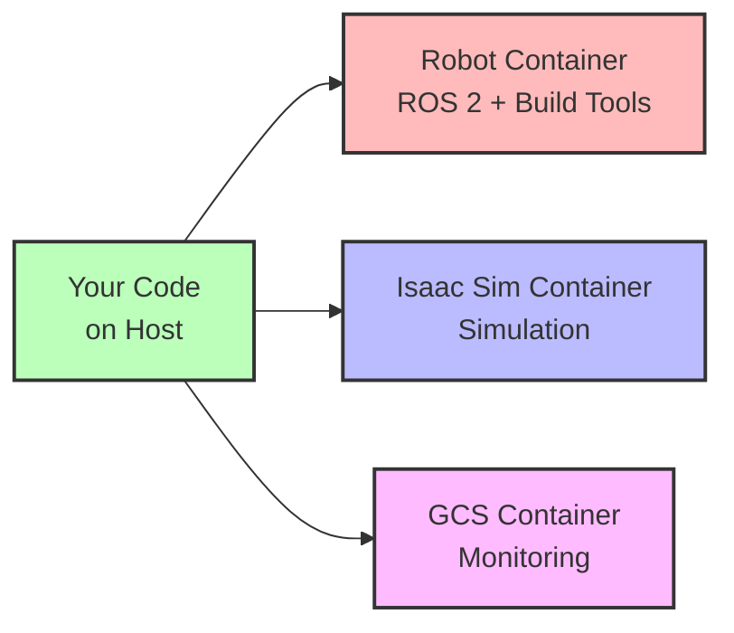
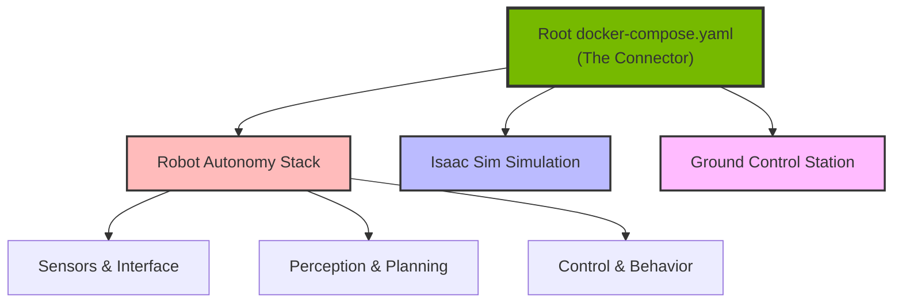

# Key Concepts

Understanding a few core concepts will help you work effectively with AirStack. This document provides the essential mental models to the AirStack way of doing things.

## The AirStack Philosophy

### CLI-First Development

AirStack development centers around the **`airstack` CLI tool** - your single interface for all development tasks.

```bash
airstack up           # Launch the system
airstack connect robot # Jump into a container
airstack down         # Shut everything down
```

!!! tip "First Step"
    Run `airstack setup` after installation to add the CLI to your PATH.

**Why a CLI?** It provides consistency and simplicity. Under the hood, it's a lightweight wrapper around Docker Compose, so you can always drop down to `docker compose` commands if needed.

**Learn more:** [CLI Command Reference](airstack-cli/index.md)

### Containerized Everything

**All development happens inside Docker containers.** This isn't just a deployment detail - it's how you develop, build, and test your code every day.


```mermaid
graph LR
    A[Your Code<br/>on Host] --> B[Robot Container<br/>ROS 2 + Build Tools]
    A --> C[Isaac Sim Container<br/>Simulation]
    A --> D[GCS Container<br/>Monitoring]
    
    style A fill:#bfb,stroke:#333,stroke-width:2px
    style B fill:#fbb,stroke:#333,stroke-width:2px
    style C fill:#bbf,stroke:#333,stroke-width:2px
    style D fill:#fbf,stroke:#333,stroke-width:2px
```

**Why containers?**

- **Reproducible**: Everyone has the same environment
- **Isolated**: Doesn't mess with your host system
- **Multi-robot ready**: Run multiple robots on one machine
- **Dev-prod parity**: Same containers in simulation and on real hardware

**Learn more:** [Docker Workflow Details](airstack-cli/docker_usage.md)

## How AirStack is Composed

AirStack simulates multiple separate machines (e.g. robots, GCS) that communicate with each other through Docker Compose:


```mermaid
graph TD
    A["Root docker-compose.yaml<br/>(The Connector)"] --> B[Robot Autonomy Stack]
    A --> C[Isaac Sim Simulation]
    A --> D[Ground Control Station]
    
    B --> B1[Sensors & Interface]
    B --> B2[Perception & Planning]
    B --> B3[Control & Behavior]
    
    style A fill:#76B900,stroke:#333,stroke-width:3px
    style B fill:#fbb,stroke:#333,stroke-width:2px
    style C fill:#bbf,stroke:#333,stroke-width:2px
    style D fill:#fbf,stroke:#333,stroke-width:2px
```

When you run `airstack up`, here's what happens:

1. **Root compose file** (`docker-compose.yaml`) includes all component-specific compose files:
   ```yaml
   include:
     - simulation/isaac-sim/docker/docker-compose.yaml
     - robot/docker/docker-compose.yaml
     - gcs/docker/docker-compose.yaml
   ```

2. **Shared network** connects all containers (subnet `172.31.0.0/24`)

3. **Independent launch** - each component's `command:` attribute starts its main process:
   - **Robot**: Builds workspace → Launches ROS 2 autonomy stack
   - **Isaac Sim**: Starts simulation with your scene
   - **GCS**: Launches monitoring interface

This modular design means you can:

- Launch only what you need: `airstack up robot-desktop` (skip simulation)
- Swap components easily (different planners, different simulators)
- Scale to multiple robots: `airstack up --fleet <name>` (or the simple knob `airstack up --robots 3`)

**Learn more:** [Docker Compose Architecture](airstack-cli/docker_usage.md#container-details)

## Stacks, Modules, and Fleets

Beyond containers, AirStack organizes the *autonomy software itself* into three composable concepts:

**Modules** are individual capabilities packaged as thin external repos — a planner, a sensor driver, an Isaac Sim scene library — each carrying a small `module.yaml` manifest. You pull them on demand with `airstack module add <url> --version <tag|sha>` (always pinned to a tag or SHA, never a branch); the CLI validates the manifest, mounts the module into the right containers, and `airstack module list` shows what you have. **Learn more:** [AirStack Modules](../modules.md)

**Stacks** are self-contained topology folders under `stacks/` that say which modules run and how they're wired together. Each stack has a pinned `modules.repos`, plain ROS 2 launch entry points (all cross-module wiring lives in the one entry launch file), and a CI-observed `wiring.md` — the system diagram, captured from the running graph rather than drawn by hand. `airstack up --stack <name>` launches one; with no `--stack`, the reference stack `full_default` launches. Never edit a reference stack — copy it with `airstack stack new full_default my_stack` and rewire the copy. **Learn more:** [AirStack Stacks](../stacks.md)

**Fleets** declare a whole deployment in one YAML file under `config/fleets/`: which robots exist, which vehicle each flies, which stack each runs, and which ground hosts run split-stack offboard halves. `airstack up --fleet <name>` validates the file, derives the robot count, and spawns everything — including heterogeneous fleets where each robot runs a different stack. **Learn more:** [AirStack Fleets](../fleets.md)

For the hands-on tour of all three — fly a reference stack, read its wiring, add a module, make your own stack, scale to a fleet — follow the [Modular AirStack Walkthrough](../../getting_started/modular_airstack.md).

## Multi-Robot by Design

AirStack assumes you might have multiple robots, even in development. Each robot container gets:

- **Unique ID**: `ROS_DOMAIN_ID` resolved from the container name (e.g., `airstack-robot-desktop-1` → `ROS_DOMAIN_ID=1`)
- **Unique namespace**: All topics under `/{robot_name}/`
- **Isolated environment**: Own workspace, own state
- **Shared network**: Can communicate with other robots and GCS

The **primary way** to run multiple robots is a **fleet file** (`config/fleets/*.yaml`) — it declares which robots exist, which vehicle each flies, and which stack each runs:

```bash
# Launch a fleet (robot count, vehicles, and stacks come from the fleet file)
airstack up --fleet sim_three_mixed --sim isaac

# Simple homogeneous alternative: N identical robots, no fleet file needed
airstack up --sim isaac --robots 3

# Connect to a specific robot (partial name matching against the real
# container names airstack-robot-desktop-1, -2, ...)
airstack connect robot-desktop-1
airstack connect robot-desktop-2
```

(`NUM_ROBOTS` in `.env` is the same homogeneous knob as `--robots` — fine for N identical robots, but fleets are the primary mechanism whenever robots differ.) Each robot runs independently but can coordinate through the shared ROS 2 network. See [AirStack Fleets](../fleets.md) for the full guide.

## The Development Loop

Here's what a typical development session looks like:

```bash
# 1. Start containers (without auto-launching the stack)
airstack up robot-desktop --no-autolaunch

# 2. Connect to the robot container
airstack connect robot

# 3. Build your changes
bws --packages-select my_package  # within container

# 3. Launch and test
sws && ros2 launch my_package my_launch.xml   # within container

# 4. Iterate...

# 5. When done, detach and shut down
Ctrl-b, d  # Detach from tmux session
airstack down
```

**Bash aliases within the robot container:**

- `bws` = build workspace (alias for `colcon build`)
- `sws` = source workspace (alias for `source install/setup.bash`)
- `cws` = clean workspace and reset variables 

**Learn more:** [Development Environment Setup](development_environment.md)

## Configuration: Environment Variables

AirStack uses environment variables for configuration, following Docker Compose patterns.

**Default settings** (`.env` file):
```bash
VERSION=latest
AUTOLAUNCH=true
NUM_ROBOTS=1
ISAAC_SIM_SCRIPT_NAME=example_one_px4_pegasus_launch_script.py
```

**Runtime overrides**:
```bash
# Pick the simulator and robot count without editing .env
airstack up --sim isaac --robots 3

# Different scene (launch scripts live in simulation/isaac-sim/launch_scripts/)
ISAAC_SIM_SCRIPT_NAME=my_scene_script.py airstack up

# Custom env file with overrides
airstack up --env-file overrides/custom.env
```

Launch-intent flags like `--sim` and `--robots` derive the right env vars for you — the full flags table is in the [CLI reference](airstack-cli/index.md#airstack-up-flags).

You can layer multiple env files to compose configurations. **NOTE**: Unlike docker compose, the airstack cli always uses the root `.env` file as the base, and then applies any additional env files on top of it. This ensures that essential defaults are always present, while still allowing for flexible overrides.

## What Makes AirStack Different

If you're coming from other robotics frameworks, here's what's unique:

1. **CLI-first**: One command for everything, no hunting for scripts
2. **Docker-native**: Containers aren't optional, they're the development environment
3. **Modular composition**: Components compose via Docker, not monolithic builds
4. **Multi-robot from day one**: Built for fleets, works great for single robots too
5. **Simulation-first**: Develop and test in Isaac Sim before hardware

## Next Steps

Now that you understand the philosophy:

1. **[Set up your environment](development_environment.md)** - Get your IDE and tools ready
2. **[CLI deep dive](airstack-cli/index.md)** - Master all the commands
3. **[Docker workflow](airstack-cli/docker_usage.md)** - Understand container management
4. **[Fork your project](fork_your_own_project.md)** - Start building

!!! note "Remember"
    Everything flows through the `airstack` CLI → launches Docker Compose → starts containers → runs ROS 2 nodes. This pattern repeats everywhere in AirStack.
