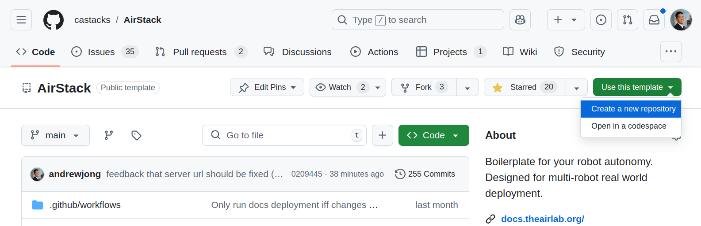

# Create a New Project


## Option 1: Generate from Template (no further updates from upstream)
The AirStack repository is setup as a [Template](https://docs.github.com/en/repositories/creating-and-managing-repositories/creating-a-repository-from-a-template) on GitHub.
This makes it easy to create a new project from AirStack with the "Use this template" button.




However, generating from a template squashes the entire git history into a single starter commit in your new repository. 
This prevents pulling in updates from the AirStack repository in the future.

To be able to pull upstream changes from the AirStack repository, use option 2.

## Option 2: Duplicate (for future updates from upstream)

Duplicating a repository preserves the entire history of the repository, making it easier to pull in updates from AirStack in the future.
Unlike creating a fork, duplicating a repository allows your new repository to be private.

See GitHub's instructions to [duplicate a repository](https://docs.github.com/en/repositories/creating-and-managing-repositories/duplicating-a-repository).

Sample commands are provided below:
```bash
git clone --bare https://github.com/castacks/AirStack.git my-airstack
cd my-airstack
git push --mirror https://github.com/EXAMPLE-USER/my-airstack.git
```
