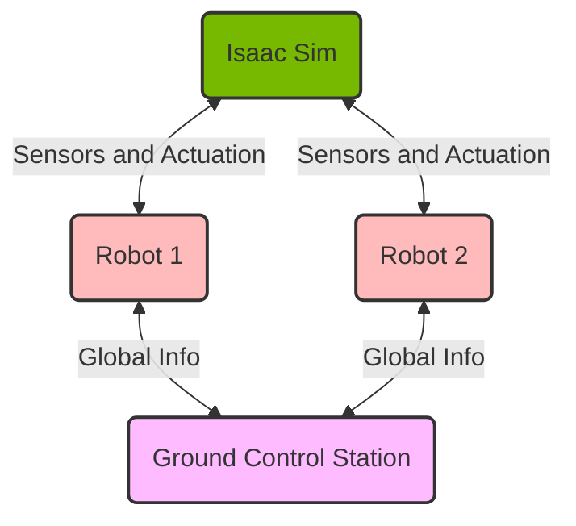

# General Usage with Docker Compose

To mimic interacting with multiple real world robots, we use Docker Compose to manage Docker containers that isolate the simulation, each robot, and the ground control station.

The details of the docker compose setup is in `AirStack/docker-compose.yaml`.

In essence, the compose file launches:

- Isaac Sim
- ground control station
- robots

all get created on the same default Docker bridge network.
This lets them communicate with ROS2 on the same network.

Each robot has its own ROS_DOMAIN_ID.

## Pull Images

To use the AirLab docker registry:

```bash
cd AirStack/
docker login airlab-storage.andrew.cmu.edu:5001
## <Enter your andrew id (without @andrew.cmu.edu)>
## <Enter your andrew password>

## Pull the images in the docker compose file
docker compose pull
```

Catelog: [AirLab Registry Images](https://airlab-storage.andrew.cmu.edu:5001/v2/_catalog).

Available image tags:
[airstack-dev](https://airlab-storage.andrew.cmu.edu:5001/v2/shared/airstack-dev/tags/list),
[isaac-sim_ros-humble](https://airlab-storage.andrew.cmu.edu:5001/v2/shared/isaac-sim_ros-humble/tags/list)

## Build Images

```bash
docker compose build
```

## Start, Stop, and Remove

Start

```bash
docker compose up -d --scale robot=[NUM_ROBOTS]

# see running containers
docker ps -a
```

Stop

```bash
docker compose stop
```

Remove

```bash
docker compose down
```

### Isaac Sim

Start a bash shell in the Isaac Sim container:

```bash
# if the isaac container is already running, execute a bash shell in it
docker exec -it isaac-sim bash
# or if not, start a new container
docker compose run isaac-sim bash
```

Within the isaac-sim Docker container, the alias `runapp` launches Isaac Sim.
The `--path` argument can be passed with a path to a `.usd` file to load a scene.

It can also be run in headless mode with `./runheadless.native.sh` to stream to [Omniverse Streaming Client](https://docs.omniverse.nvidia.com/streaming-client/latest/user-manual.html) or `./runheadless.webrtc.sh` to [stream to a web browser](https://docs.omniverse.nvidia.com/extensions/latest/ext_livestream/webrtc.html).

The container also has the isaacsim ROS2 package within that can be launched with `ros2 launch isaacsim run_isaacsim.launch.py`.

### Robot

Start a bash shell in a robot container, e.g. for robot_1:

```bash
docker exec -it airstack-robot-1 bash
```

The previous `docker compose up` launches robot_bringup in a tmux session. To attach to the session within the docker container, e.g. to inspect output, run `tmux attach`.

The following commands are available within the robot container:

```bash
# in robot docker
cws  # cleans workspace
bws  # builds workspace
bws --packages-select [your_packages] # builds only desired packages
sws  # sources workspace
ros2 launch robot_bringup robot.launch.xml  # top-level launch
```

These aliases are in `AirStack/robot/.bashrc`.

Each robot has `ROS_DOMAIN_ID` set to its ID number. `ROBOT_NAME` is set to `robot_$ROS_DOMAIN_ID`.

### Ground Control Station

Currently the ground control station uses the same image as the robot container. This may change in the future.

Start a bash shell in a robot container:

```bash
docker exec -it ground-control-station bash
```

The available aliases within the container are currently the same.

On the GCS `ROS_DOMAIN_ID` is set to 0.

## SSH into Robots

The containers mimic the robots' onboard computers on the same network. Therefore we intend to interface with the robots through ssh.

The `ground-control-station` and `docker-robot-*` containers are setup with ssh daemon, so you can ssh into the containers using the IP address.

You can get the IP address of each container by running the following command:

```bash
docker inspect -f '{{range.NetworkSettings.Networks}}{{.IPAddress}}{{end}}' [CONTAINER-NAME]
```

Then ssh in, for example:

```bash
ssh root@172.18.0.6
```

The ssh password is `airstack`.

## Container Details


