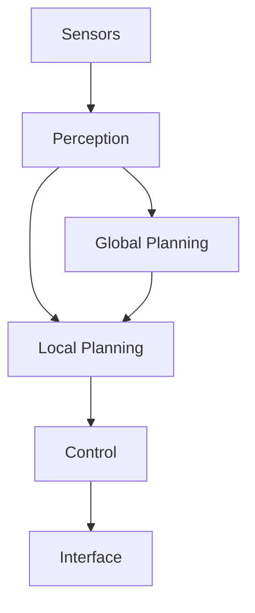
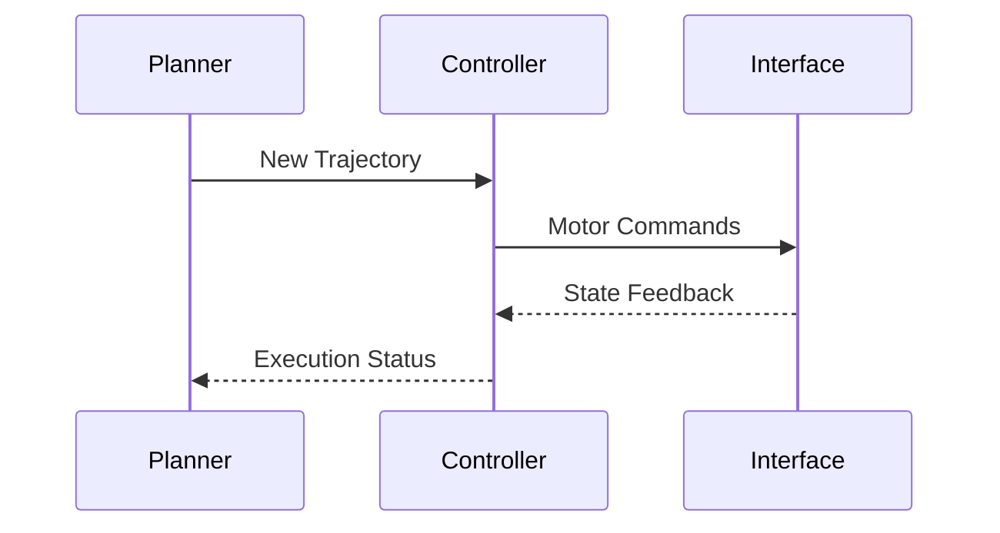
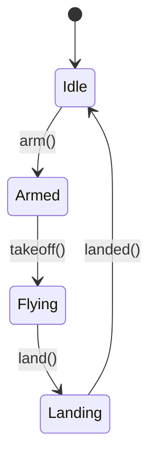

# Documentation Guide

Writing clear, comprehensive documentation is essential for AirStack's usability and maintainability. This guide covers documentation standards, tools, and best practices.

## Documentation Philosophy

Good documentation:

- **Explains the "why"** not just the "what"
- **Provides examples** for common use cases
- **Is kept up-to-date** with code changes
- **Uses consistent formatting** and structure
- **Includes diagrams** for complex concepts

## Documentation Types

### 1. Module README Files

Every ROS 2 package must have a `README.md` in its root directory.

**Location**: `robot/ros_ws/src/<layer>/<type>/<package_name>/README.md`

**Template**: See `.agents/skills/add-ros2-package/assets/package_template/README.md`

**Required Sections**:

- **Overview**: What the module does and why
- **Algorithm/Approach**: High-level description of implementation
- **Architecture**: Mermaid diagram showing data flow
- **Dependencies**: ROS 2 and external dependencies
- **Topics**: Input/output topics with types
- **Parameters**: Configurable parameters with defaults
- **Configuration**: How to configure the module
- **Usage**: Launch commands and examples
- **Testing**: How to test the module
- **References**: Papers, related work

**Example**:
```markdown
# My Planner

## Overview

This planner generates collision-free trajectories for obstacle avoidance...

## Algorithm

Uses [algorithm name] with [key features]...

## Architecture

\`\`\`mermaid
graph LR
    A[Odometry] --> B[My Planner]
    C[Obstacle Map] --> B
    B --> D[Trajectory Output]
\`\`\`

## Dependencies

- `disparity_expansion` - Obstacle map
- `trajectory_controller` - Trajectory execution

## Topics

### Subscribed
- `/robot1/odometry` (nav_msgs/Odometry) - Robot state
- `/robot1/obstacle_map` (sensor_msgs/PointCloud2) - Obstacles

### Published
- `/robot1/trajectory` (airstack_msgs/TrajectorySegment) - Planned trajectory

## Parameters

| Parameter | Type | Default | Description |
|-----------|------|---------|-------------|
| `planning_horizon` | double | 5.0 | Planning horizon in seconds |
| `max_velocity` | double | 2.0 | Maximum velocity in m/s |

## Configuration

Edit `config/my_planner.yaml`...

## Usage

\`\`\`bash
ros2 launch my_planner_bringup my_planner.launch.xml
\`\`\`

## Testing

\`\`\`bash
colcon test --packages-select my_planner
\`\`\`

## References

[1] Author et al., "Paper Title", Conference Year
```

### 2. System Documentation

High-level documentation under `docs/` directory.

**Categories**:

- **Tutorials**: Step-by-step workflows (`docs/tutorials/`)
- **Guides**: In-depth topic coverage (`docs/robot/autonomy/`)
- **Reference**: Technical specifications (`docs/robot/autonomy/integration_checklist.md`)

**Structure**:
```markdown
# Page Title

Brief introduction paragraph.

## Section 1

Content with examples...

### Subsection

More detailed content...

## See Also

- [Related Page 1](link)
- [Related Page 2](link)
```

### 3. Code Comments

**C++ Header Files**:
```cpp
/**
 * @brief Brief description of class
 *
 * Detailed description of what this class does,
 * its purpose, and how it fits in the system.
 */
class MyPlanner {
public:
    /**
     * @brief Compute trajectory from current state to goal
     * 
     * @param current_state Current robot state
     * @param goal Desired goal state
     * @return Trajectory if found, nullptr if no solution
     */
    Trajectory* computeTrajectory(const State& current_state, const State& goal);

private:
    double planning_horizon_;  ///< Planning horizon in seconds
};
```

**Python**:
```python
class MyPlanner:
    """Brief description of class.
    
    Detailed description of what this class does,
    its purpose, and how it fits in the system.
    """
    
    def compute_trajectory(self, current_state: State, goal: State) -> Optional[Trajectory]:
        """Compute trajectory from current state to goal.
        
        Args:
            current_state: Current robot state
            goal: Desired goal state
            
        Returns:
            Trajectory if found, None if no solution
        """
        pass
```

### 4. Launch File Documentation

Document parameters in launch files:

```xml
<launch>
    <!-- Robot namespace for multi-robot support -->
    <arg name="robot_name" default="$(env ROBOT_NAME)" />
    
    <!-- Enable debug mode (verbose logging) -->
    <arg name="debug" default="false" />
    
    <!-- Planning horizon in seconds -->
    <arg name="planning_horizon" default="5.0" />
    
    <node pkg="my_planner" exec="my_planner_node" name="my_planner">
        <param name="robot_name" value="$(var robot_name)" />
        <param name="planning_horizon" value="$(var planning_horizon)" />
    </node>
</launch>
```

## MkDocs Integration

### Adding Pages to Navigation

Edit `mkdocs.yml` to add your documentation:

```yaml
nav:
  - Robot:
      - Autonomy Modules:
          - Local:
              - Planning:
                  - My Planner: robot/ros_ws/src/local/planners/my_planner/README.md
```

The `same-dir` plugin allows linking README.md files from anywhere in the repository.

### Internal Links

Use relative paths from the `docs/` root:

```markdown
See [System Architecture](../robot/autonomy/system_architecture.md)
```

Or for files in the same directory:

```markdown
See [Related Topic](related_topic.md)
```

## Diagrams

### Mermaid Diagrams

MkDocs supports Mermaid for diagrams.

**System Architecture**:


**Sequence Diagram**:


**State Machine**:


### Images

Store images near the markdown file:

```
docs/robot/autonomy/local/planning/
├── index.md
├── planner_architecture.png
└── trajectory_example.png
```

Reference in markdown:
```markdown

```

## Code Examples

### Bash Commands

Use code blocks with syntax highlighting:

````markdown
```bash
ros2 launch my_package my_launch.xml robot_name:=robot1
```
````

### Multi-Line Commands

Break long commands:

```bash
docker exec airstack-robot-desktop-1 bash -c \
    "bws --packages-select my_package --cmake-args '-DCMAKE_BUILD_TYPE=Debug'"
```

### Command Output

Show expected output:

```bash
$ ros2 topic list
/robot1/odometry
/robot1/cmd_vel
/robot1/trajectory
```

## Admonitions (Info Boxes)

Use admonitions for important information:

```markdown
!!! note "Note Title"
    This is additional information that readers should be aware of.

!!! warning "Warning"
    This is a warning about potential issues.

!!! tip "Pro Tip"
    This is a helpful tip for advanced users.

!!! danger "Danger"
    This is critical safety information.
```

Results in colored boxes with icons.

## Documentation Workflow

### When Adding a New Module

1. **Write README.md** using the template
2. **Add to mkdocs.yml** navigation
3. **Create diagrams** with Mermaid or images
4. **Link from related pages**
5. **Test locally** with `airstack docs`
6. **Review before PR**

### Local Preview

Build and serve documentation locally:

```bash
airstack docs
```

Opens browser to `http://localhost:8000`

Changes auto-reload during editing.

### Building Documentation

Build documentation site:

```bash
cd AirStack
mkdocs build
```

Output in `site/` directory.

## Style Guide

### Formatting

- **Bold** for UI elements, buttons, emphasis
- *Italics* for terms being defined
- `Code` for code, commands, file paths
- Headings: Title Case for ## and ###

### Writing Style

- **Be concise** but complete
- **Use active voice**: "The planner computes..." not "The trajectory is computed by..."
- **Write for your audience**: Assume ROS 2 knowledge, explain AirStack-specific concepts
- **Provide context**: Explain why something is done, not just how
- **Use examples**: Show concrete usage, not just abstract descriptions

### Terminology

- **Module**: A ROS 2 package that implements specific functionality
- **Layer**: A high-level grouping (interface, sensors, perception, local, global, behavior)
- **Bringup**: Launch package that orchestrates a layer
- **Topic**: ROS 2 topic for inter-node communication
- **Node**: ROS 2 node (running process)

## Documentation Checklist

When adding or modifying documentation:

- [ ] README.md present for new packages
- [ ] All sections from template completed
- [ ] Mermaid diagram showing architecture
- [ ] Topics and parameters documented
- [ ] Usage examples provided
- [ ] Added to mkdocs.yml navigation
- [ ] Internal links working (tested locally)
- [ ] Images/diagrams included and rendering correctly
- [ ] Code examples tested and work as shown
- [ ] Spelling and grammar checked
- [ ] Reviewed by another team member

## Automated Documentation

### AI-Assisted Documentation

Use the [AI Agent Guide](ai_agent_guide.md) for automated documentation tasks:

- Generate README.md from code
- Update mkdocs.yml navigation
- Create Mermaid diagrams from code structure
- Check for broken links

### Update Documentation Skill

Use the `update-documentation` skill:

See: [.agents/skills/update-documentation](.agents/skills/update-documentation)

## Common Issues

**Links broken after renaming file**:

- Search for references: `grep -r "old_name.md" docs/`
- Update all references to new name

**Images not displaying**:

- Check relative path is correct
- Verify image file exists
- Try absolute path from `docs/` root

**Mermaid diagram not rendering**:

- Check syntax at [Mermaid Live Editor](https://mermaid.live)
- Ensure mkdocs.yml has pymdownx.superfences configured
- Verify using three backticks with `mermaid` language

**Navigation not showing new page**:

- Check mkdocs.yml indentation (YAML is sensitive)
- Restart `mkdocs serve` after changes to mkdocs.yml
- Verify file path is correct relative to repository root

## See Also

- [Contributing Guide](contributing.md) - Overall contribution workflow
- [AI Agent Guide](ai_agent_guide.md) - Automated documentation generation
- [MkDocs Material Documentation](https://squidfunk.github.io/mkdocs-material/) - MkDocs features
- [Mermaid Documentation](https://mermaid.js.org/) - Diagram syntax