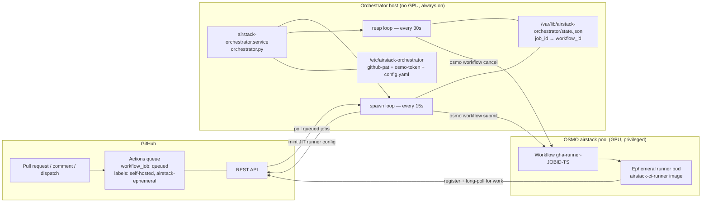
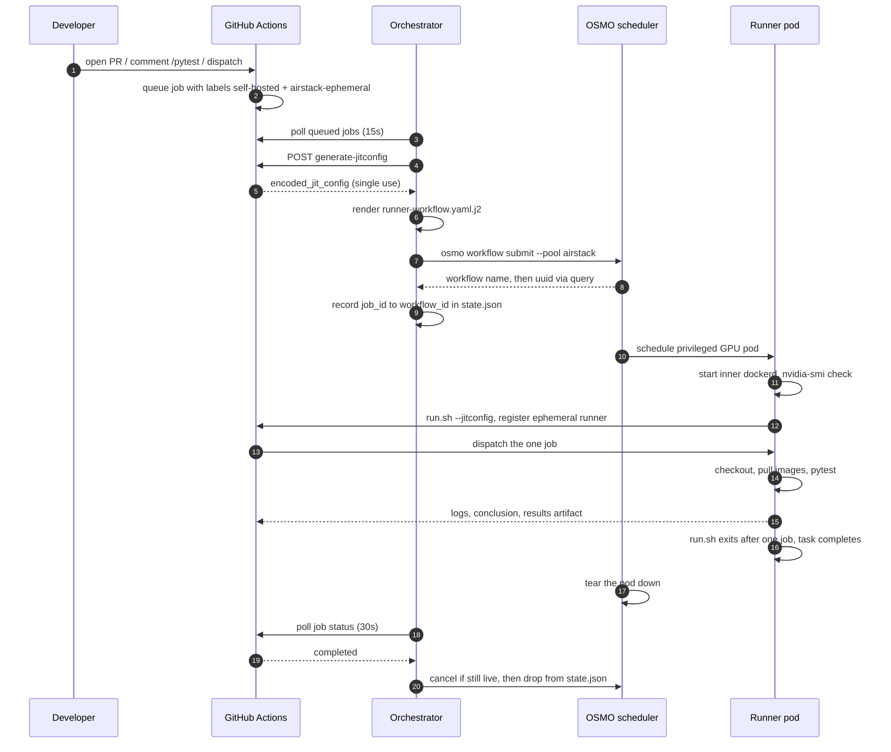
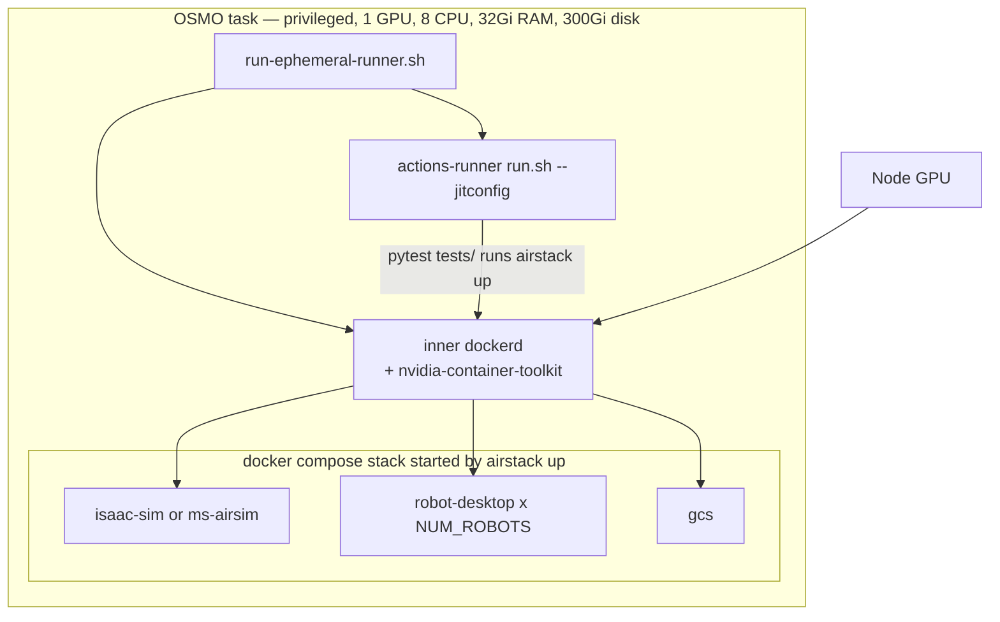
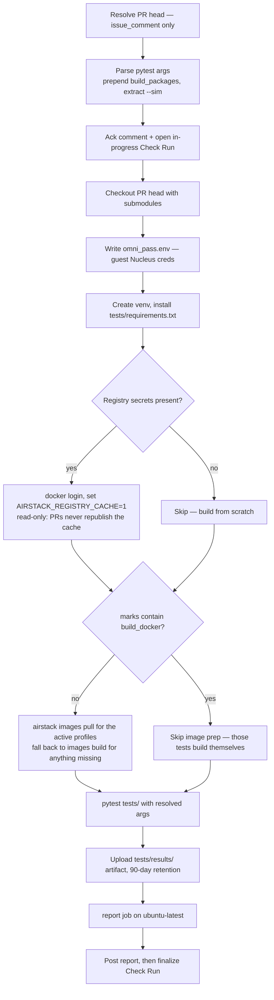
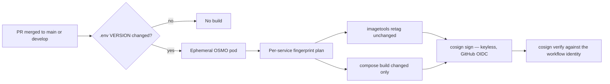

# CI/CD Pipeline on OSMO

AirStack continuous integration has two tiers. Fast Python unit and harness
contract tests run on GitHub-hosted runners for updates to PRs targeting
`main` or `develop`. Container,
ROS workspace, and selectable **full drone stack** campaigns — simulator,
robot autonomy, and GCS — run on an ephemeral GPU worker. A small orchestrator
service watches the GitHub Actions queue and submits one **ephemeral
[NVIDIA OSMO](https://nvidia.github.io/OSMO/) pod per system-test job**. The pod
registers as a single-use GitHub Actions runner, executes exactly one job, and
is destroyed.

This page explains how the system works — the architecture, the job
lifecycle, the anatomy of an ephemeral runner pod, the cache strategy, and the
security model. It is aimed at maintainers of the pipeline itself.

!!! tip "Just want to run CI on your PR?"
    See [Using CI](using_ci.md) — triggering runs with `/pytest`, choosing
    marks, and reading the results.

!!! note "Related pages"
    - [`tests/README.md`](../../../../tests/README.md) — the test suite reference: marks, fixtures, metrics, CLI flags.
    - [CI/CD Orchestrator](../../../../tests/ci-cd-orchestrator.md) — the lab-admin runbook: pool prerequisites, credential staging, `setup.sh`, rotation, break-glass debugging.
    - [AirStack on OSMO](../../../tutorials/airstack_on_osmo.md) — the *interactive* OSMO dev pod (Remote-SSH + Isaac Sim streaming). Different workflow, same compute pool.

---

## The short version

| Question | Answer |
|---|---|
| Where do CI jobs run? | Python unit tests: `ubuntu-latest`. Build and simulation tests: a fresh OSMO GPU pod, destroyed afterward. |
| What triggers a run? | PR open/update/reopen runs unit + package-build gates; maintainers select simulations with `/pytest`; `workflow_dispatch` is also available. |
| What gets tested? | Automatically: Python units/contracts and ROS package builds/tests. Selectably: Docker builds, liveliness, sensors, and flight policies. (OptiTrack system tests live in the asm_optitrack module's CI.) |
| How do I see results? | Checks plus a report comment and `test-results-*` artifact (`summary.txt`, `results.xml`, `run_meta.json`, `metrics.json`, and bounded failure diagnostics when needed). |
| What fails the build? | Test assertions, infrastructure/prerequisite failures, or report integrity failures. Comparable numeric metric deltas are advisory. |
| Who holds the secrets? | Only the orchestrator host. Workers get a single-use JIT token valid for one registration. |

---

## Architecture

Three planes, each owning one job. GitHub owns the queue and the logs. The
orchestrator owns the credentials and the job ↔ pod bookkeeping. OSMO owns the
GPU compute and the pod lifecycle.



Key properties that fall out of this shape:

- **Truly ephemeral.** Every job starts from the prebaked image with an empty Docker cache. No leftover containers, no dangling networks, no "works because the last run left something behind".
- **PAT isolation.** The GitHub PAT never leaves the orchestrator. The pod receives a [JIT runner config](https://docs.github.com/en/rest/actions/self-hosted-runners#create-configuration-for-a-just-in-time-runner-for-a-repository) — a base64 blob bound to exactly one runner registration, short-lived.
- **Non-personal OSMO identity.** The orchestrator authenticates with a service-account token scoped to the CI pool, so runs never consume an individual's GPU quota and nothing breaks when someone graduates.
- **Crash-safe.** Every workflow is named `gha-runner-<job_id>-<unix_ts>`. The reap loop cancels any active workflow with that prefix that is missing from `state.json`, so a crashed or restarted orchestrator cannot leak pods.

---

## Job lifecycle

From "you comment `/pytest`" to "the pod is gone", in order:



Two safety nets run on top of the happy path:

- **Straggler reap.** Any tracked job older than `max_job_minutes` (default 48 h) is force-cancelled regardless of what GitHub reports.
- **Orphan sweep.** Active `gha-runner-*` workflows that are not in `state.json` and are more than two minutes old get cancelled. The two-minute grace window prevents the sweep from racing a submit that has not been recorded yet.

---

## Anatomy of a runner pod

The worker is a prebaked image — everything the job needs is already in the
layer cache when the pod starts, so a slow `apt-get` can never outlive the JIT
token's validity window.



| Piece | File | What it contributes |
|---|---|---|
| Image | [`runner.Dockerfile`](../../../../.github/orchestrator/runner.Dockerfile) | Ubuntu 24.04 + Docker CE + compose/buildx + NVIDIA container toolkit + pinned `actions/runner` (2.334.0) |
| Entrypoint | [`runner-entrypoint.sh`](../../../../.github/orchestrator/runner-entrypoint.sh) | Starts `dockerd`, waits up to 60 s for it, runs `nvidia-smi` as a non-fatal GPU sanity check, then `exec`s `run.sh --jitconfig` |
| Pod shape | [`runner-workflow.yaml.j2`](../../../../.github/orchestrator/runner-workflow.yaml.j2) | Resource request, `privileged: true`, the JIT config and `RUNNER_ALLOW_RUNASROOT` env |
| Sizing | `config.yaml` | `cpu: 8`, `gpu: 1`, `memory: 32Gi`, `storage: 300Gi` — sized for sim + robot + GCS images plus Isaac assets |

!!! warning "Privileged is mandatory"
    The tests run `airstack up`, which is `docker compose`, which needs a Docker
    daemon *inside* the pod. That requires the pool's platform to have
    **Privileged Mode Allowed** enabled. Without it, submissions are rejected and
    `osmo workflow logs` shows `dockerd did not become ready`.

Build and publish the image with
[`build-and-push.sh`](../../../../.github/orchestrator/build-and-push.sh),
or — if you have no local Docker — submit
[`build-runner-on-osmo.yaml`](../../../../.github/orchestrator/build-runner-on-osmo.yaml),
a one-shot OSMO job that builds the runner image inside an OSMO pod and pushes
it to Harbor.

---

## Inside a system-tests job

How to trigger a run — the PR gates, `/pytest` comment syntax, and
`workflow_dispatch` — is covered in [Using CI](using_ci.md). This section
follows what `system-tests.yml` does once a run is requested.

### What the job does, step by step



The image-prep step is what makes runs on a cold pod tolerable: it pulls the
published images for exactly the compose profiles the selected `--sim` implies,
then falls back to a local build only for images the registry did not have (a
new branch that has not been released yet, for example).

### Layer cache: the floating `cache_*` tag

Every pod starts with an empty Docker cache, so `build_docker` is only fast if
BuildKit can import layers from the registry. Each compose service therefore
declares two `cache_from` entries:

| Entry | Example | Who writes it |
|---|---|---|
| Versioned | `airstack:v0.19.0-alpha.7_isaac-sim` | `docker-build.yml`, per release |
| Floating | `airstack:cache_isaac-sim` | `docker-build.yml`, republished every build |

The versioned entry alone cannot work on a pull request. `check-version-increment`
requires every PR to raise `VERSION`, so the tag a PR builds under is by
definition one that has never been pushed — the pull misses and the build runs
cold from the first `RUN` layer:

```
Image ...airstack:v0.19.0-alpha.7_isaac-sim Pulling
Image ...airstack:v0.19.0-alpha.7_isaac-sim failed to resolve reference
```

The floating tag is the one that actually hits. It tracks the newest build from
`main`/`develop` rather than any particular version, so a PR imports the layers
its base branch already produced and rebuilds only what it changed.

Reading and writing the cache are separate switches, and PR runs get read only:

- `AIRSTACK_REGISTRY_CACHE=1` — pull to seed, build with `BUILDKIT_INLINE_CACHE=1`.
  Set by `system-tests.yml` whenever registry secrets are available.
- `AIRSTACK_REGISTRY_CACHE_PUSH=1` — additionally publish the versioned and
  floating tags. Set only by `docker-build.yml`.

Keeping the write switch off for pull requests means an unmerged branch can
neither poison the shared cache for everyone else nor publish an unreleased
`VERSION` tag. Override the tag name with `CACHE_TAG` (default `cache`) to keep
an experimental cache line separate.

### Publish path: retag when image inputs are unchanged

`check-version-increment` forces every PR to raise `VERSION`, including
docs-only changes. On `main`/`develop`, that would otherwise mean a full
multi-hour rebuild of every image for a no-op Docker change.

[`docker-build.yml`](../../../../.github/workflows/docker-build.yml)
therefore plans per service before building:

1. [`.github/workflows/scripts/docker_image_plan.py`](../../../../.github/workflows/scripts/docker_image_plan.py)
   hashes each service’s Dockerfile, compose-related files, build args, and
   tracked fingerprint roots into `org.airstack.content-fingerprint`.
2. It inspects the **previous** versioned image’s label (from `HEAD~1`’s
   `VERSION=`).
3. **Match** → registry-side retag with
   `docker buildx imagetools create` (new `v${VERSION}_…` tag and floating
   `cache_*` tag, same digest — no rebuild).
4. **Mismatch / missing / unlabeled / `force_rebuild`** → `docker compose build`
   for that service only, with the fingerprint applied as a build label via an
   ephemeral `docker-compose.fingerprint.yaml` override.

PR `system-tests` / `build_docker` are unchanged: they still run real builds so
Dockerfiles keep being proven. Floating `cache_*` remains the layer-cache seed
for those rebuilds.

Manual dispatch accepts `force_rebuild=true` to rebuild and relabel everything
(useful the first time after this lands, or to refresh `cache_*` from scratch).

---

## The release path

`system-tests.yml` is not the only workflow on the ephemeral runners.
[`docker-build.yml`](../../../../.github/workflows/docker-build.yml)
also requests `runs-on: [self-hosted, airstack-ephemeral]` and therefore gets
the same per-job pod treatment.



Signing is keyless via GitHub's OIDC token, and the same job immediately
verifies each published digest against the expected certificate identity, so a
published image that was not built by this workflow fails the check. Retagged
images keep the previous digest (and therefore an existing signature still
covers that digest; the job re-signs the same digest under the new tags’ refs).

| Workflow | Runner | Purpose |
|---|---|---|
| `unit-tests.yml` | `ubuntu-latest` | Python unit tests and harness contracts on updates to PRs targeting `main`/`develop` |
| `system-tests.yml` | Ephemeral OSMO GPU pod | Automatic package-build gate and selectable simulation campaigns + metrics report |
| `docker-build.yml` | Ephemeral OSMO GPU pod | Retag or rebuild, push, and sign compose images |
| `check-version-increment.yml` | `ubuntu-latest` | Semver gate on `.env` `VERSION=` |
| `deploy_docs_from_*.yaml` | `ubuntu-latest` | Versioned MkDocs publish via `mike` |

---

## Security model

| Concern | How the design handles it |
|---|---|
| Cross-job state pollution | Fresh pod per job with an empty Docker cache; destroyed within ~30 s of completion |
| Fork PRs executing arbitrary code on a GPU node | `head.repo.full_name == github.repository` guard on the `pull_request` path, and an explicit fork check plus `author_association` gate on the `/pytest` path |
| Long-lived GitHub PAT on a worker | The PAT lives only on the orchestrator; workers get a single-use JIT config bound to one registration |
| Credentials tied to a person | OSMO auth uses a non-personal service-account token scoped to the CI pool |
| Privileged container is root-equivalent | Accepted deliberately — docker-in-docker is required — but bounded to a one-shot pod, on a dedicated pool, running only same-repo code |
| Orchestrator compromise blast radius | Systemd hardening: `NoNewPrivileges`, `ProtectSystem=strict`, `ProtectHome=read-only`, `PrivateTmp`, with a single `ReadWritePaths` for state |
| Leaked pods after a crash | Name-prefix orphan sweep plus a `max_job_minutes` straggler ceiling |

---

## Troubleshooting

A failed run can break at the orchestrator, at the OSMO pod, at the runner, or
in the tests themselves, and each layer has a different inspection path. The
entries below all require orchestrator or OSMO access; work down the list.

| Symptom | Layer | First thing to check |
|---|---|---|
| Job sits `queued` forever, no pod appears | Orchestrator | `journalctl -u airstack-orchestrator.service --since '30 min ago'` — look for `submitted workflow <id> for job <job_id>` |
| `find_queued_jobs failed: 401` | Orchestrator | GitHub PAT expired or lost a scope; rotate it |
| `osmo login failed` / auth error | Orchestrator | OSMO service-account token expired (default 31 days); mint a new one and restart the service |
| `osmo workflow submit failed ... privileged` | OSMO pool | The pool's platform lacks **Privileged Mode Allowed** |
| Job queued but never claimed | Labels | `runs-on` labels must be a superset of `runner_labels` in `config.yaml` |
| `dockerd did not become ready` | Pod | Not actually privileged; check the platform, then `osmo workflow logs "$WF" --task runner` |
| `nvidia-smi unavailable` | Pod | GPU not requested or the toolkit is not configured on the node |
| `Cannot connect to the Docker daemon` mid-test | Pod | Inner dockerd crashed — `osmo workflow exec "$WF" runner`, then read `/var/log/dockerd.log` |
| `No space left on device` | Pod | Bump `storage` in `config.yaml`; Isaac assets plus all images are large |

Failures in the tests or the metrics report themselves — a runner that
registered and then failed pytest, a "simulation metrics are not comparable"
report, a report job that failed with no test failures — are covered from the
developer's side in [Using CI → Troubleshooting](using_ci.md#troubleshooting).

To map a GitHub job to its pod:

```bash
JOB_ID=73286176852   # from the GitHub Actions URL
WF=$(sudo jq -r ".jobs[\"$JOB_ID\"].workflow_id" /var/lib/airstack-orchestrator/state.json)

osmo workflow query "$WF" --verbose
osmo workflow events "$WF" --task runner     # scheduling, image pull, eviction
osmo workflow logs   "$WF" --task runner     # dockerd, run.sh, and the job itself
osmo workflow exec   "$WF" runner            # break-glass shell, while RUNNING
```

Full runbook, including credential rotation and worker-side diagnostics:
[CI/CD Orchestrator](../../../../tests/ci-cd-orchestrator.md).

---

## File map

| Path | Role |
|---|---|
| [`.github/workflows/unit-tests.yml`](../../../../.github/workflows/unit-tests.yml) | Fast Python unit/harness gate on GitHub-hosted runners |
| [`.github/workflows/system-tests.yml`](../../../../.github/workflows/system-tests.yml) | The test workflow: triggers, arg parsing, image prep, pytest, artifact, metrics report |
| [`.github/orchestrator/orchestrator.py`](../../../../.github/orchestrator/orchestrator.py) | The spawn and reap loops, GitHub polling, JIT minting, OSMO CLI plumbing |
| [`.github/orchestrator/runner-workflow.yaml.j2`](../../../../.github/orchestrator/runner-workflow.yaml.j2) | Per-job OSMO workflow template |
| [`.github/orchestrator/runner.Dockerfile`](../../../../.github/orchestrator/runner.Dockerfile) | Prebaked worker image |
| [`.github/orchestrator/runner-entrypoint.sh`](../../../../.github/orchestrator/runner-entrypoint.sh) | dockerd bring-up, GPU check, single-job runner |
| [`.github/orchestrator/config.example.yaml`](../../../../.github/orchestrator/config.example.yaml) | Every tunable: pool, platform, resources, limits, poll intervals |
| [`.github/orchestrator/setup.sh`](../../../../.github/orchestrator/setup.sh) | One-time orchestrator host install |
| [`tests/conftest.py`](../../../../tests/conftest.py) | `airstack_env` fixture, collection order, `MetricsRecorder` |
| [`tests/parse_metrics.py`](../../../../tests/parse_metrics.py) | Comparable advisory report generation and report-integrity gate |
| [`tests/run_summary.py`](../../../../tests/run_summary.py) | `summary.txt` generation |

## See also

- [Using CI](using_ci.md) — triggering runs, choosing marks, and reading results day-to-day.
- [System Tests](../../../../tests/README.md) — marks, fixtures, metrics, and every CLI flag.
- [Unit Testing](unit_testing.md) — the co-location and proxy pattern for package-level tests.
- [End-to-End Testing](end_to_end_testing.md) — the fixed-trajectory benchmark in depth.
- [CI/CD Orchestrator](../../../../tests/ci-cd-orchestrator.md) — admin setup, rotation, and break-glass procedures.
- [AirStack on OSMO](../../../tutorials/airstack_on_osmo.md) — interactive GPU dev pods on the same pool.
