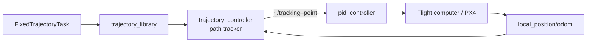
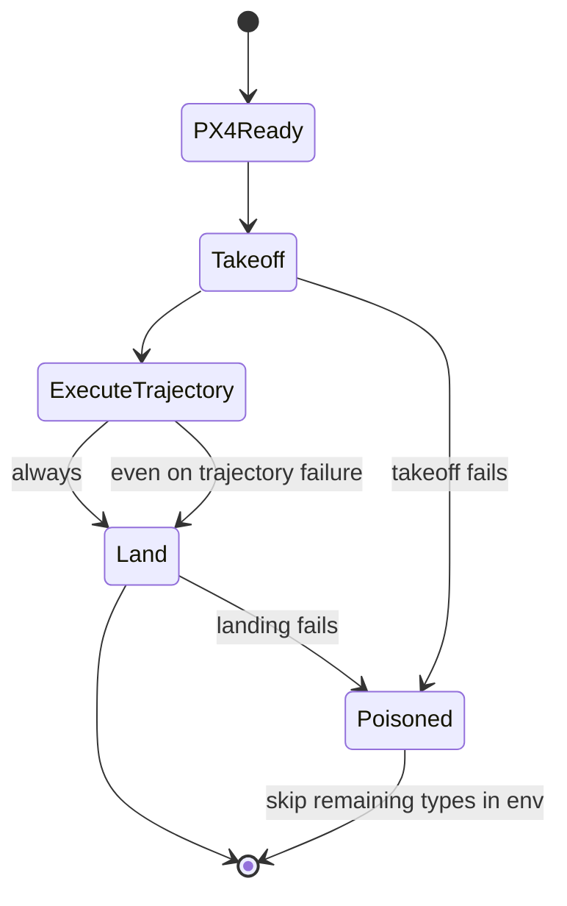

# End-to-End Testing

End-to-end (e2e) tests exercise the **full autonomy stack in simulation** — the drone takes off, performs an action, and lands — so one run validates the whole pipeline (interface → perception → planning → control → PX4) rather than a single module.

AirStack currently has two e2e suites:

- **Takeoff / hover / land** (`takeoff_hover_land` mark) — the basic flight chain, documented in [`tests/README.md`](../../../../tests/README.md).
- **Fixed-trajectory path-tracker benchmark** (`autonomy` mark) — takeoff → execute a fixed pattern (Circle / Figure8 / Racetrack / Line) → land, measuring cross-track error. Documented below.

!!! note "Future work: unify the e2e marks"
    `takeoff_hover_land` and `autonomy` are separate marks today. As the suite grows they can be consolidated into a single general **e2e** mark/pipeline.

---

## Fixed-Trajectory Path-Tracker Benchmark

This section documents the **fixed-trajectory evaluation test suite** (`tests/system/test_fixed_trajectory.py`): why it exists, how it is implemented, how to run it, how to interpret results, and how to use it to **compare path trackers** without rewriting tests.

---

## Purpose

AirStack's local controls stack separates **reference-path generation**, **path tracking**, and **low-level control**:



The benchmark harness holds the **reference trajectory** and **flight procedure** constant so maintainers can:

- **Swap or retune path trackers** and measure the same metrics every time.
- **Compare execution time** — how long does a standard pattern take in sim-time?
- **Compare tracking error** — mean/max cross-track error and path RMSE against a known ideal path.
- **Detect regressions** — action timeouts, stalls, or catastrophic drift via `trajectory_success` and assertion thresholds.

Today the default tracker is the **sphere-intersection pure-pursuit** implementation in `trajectory_controller` + `trajectory_library`. The downstream `pid_controller` is held fixed so changes isolate tracker behavior. A different tracker can replace the `trajectory_controller` node (or its parameters) in launch; the pytest module does not need to change as long as `FixedTrajectoryTask` and odom topics remain the same.

---

## What gets tested

### Test module

| Item | Value |
| ---- | ----- |
| File | [`tests/system/test_fixed_trajectory.py`](../../../../tests/system/test_fixed_trajectory.py) |
| Pytest mark | `autonomy` |
| Class | `TestFixedTrajectory` |
| Timeout | 2400 s per test class invocation |

### Parametrization

Each run sweeps:

```
(sim, num_robots, iteration, trajectory_type)
```

| Parameter | CLI flag | Default |
| --------- | -------- | ------- |
| Simulator | `--sim` | `isaacsim` (`msairsim` opt-in) |
| Robot count | `--num-robots` | `1,3` |
| Repeat count | `--stress-iterations` | `1` |
| Trajectory type | `--trajectory-types` | `Circle,Figure8,Racetrack,Line` |

!!! tip "Pin your sweep for local runs"
    Defaults multiply configs and run for hours. For development, always set explicit values:

    ```bash
    airstack test -m autonomy \
      --sim isaacsim \
      --num-robots 1 \
      --stress-iterations 1 \
      --trajectory-types Circle \
      -v
    ```

### Four-phase flight chain

For every `(sim, num_robots, iteration, trajectory_type)` tuple the drone runs:

| Phase | Test | Action | Pass criteria |
| ----- | ---- | ------ | ------------- |
| 1 | `test_px4_ready` | Wait for MAVROS + odom | All robots connected and publishing within 300 s wall-clock |
| 2 | `test_takeoff` | `TakeoffTask` to 10 m @ 1 m/s | Steady-state altitude within ±10% of target |
| 3 | `test_fixed_trajectory` | `FixedTrajectoryTask` | Cross-track mean &lt; 5 m; records success + timing |
| 4 | `test_landing` | `LandTask` @ 1 m/s | Final altitude &lt; 0.5 m |



**Chain guard:** a failure in phase 3 (`test_fixed_trajectory`) does **not** poison the environment — landing always runs so the drone returns to the ground before the next trajectory type. Failures in takeoff or landing **do** poison the env and skip subsequent trajectory types for that `(sim, num_robots, iteration)`.

Phase 1 (`test_px4_ready`) runs once per env regardless of how many trajectory types are swept.

---

## Reference trajectories

The test uses the same patterns as the `FixedTrajectoryTask` action server in `trajectory_controller` (`fixed_trajectory_task.cpp`). Default parameters are defined in `TRAJECTORY_CONFIGS` inside `test_fixed_trajectory.py` and must stay in sync with the C++ generators.

| Type | Parameters | Approx. path length | Expected sim-time* |
| ---- | ---------- | ------------------- | ------------------ |
| **Circle** | radius=10 m, velocity=2 m/s | ~63 m loop + return segments | **~45–50 s** |
| **Figure8** | length=15 m, width=8 m, v=2 m/s, max_accel=1 m/s² | ~100+ m | **~50–70 s** |
| **Racetrack** | length=30 m, width=10 m, v=3 m/s, turn_v=1.5 m/s | ~80+ m | **~30–50 s** |
| **Line** | length=20 m, v=2 m/s, max_accel=1 m/s² | 20 m | **~12–15 s** |

\*Sim-time from odom timestamps; wall-clock varies with sim real-time factor (RTF).

### Circle geometry (ideal path)

Python `_ideal_circle()` mirrors `generate_circle()` in C++:

- Start at origin, move to `(radius, 0, 0)`.
- Trace the circle in 10° steps.
- Return to `(radius, 0, 0)` then origin.

The trajectory is defined in **`base_link`** at dispatch; the test transforms it to **world frame** using the robot pose snapshot (see below).

---

## Metrics

All metrics are recorded per robot as `robot_N.<key>` in `tests/results/<timestamp>/metrics.json` and rolled up into `summary.txt`.

### Flight metrics

| Key | Unit | Better | Description |
| --- | ---- | ------ | ----------- |
| `ready_duration_sys_s` | s | lower | Wall-clock time until PX4/MAVROS ready |
| `takeoff_duration_sim_s` | s | lower | Sim-time from first motion to 95% of 10 m target |
| `altitude_error_m` | m | lower | Signed steady-state altitude error after takeoff |
| `overshoot_m` | m | lower | Unsigned overshoot above 10 m |
| `trajectory_success` | — | **higher** | `1.0` if action returned `success: true`, else `0.0` |
| `trajectory_execution_time_sim_s` | s | lower | Sim-time from action dispatch to completion |
| `cross_track_error_mean_m` | m | lower | Mean 2-D lateral distance to nearest ideal point |
| `cross_track_error_max_m` | m | lower | Worst 2-D lateral deviation |
| `path_rmse_m` | m | lower | 2-D RMSE against ideal polyline |
| `land_duration_sim_s` | s | lower | Sim-time from 80% peak descent to &lt; 0.5 m |
| `final_altitude_m` | m | lower | Altitude when landing action completes |

### How to read metrics when comparing trackers

| Observation | Likely meaning |
| ----------- | -------------- |
| High `cross_track_error_max_m`, moderate mean | Turn/corner lag (common on Circle) |
| High mean and max | Tracker not keeping up or wrong frame |
| Long `trajectory_execution_time_sim_s` at same velocity | Virtual time stalling behind the robot |
| `trajectory_success = 0` | Action timed out or aborted — fix before interpreting error |
| Good mean, bad max | Occasional spikes — check sphere intersection on curves |

### Observed baseline (Circle, Isaac Sim, 10 headless runs)

Measured on the **AirStations** (Linux workstations with GPU support):

| Metric | Typical value |
| ------ | ------------- |
| Tests | 40 passed / 0 failed (10 iter × 4 phases) |
| `trajectory_success` | yes (every run) |
| `trajectory_execution_time_sim_s` | ~46 s |
| `cross_track_error_mean_m` | ~0.98 m |
| `cross_track_error_max_m` | ~5.0 m |
| `path_rmse_m` | ~1.55 m |
| `final_altitude_m` | &lt; 0.05 m |

The assertion tolerance is **`CROSS_TRACK_TOLERANCE_M = 5.0`** in `test_fixed_trajectory.py` — intentionally loose while the default tracker matures. Tighten this constant as tracking improves.

---

## Cross-track error algorithm

The test measures **end-to-end** tracking (tracker + PID + sim physics), not the tracker in isolation.

### Steps

1. **Snapshot pose** — immediately before sending `FixedTrajectoryTask`, read one odom sample: `(x₀, y₀, z₀, yaw₀)`.
2. **Build ideal path** — generate waypoints in `base_link` using the same equations as C++ (`_ideal_circle`, `_ideal_figure8`, etc.).
3. **Transform to world** — rotate by `yaw₀` and translate by `(x₀, y₀, z₀)`.
4. **Capture odom** — background `ros2 topic echo --csv` on `/robot_N/interface/mavros/local_position/odom` for the action duration (timeout 180 s).
5. **Compute error** — for each odom sample, find the nearest ideal waypoint in **XY**; record distance statistics.

Altitude is not part of cross-track error (these patterns are flat; altitude is checked at takeoff).

### Why world-frame alignment matters

`FixedTrajectoryTask` publishes the path in `base_link` relative to the robot at dispatch. Without transforming the ideal path to world frame, odom (world-fixed) would be compared against the wrong reference and error would be meaningless.

---

## Results pipeline

Every `airstack test` run writes:

```
tests/results/<YYYY-MM-DD_HH-MM-SS>/
├── summary.txt      ← open this first (human-readable)
├── results.xml      ← JUnit pass/fail + durations
└── metrics.json     ← structured metrics for diff tools
```

| Artifact | Producer | Use |
| -------- | -------- | --- |
| `summary.txt` | `tests/run_summary.py` (auto at session end via `conftest.py`) | Quick pass/fail + key numbers per trajectory type |
| `results.xml` | pytest `--junitxml` | CI, phase wall times |
| `metrics.json` | `MetricsRecorder` in `tests/harness/metrics.py` | Regression diffs |

### Regenerate or inspect

```bash
# Latest run
LATEST=$(ls -1t tests/results/ | head -1)

# Human summary
cat "tests/results/$LATEST/summary.txt"

# Regenerate summary manually
python3 tests/run_summary.py "tests/results/$LATEST/"

# Markdown table of all metrics
python3 tests/parse_metrics.py --current "tests/results/$LATEST/"

# Compare two tracker configs
python3 tests/parse_metrics.py \
  --current  "tests/results/$NEW/" \
  --baseline "tests/results/$OLD/" \
  --threshold 20 \
  --output report.md
```

`parse_metrics.py` exits **1** when any metric regresses beyond the threshold percentage.

---

## Running tests (complete CLI reference)

### Prerequisites

See **[Testing → Prerequisites](index.md#prerequisites)** for the shared setup (Docker daemon, NVIDIA GPU + `nvidia-container-toolkit`, and Isaac Sim `omni_pass.env`).

### Primary interface

```bash
airstack test [pytest options]
```

All arguments are forwarded to pytest inside the containerized test runner (`tests/docker/`).

### Rebuild after C++ changes

```bash
airstack test -m build_packages -v
```

Always run this after modifying `trajectory_controller`, `trajectory_library`, or launch params before flight tests.

### Fixed-trajectory commands

```bash
# Quick Circle regression (recommended smoke test)
airstack test -m "build_packages or autonomy" \
  --sim isaacsim \
  --num-robots 1 \
  --stress-iterations 1 \
  --trajectory-types Circle \
  -v

# All four trajectory types, ms-airsim
airstack test -m autonomy \
  --sim msairsim \
  --num-robots 1 \
  --stress-iterations 1 \
  --trajectory-types Circle,Figure8,Racetrack,Line \
  -v

# Stress: 10 iterations (statistical stability)
airstack test -m autonomy \
  --sim isaacsim \
  --num-robots 1 \
  --stress-iterations 10 \
  --trajectory-types Circle \
  -v

# Visual debug (sim GUI)
airstack test -m autonomy \
  --sim isaacsim \
  --num-robots 1 \
  --stress-iterations 1 \
  --trajectory-types Circle \
  --gui \
  -v

# Run only the trajectory phase (debugging)
airstack test -m autonomy \
  --sim isaacsim \
  --num-robots 1 \
  --stress-iterations 1 \
  --trajectory-types Circle \
  -k test_fixed_trajectory \
  -v
```

### Global CLI options

| Option | Default | Description |
| ------ | ------- | ----------- |
| `--sim` | `isaacsim` | Comma-separated sim targets (`msairsim` opt-in) |
| `--num-robots` | `1,3` | Comma-separated robot counts |
| `--stress-iterations` | `1` | Repeat count per `(sim, num_robots)` |
| `--trajectory-types` | `Circle,Figure8,Racetrack,Line` | Trajectory sweep |
| `--gui` | off | Show simulator windows |
| `-v` | — | Verbose pytest |
| `-k EXPR` | — | Filter test names |

### Direct pytest (local Python env)

For faster iteration when editing test code:

```bash
export AIRSTACK_ROOT=$(pwd)
pip install -r tests/requirements.txt

pytest tests/ -m autonomy \
  --sim isaacsim \
  --num-robots 1 \
  --stress-iterations 1 \
  --trajectory-types Circle \
  -v
```

### CI: `/pytest` PR comment

Core contributors can trigger runs by commenting on the PR:

```
/pytest -m "build_packages or autonomy" --sim isaacsim --num-robots 1 --stress-iterations 1 --trajectory-types Circle -v
```

The workflow auto-prepends `build_packages` when not already specified.

---

## Comparing path trackers

### What to change

| Layer | Location | Examples |
| ----- | -------- | -------- |
| Tracker params | `robot/ros_ws/src/local/controls/trajectory_controller/config/trajectory_controller.yaml` (selected by the stack entry file) | `sphere_radius`, `look_ahead_time`, `search_ahead_factor`, `min_virtual_tracking_velocity` |
| Tracker implementation | Replace or fork `trajectory_controller` node | Alternative pure-pursuit, different intersection logic |
| Low-level control | Swap `pid_controller` for an alternative controller in launch | Changes end-to-end error, not tracker-only |

Key `trajectory_controller` parameters today:

| Param | Current value | Role |
| ----- | ------------- | ---- |
| `sphere_radius` | `2.0` | Lookahead sphere radius (m) |
| `look_ahead_time` | `1.0` | Look-ahead horizon for local planner feed |
| `virtual_tracking_ahead_time` | `0.5` | Virtual tracking search window |
| `min_virtual_tracking_velocity` | `0.5` | Below this, time-advance mode instead of sphere mode |
| `search_ahead_factor` | `1.5` | Multiplier on sphere radius when searching intersection |

### Recommended A/B workflow

```bash
# 1. Baseline run
airstack test -m "build_packages or autonomy" \
  --sim isaacsim --num-robots 1 --stress-iterations 5 \
  --trajectory-types Circle -v
BASELINE=$(ls -1t tests/results/ | head -1)

# 2. Edit tracker params in trajectory_controller.yaml, rebuild
airstack test -m build_packages -v

# 3. Candidate run
airstack test -m autonomy \
  --sim isaacsim --num-robots 1 --stress-iterations 5 \
  --trajectory-types Circle -v
CURRENT=$(ls -1t tests/results/ | head -1)

# 4. Diff
python3 tests/parse_metrics.py \
  --current  "tests/results/$CURRENT/" \
  --baseline "tests/results/$BASELINE/" \
  --threshold 20
```

Focus on: `cross_track_error_mean_m`, `cross_track_error_max_m`, `path_rmse_m`, `trajectory_execution_time_sim_s`, `trajectory_success`.

---

## Manual stack usage (without pytest)

Bring up the stack and take off as described in **[Getting Started](../../../getting_started/index.md)** (`airstack up`, then press `Takeoff` in the Foxglove Robot Tasks panel). Once the drone is hovering, dispatch a fixed trajectory directly:

```bash
docker exec -it airstack-robot-desktop-1 bash -c '
  source /opt/ros/jazzy/setup.bash &&
  source /root/AirStack/robot/ros_ws/install/setup.bash &&
  ros2 action send_goal --feedback /robot_1/tasks/fixed_trajectory \
    task_msgs/action/FixedTrajectoryTask \
    "{trajectory_spec: {type: Circle, attributes: [{key: radius, value: \"10.0\"}, {key: velocity, value: \"2.0\"}]}, loop: false}"
'
```

Action server: `/{robot_name}/tasks/fixed_trajectory` — see also [Tasks and Task Executors](../../../robot/autonomy/tasks.md).

---

## Troubleshooting

| Symptom | Likely cause | Fix |
| ------- | ------------ | --- |
| Sentinel nodes missing | Workspace not built in container | `-m "build_packages or autonomy"` |
| PX4 ready timeout | Sim not running, GPU issue | Check `nvidia-smi`, Isaac `omni_pass.env` |
| `trajectory_success = 0` | Tracker stall or timeout | Check trajectory_controller logs; rebuild the workspace (`-m build_packages`) |
| Cross-track error &gt;&gt; 5 m | Wrong tracker params or frame bug | Compare launch params; check world-frame transform |
| Tests run for hours | Default `--num-robots 1,3` (and `--sim msairsim` if opted in) | Pin `--sim isaacsim --num-robots 1 --stress-iterations 1` |

---

## Source file reference

| File | Role |
| ---- | ---- |
| [`tests/system/test_fixed_trajectory.py`](../../../../tests/system/test_fixed_trajectory.py) | Test module, ideal paths, metrics |
| [`tests/conftest.py`](../../../../tests/conftest.py) | Fixtures, `--trajectory-types`, summary hook, collection order |
| [`tests/run_summary.py`](../../../../tests/run_summary.py) | `summary.txt` generator |
| [`tests/parse_metrics.py`](../../../../tests/parse_metrics.py) | Markdown reports + regression diff |
| [`tests/pytest.ini`](../../../../tests/pytest.ini) | Registered marks |
| [`robot/.../fixed_trajectory_task.cpp`](../../../../robot/ros_ws/src/local/controls/trajectory_controller/src/fixed_trajectory_task.cpp) | C++ reference path generators |
| [`robot/.../trajectory_controller.cpp`](../../../../robot/ros_ws/src/local/controls/trajectory_controller/src/trajectory_controller.cpp) | Pure-pursuit path tracker |
| [`robot/.../trajectory_library.cpp`](../../../../robot/ros_ws/src/local/planners/trajectory_library/src/trajectory_library.cpp) | Trajectory math, sphere intersection |
| [`robot/.../trajectory_controller.yaml`](../../../../robot/ros_ws/src/local/controls/trajectory_controller/config/trajectory_controller.yaml) + [`pid_controller.yaml`](../../../../robot/ros_ws/src/local/controls/pid_controller/config/pid_controller.yaml) | Tracker + PID params |

---

## Related documentation

- [System tests overview (`tests/README.md`)](../../../../tests/README.md)
- [Trajectory Controller README](../../../../robot/ros_ws/src/local/controls/trajectory_controller/README.md)
- [Tasks and Task Executors](../../../robot/autonomy/tasks.md)
- [CI/CD orchestrator](../../../../tests/ci-cd-orchestrator.md)
