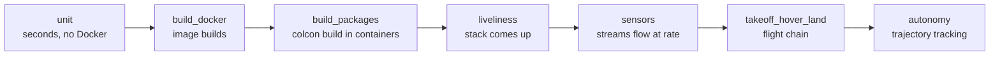
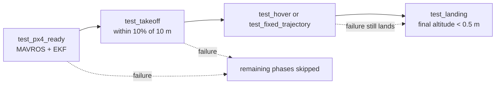
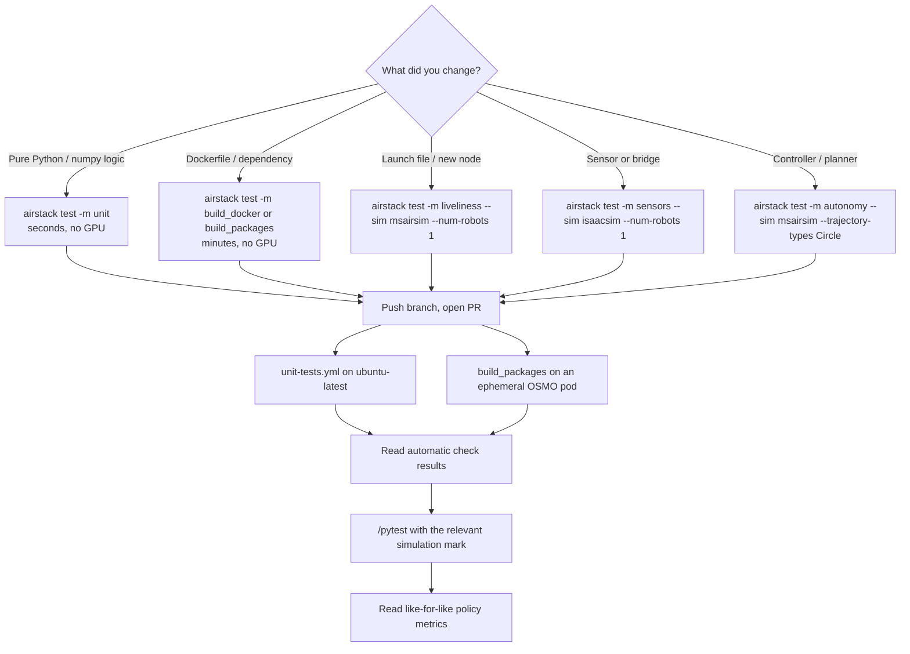

# Using CI

How to run AirStack CI on your pull request and read what comes back: what runs
automatically, how to select simulation campaigns with `/pytest`, and where the
results land. For how the pipeline itself works — the orchestrator, ephemeral
OSMO pods, caching, and security — see [CI/CD Pipeline on OSMO](ci_cd.md).

---

## Triggering a run

### The three entry points

| Trigger | When it fires | What it runs |
|---|---|---|
| `unit-tests.yml` pull request | PR to `main`/`develop` opened, synchronized, or reopened (including forks) | `pytest tests/ -m unit` on `ubuntu-latest` |
| `system-tests.yml` pull request | PR opened, synchronized, or reopened, same-repo branches only | `-m build_packages` on an OSMO worker |
| `/pytest` PR comment | Any time, from a user with `OWNER`/`MEMBER`/`COLLABORATOR` association | Whatever args you put on the first line of the comment |
| `workflow_dispatch` | Manual, from the Actions tab | The form inputs: `marks`, `sim`, `num_robots`, `stress_iterations`, `stable_duration`, `baseline_run_id` |

PR pushes re-run the fast unit gate and the pull-only `build_packages` gate.
GPU-intensive simulations do **not** run automatically; select the campaign
whose policy or integration changed with `/pytest`.

### Comment syntax

The first line is parsed with `shlex`; everything after it is free-form notes.

```text
/pytest -m liveliness --sim msairsim --num-robots 1 --stress-iterations 1

Checking whether the DDS bridge fix holds under 3 robots — see thread above.
```

`-m build_packages` is **pull-only**: it retags floating `cache_*` images onto the PR `VERSION` tag and never runs `images build` (and does not pull Isaac Sim). Use that when iterating on colcon/pytest failures. For other marks, add `--no-image-build` to skip the bake:

```text
/pytest -m build_packages
/pytest -m liveliness --sim msairsim --no-image-build
```

The workflow replies on the thread with the exact `pytest` command it resolved
and a link to the run, and opens a **Check Run** pinned to the PR head SHA so
comment-triggered runs still show up in the PR's Checks tab.

!!! tip "`build_packages` is prepended for you"
    Whenever you pass `-m`, the workflow rewrites the expression to
    `build_packages or <your marks>`. Launch tests are useless against a stale
    `install/` tree, and this removes the most common way to waste a 40-minute
    GPU run. It is skipped when you already named `build_packages`, and when you
    pass no marks at all (pytest then runs everything anyway).

---

## What the pipeline tests, and what that catches

Tests are selected with pytest marks. Collection order is fixed in
`tests/conftest.py` so cheap and prerequisite suites always run first — a
`colcon` break fails in minutes instead of after a sim bring-up.



The table below focuses on what each suite *catches*; the authoritative mark
list and per-mark reference live in
[`tests/README.md`](../../../../tests/README.md).

| Mark | Module | What it verifies | Bugs it is good at catching |
|---|---|---|---|
| `unit` | `<pkg>/test/` (co-located) | Hermetic Python/numpy logic co-located with each ROS 2 package | Off-by-one and boundary errors in filters, converters, validators; regressions in pure algorithm code |
| `build_docker` | `system/test_build_docker.py` | Every image builds; records image sizes | Broken Dockerfiles, deleted apt packages, upstream base-image drift, accidental image bloat |
| `build_packages` | `system/test_build_packages.py` | `colcon build` inside robot, GCS, and ms-airsim workspaces | Missing `package.xml` dependencies, uninstalled launch/config files, C++ breakage on a clean tree |
| `liveliness` | `system/test_liveliness.py` | Containers reach Running, `/clock` publishes, tmux panes alive, sentinel ROS 2 nodes present, compute snapshot, stability poll | Launch files that crash on start, nodes that die after 30 s, `ROBOT_NAME`/domain-ID misconfiguration, runaway CPU or memory |
| `wiring` | `system/test_wiring_snapshot.py` | Observed wiring snapshot of the running ROS graph, drift-checked against the stack's committed `stacks/<name>/wiring.md` | Topic remaps that silently disconnect, nodes publishing into the void, launch-file edits that change the graph without updating `wiring.md` |
| `sensors` | `system/test_sensors.py` | Stereo and depth publish rates on both sim and robot side, filtered LiDAR liveness plus geometry sanity, sim real-time factor, time-series stability | Broken sim-to-ROS bridges, sensor Hz that silently halves, RTF collapse from a heavy new node, LiDAR filter range regressions |
| `takeoff_hover_land` | `system/test_takeoff_hover_land.py` | Four-phase chain per (sim, robots, iteration, velocity): PX4 ready → takeoff to 10 m → hover → land | Controller tuning regressions, altitude overshoot, hover drift, state-estimation bias against ground truth, PX4/MAVROS handshake breakage |
| `autonomy` | `system/test_fixed_trajectory.py` | Same chain with a Circle / Figure8 / Racetrack / Line pattern in the middle; records cross-track error and path RMSE | Path-tracker regressions, trajectory-library math errors, velocity/acceleration limit violations that show up as corner-cutting |
| `waypoint_flight` | `system/test_waypoint_flight.py` | Same chain with an ordered `NavigateTask` waypoint route in the middle; the odometry track is judged by the standalone `waypoint_checker.py` (in-order corridor arrival, final-goal tolerance, per-waypoint timeout) | Waypoint sequencing regressions, behavior-tree/navigation task breakage, routes that skip or stall at a waypoint |

### The flight chain

Both flight suites run as an ordered chain per parametrization, so the drone
always ends on the ground before the next configuration starts:



A failure in the middle phase (`test_hover` or `test_fixed_trajectory`) does
**not** skip landing — a bad tracker must not leave a drone stuck in the air
blocking the rest of the sweep. A failure in `test_px4_ready` or `test_takeoff`
does skip the remaining phases for that configuration.

### Bring-up scope, and why mark selection costs money

`airstack_env` is **class-scoped** and parametrized over
`(sim, num_robots, iteration)`. Each test class does its own `airstack up` and
`airstack down`. Selecting two suites with `or` therefore performs **two full
stack cycles per tuple**:

```text
-m liveliness                  → 1 bring-up per (sim, robots, iter)
-m "liveliness or sensors"     → 2 bring-ups per (sim, robots, iter)
--sim msairsim                 → opt in; both sims doubles all of the above
--num-robots 1,3               → doubles it again
```

Run one mark at a time unless you genuinely need both.

---

## Reading the results

### The PR comment

After `run-tests` finishes — pass or fail — a `report` job on `ubuntu-latest`
downloads the current artifact plus a **baseline** artifact and runs
[`parse_metrics.py`](../../../../tests/parse_metrics.py)
in diff mode only when both artifacts have the same complete simulation
campaign fingerprint (selected tests and parameters).

| Run type | Baseline used |
|---|---|
| PR opened or `/pytest` | Latest `system-tests.yml` artifact on the PR's base branch |
| `workflow_dispatch` with `baseline_run_id` | That specific run |
| `workflow_dispatch` without it | Latest artifact on `main` |

For a complete simulation campaign, the comment has pass rates plus a flat
**Metrics** table, a **Sim publishing rates** pivot (topic Hz aggregates from
the `sensors` mark), and a **Compute usage** pivot (CPU / memory / GPU per
container). Regressions are marked with a red circle, improvements with a
green one. These numeric deltas are advisory: they inform review but do not
fail the PR.

`run_meta.json` separates those policy results from CI failures. A collection
error, zero-test selection, internal pytest error, cancellation, or timeout is
reported as **simulation metrics are not comparable**. Pass-rate and regression
tables are suppressed in that case; the infrastructure problem cannot appear as
a false 0% policy score. A policy assertion that runs and fails remains a real
simulation result and keeps its recorded error metrics.

### The artifact

`test-results-<sha>-<run_id>`, retained 90 days:

```text
tests/results/2026-08-06_14-30-00/
├── summary.txt    # human-readable per-chain summary — open this first
├── results.xml    # JUnit XML: durations, pass/fail per test
├── run_meta.json  # schema-v2 completion/failure class + exact campaign config
├── metrics.json   # every recorded metric, including time series
└── diagnostics/   # on failure: bounded config, panes, logs, ROS/GPU/command ring
```

There are no per-test log files. Live output streams to the Actions log via
pytest's `log_cli`, and failed assertions embed the tail of the relevant
`docker` or `ros2` subprocess output directly in the failure message.

Regenerate a report locally from a downloaded artifact:

```bash
python tests/parse_metrics.py \
  --current  path/to/current-run/ \
  --baseline path/to/baseline-run/ \
  --threshold 20
```

---

## Using CI well while developing

The pipeline is expensive at the far end and nearly free at the near end. Push
each class of failure as far left as it will go.



Practical rules that follow from how the system is built:

- **Reproduce CI locally with the same command.** `airstack test` and CI both call `pytest tests/` with the same flags. If a run fails in CI, copy the resolved command from the acknowledgment comment and run it on any GPU box — including an [interactive OSMO dev pod](../../../tutorials/airstack_on_osmo.md) if you do not have a local GPU.
- **Narrow before you re-run.** A `/pytest` with no args re-runs everything. `/pytest -m autonomy --sim msairsim --trajectory-types Circle` re-runs the one chain you are fixing, in a fraction of the time.
- **Never trust a green launch test against a stale build.** This is why `build_packages` is auto-prepended; keep it that way when writing your own `/pytest` line.
- **Read `summary.txt` before the raw log.** It groups each flight chain with per-phase wall times and status, so the failing phase is obvious without scrolling a 40-minute log.
- **Treat a like-for-like metrics diff as a review artifact.** The reporter compares only identical selected simulation campaigns; a PR that turns a metric red needs an explanation even when every assertion passed.
- **Bump `VERSION` in `.env` when image content changes.** [`check-version-increment.yml`](../../../../.github/workflows/check-version-increment.yml) gates the PR on a strictly-greater semver, and merging that bump is what triggers the release build.

---

## Troubleshooting

The failures a CI *user* can act on from the GitHub side:

| Symptom | Layer | First thing to check |
|---|---|---|
| `/pytest` comment produced no run | Trigger guard | You need `OWNER`/`MEMBER`/`COLLABORATOR` association, and the PR must come from a same-repo branch — fork PRs are blocked from the GPU runners |
| `system-tests.yml` never ran on a fork PR | Trigger guard | Expected: the `pull_request` path only runs for same-repo branches; only the `ubuntu-latest` unit gate runs on forks |
| Runner registered, then pytest failed | Tests | A real test failure — the GitHub Actions log and `summary.txt` are canonical |
| Report says “simulation metrics are not comparable” | Collection/infrastructure | Read the run outcome and pytest exit status in `run_meta.json`; no policy regression was scored |
| Metrics report job failed with no test failures | Report | Report generation or artifact integrity failed; numeric metric deltas are advisory and do not cause this conclusion |
| Job sits `queued` forever, no runner appears | Orchestrator / pod | Not fixable from the PR — an admin needs to inspect the orchestrator and pod; see the [pipeline troubleshooting table](ci_cd.md#troubleshooting) |

Orchestrator-, OSMO-, and pod-level failures (auth errors, `dockerd did not
become ready`, disk exhaustion, …) require orchestrator host access — work
through [CI/CD Pipeline on OSMO → Troubleshooting](ci_cd.md#troubleshooting).

---

## See also

- [CI/CD Pipeline on OSMO](ci_cd.md) — architecture, job lifecycle, pod anatomy, cache strategy, security model.
- [System Tests](../../../../tests/README.md) — marks, fixtures, metrics, and every CLI flag.
- [CI/CD Orchestrator](../../../../tests/ci-cd-orchestrator.md) — admin setup, rotation, and break-glass procedures.
