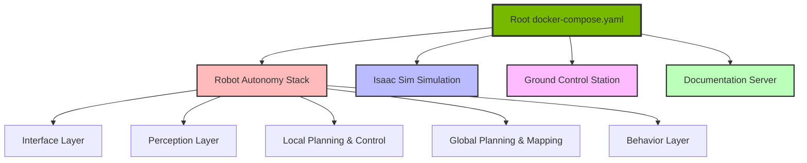
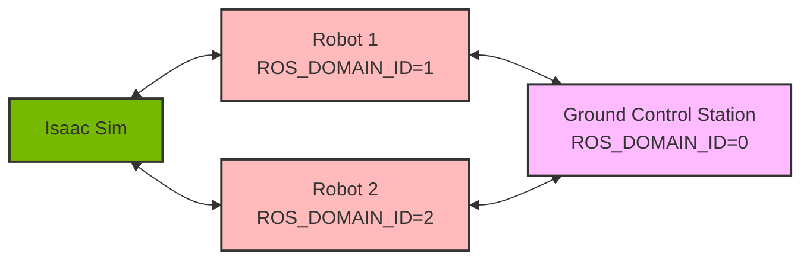

# Key Concepts

This guide introduces the core concepts and workflow of AirStack development. Understanding these concepts will help you work effectively with the AirStack system.

## The AirStack Workflow

### Everything Through the CLI

The primary way to interact with AirStack is through the **`airstack` CLI tool**. This unified command-line interface provides a consistent and simple way to manage all aspects of your development workflow.

The `airstack` CLI is designed to be:

- **Modular**: Commands are organized into modules that can be easily extended
- **Consistent**: Provides a unified interface for all AirStack-related tasks
- **Helpful**: Includes detailed help text and error messages
- **Simple**: Abstracts away complexity while remaining transparent

!!! tip "Getting Started with the CLI"
    After installation, run `airstack setup` to add the CLI to your PATH. Then you can use `airstack` from any directory instead of `./airstack.sh`.

### Core Philosophy: Docker Compose Wrapper

At its core, the `airstack` CLI is a **lightweight wrapper around Docker Compose**. This means:

- `airstack up` ≈ `docker compose up -d`
- `airstack down` ≈ `docker compose down`
- `airstack status` ≈ `docker ps -a`

The CLI adds convenience features like partial name matching for containers, helpful error messages, and simplified service management, but it ultimately delegates to Docker Compose for container orchestration.

## AirStack's Architecture: Composable Components

AirStack is built as a collection of independent, composable components that work together through Docker Compose:



### The Composition Pattern

When you run `airstack up`, here's what happens:

1. **Root Composition**: The main `docker-compose.yaml` at the project root uses the `include:` directive to compose multiple component-specific compose files:

```yaml title="docker-compose.yaml"
include:
  - simulation/isaac-sim/docker/docker-compose.yaml
  - simulation/simple-sim/docker/docker-compose.yaml
  - robot/docker/docker-compose.yaml
  - gcs/docker/docker-compose.yaml
  - docs/docker/docker-compose.yaml
```

2. **Shared Network**: All components are launched on a shared Docker bridge network (`airstack_network` with subnet `172.31.0.0/24`), allowing them to communicate via ROS 2.

3. **Independent Services**: Each component defines its own services, images, and configurations in its own compose file, maintaining separation of concerns.

### Component Launch Commands

Each component's main functionality is defined in the `command:` attribute of its Docker service. This is where the "magic happens" - where the autonomy stack, simulation, or ground control station actually launches.

#### Example: Robot Autonomy Stack

In `robot/docker/docker-compose.yaml`, the robot service defines:

```yaml
command: >
  bash -c "
  service ssh restart;
  tmux new -d -s bringup;
  if [ $$AUTOLAUNCH == 'true' ]; then
    tmux send-keys -t bringup:0.0 'bws && sws && ros2 launch $$LAUNCH_PACKAGE robot.launch.xml role:=$$AUTONOMY_ROLE' ENTER;
  fi;
  sleep infinity"
```

This command:

1. Starts SSH for remote access
2. Creates a tmux session called "bringup"
3. If `AUTOLAUNCH=true` (default), builds the workspace (`bws`), sources it (`sws`), and launches the robot autonomy stack
4. Keeps the container alive with `sleep infinity`

The actual launch command is `ros2 launch $LAUNCH_PACKAGE robot.launch.xml`, which brings up the entire layered autonomy stack.

## Multi-Robot Support

AirStack is designed for multi-robot systems. Each robot runs in its own container with:

- **Unique ROS_DOMAIN_ID**: Extracted from the container name (e.g., `airstack-robot-desktop-1` has `ROS_DOMAIN_ID=1`)
- **Unique ROBOT_NAME**: Set to `robot_$ROS_DOMAIN_ID` (e.g., `robot_1`)
- **Isolated Environment**: Each robot has its own workspace and configuration
- **Shared Network**: All robots can communicate on the same network

To launch multiple robots:

```bash
NUM_ROBOTS=3 airstack up
# This creates: robot-desktop-1, robot-desktop-2, robot-desktop-3
```

## Component Isolation Through Docker

The use of Docker provides several key benefits:

1. **Reproducibility**: Everyone works in the same environment, regardless of host system
2. **Isolation**: Robots, simulation, and GCS don't interfere with each other or your host system
3. **Scalability**: Easy to scale to multiple robots without configuration changes
4. **Development-Production Parity**: The same containers can run in simulation or on real hardware

### Communication Flow



- **Isaac Sim** provides sensor data and receives actuation commands
- **Robots** run their autonomy stacks independently, processing sensor data and generating control commands
- **Ground Control Station** monitors all robots and can send high-level mission commands

All communication happens over ROS 2 topics on the shared Docker network.

## Essential Commands

Here are the most common commands you'll use:

```bash
# Start all services (robot, isaac-sim, gcs)
airstack up

# Start specific services
airstack up robot-desktop          # Only robot autonomy
airstack up isaac-sim      # Only simulation
airstack up gcs            # Only ground control station

# Check status
airstack status

# Connect to a container
airstack connect robot     # Partial name matching
airstack connect isaac-sim

# View logs
airstack logs robot

# Stop everything
airstack down

# Get help
airstack help
airstack help <command>
```

## Configuration and Environment Variables

AirStack uses environment variables for configuration, following Docker Compose's [variable interpolation](https://docs.docker.com/compose/how-tos/environment-variables/variable-interpolation/) pattern.

### Default Configuration

The `.env` file in the project root defines default values:

```bash
# Docker image settings
DOCKER_IMAGE_TAG=latest
DOCKER_IMAGE_BUILD_MODE=dev

# Launch settings
AUTOLAUNCH=true
PLAY_SIM_ON_START=true
NUM_ROBOTS=1

# Simulation settings
ISAAC_SIM_SCENE=simulation/isaac-sim/scenes/two_drone_RetroNeighborhood.usd
```

### Runtime Overrides

You can override these at runtime:

```bash
# Don't autolaunch (useful for debugging)
AUTOLAUNCH=false airstack up

# Launch with 3 robots
NUM_ROBOTS=3 airstack up

# Use a different scene
ISAAC_SIM_SCENE=path/to/custom_scene.usd airstack up

# Use a custom env file
airstack --env-file custom.env up
```

## Next Steps

Now that you understand the key concepts, you can:

1. **[Set up your development environment](development_environment.md)** - Install and configure AirStack
2. **[Learn the CLI in depth](airstack-cli/index.md)** - Master all CLI commands
3. **[Understand Docker usage](airstack-cli/docker_usage.md)** - Deep dive into the Docker Compose workflow
4. **[Start developing](fork_your_own_project.md)** - Create your own autonomy modules

!!! note "Remember the Philosophy"
    Everything in AirStack is done through the `airstack` CLI, which orchestrates Docker Compose to launch modular, isolated components that communicate over ROS 2. Understanding this pattern is key to effective AirStack development.
