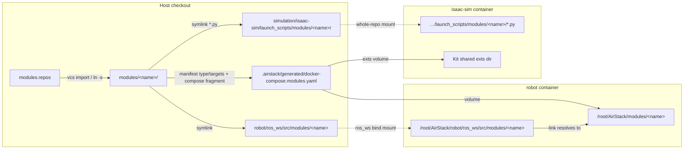

# AirStack Modules

AirStack features can live outside trunk as **modules**: thin repos containing
code plus a small `module.yaml` manifest — deps, identity, and test metadata,
never wiring. Modules exist so that heavy or organization-specific capabilities
(multi-GB ML dependencies, hardware-vendor SDKs, lab-internal algorithms) stay
out of trunk while remaining one command away: a checkout pulls the modules it
wants with the `airstack module` command group, and trunk never carries module
code.

This page covers the module machinery: the CLI, the pinning rule, hooks, and
how the overlay places a module into the containers. The manifest format itself
is documented in the [module schema README](../../common/module_schema/README.md),
and module CI in [Module CI](module_ci.md). Agents scaffolding a new module repo
should follow the `create-module` skill (`.agents/skills/create-module`).

## The moving parts

| Path | What it is | Committed? |
|------|------------|------------|
| `modules.repos` | Which modules this checkout uses: a [vcs2l](https://github.com/ros-infrastructure/vcs2l)-format `repositories:` list (pinned) plus an `x-local-modules:` list for local paths (vcs tools ignore that key) | gitignored in trunk (a *stack* commits its own copy — see [Stacks](stacks.md)) |
| `modules/<name>/` | The synced checkouts (git clones, or symlinks to local paths) | gitignored |
| `robot/ros_ws/src/modules/<name>` | Overlay symlink so colcon builds the module's ROS packages | gitignored |
| `simulation/isaac-sim/launch_scripts/modules/<name>/` | Overlay symlinks exposing a module's Isaac launch scripts | gitignored |
| `.airstack/generated/docker-compose.modules.yaml` | Generated compose override that makes the placements resolve **inside** the containers | gitignored |

## Commands

```bash
# Add a module — remote repos MUST be pinned to a tag or commit SHA:
airstack module add https://github.com/castacks/asm_dfm2_disturbances.git --version v0.1.0

# Or use a local checkout (recorded under x-local-modules, symlinked into modules/):
airstack module add ../asm_dfm2_disturbances

airstack module list            # name, type, version/pin, targets, valid?
airstack module sync            # (re)clone/link, validate, overlay, run hooks
airstack module remove <name>   # drop entry, checkout, and all overlay artifacts
airstack module doctor          # validate manifests + overlay integrity
airstack module doctor --drift  # fork workflow: classify changes vs origin/develop
airstack module create --in-tree <name>   # scaffold a module boundary in your fork
```

### The pinning rule

`modules.repos` entries are **pinned to tags or commit SHAs — never branches**.
A branch ref rots silently; a pinned `.repos` file *is* a
tested-together release set. `module add` therefore refuses `--version` values
that look like branches (`main`, `develop`, …). Moving a pin is a deliberate
act: re-run `module add <url> --version <new-tag>` (upserts the entry).

### Sync, step by step

`airstack module sync`:

1. Ensures a `vcs` binary exists — installing **vcs2l** (the maintained
   vcstool successor) via `pip3 install --user` if missing; an existing `vcs`
   is used as-is and its provider is logged.
2. `vcs import modules --input modules.repos --recursive` (recursive = git
   submodules too), then symlinks each `x-local-modules` path to
   `modules/<name>`.
3. Validates every `modules/*/module.yaml` with `tools/validate_module.py`
   against `common/module_schema/module.schema.json` — sync **fails** on an
   invalid manifest.
4. Runs `tools/module_overlay.py` (see below).
5. Runs each module's `hooks.host_setup` script (skip with `--no-hooks`).
   Hook contract: **idempotent, never sudo, writes only inside the module
   checkout** (precedent: the asm_optitrack module's NatNet SDK download script).

## How the overlay works



Placement is driven by the manifest's `type` and `targets`:

- **`ros_package` targeting `robot`** — symlink
  `robot/ros_ws/src/modules/<name>` → `../../../../modules/<name>` so colcon
  (`bws`) picks the packages up. The robot container only bind-mounts
  `robot/ros_ws` (and `common/`), so that symlink would **dangle in-container**;
  the generated compose file adds a volume mounting the module checkout at
  `/root/AirStack/modules/<name>` — exactly where the symlink resolves inside
  the container. The host-side symlink still gives IDE and host-colcon
  visibility.
- **`isaac_extension` targeting `isaac-sim`** — the repo is mounted whole at
  `/isaac-sim/AirStack`, so repo-internal symlinks resolve in-container:
  every `modules/<name>/launch_scripts/*.py` is linked into
  `simulation/isaac-sim/launch_scripts/modules/<name>/`, making module scenes
  addressable without path traversal:

  ```bash
  ISAAC_SIM_SCRIPT_NAME=modules/<name>/<script>.py airstack up ...
  ```

  Kit extensions under `modules/<name>/exts/*` are mounted into the shared
  Kit exts dir that the isaac-sim command already passes via `--ext-folder`
  (the same pattern trunk uses for `pegasus.simulator`) — either
  automatically, or via the module's own `compose:` fragment when it declares
  one (the fragment is then the source of truth; no double mounts). For
  local-path modules the generated file also binds the real directory over
  `/isaac-sim/AirStack/modules/<name>`, since a symlink out of the repo would
  dangle inside the whole-repo mount.

  The generated file additionally exports
  `AIRSTACK_LAUNCH_SCRIPTS_DIR=/isaac-sim/AirStack/simulation/isaac-sim/launch_scripts`
  into the isaac-sim service — module launch scripts should import trunk
  helpers (e.g. `pegasus_app`) via
  `sys.path.insert(0, os.environ.get("AIRSTACK_LAUNCH_SCRIPTS_DIR", "/isaac-sim/AirStack/simulation/isaac-sim/launch_scripts"))`
  instead of baking in the mount path.
- **`compose:` fragments** (any type) — the fragment's `services:` are merged
  into the generated file, with relative host paths rewritten to absolute
  (compose resolves relative bind sources against different bases depending on
  how files are merged; the generated file is machine-local and regenerated on
  every sync, so absolute is the unambiguous choice).
- **`data`** — no overlay action yet (asset fetching lands with a later phase).

Everything is idempotent: re-running `sync` converges, `module remove` (or
deleting `modules.repos` and syncing) restores a clean tree, and
`module doctor` runs the same computation in `--check` mode to detect drift.

## Starting the stack with modules

`airstack up` includes the generated override automatically whenever
`.airstack/generated/docker-compose.modules.yaml` exists (an info line names
it in the launch output). No modules synced → no file → byte-identical
behavior to a module-free checkout.

To launch *without* module mounts while keeping them synced:

```bash
AIRSTACK_NO_MODULE_COMPOSE=1 airstack up
```

## The researcher workflow (fork → module)

Research happens in a fork; modularity is a graduation step.
Day one, put your work behind a directory boundary:

```bash
airstack module create --in-tree my_planner
```

This scaffolds `robot/ros_ws/src/modules/my_planner/` — a stub `module.yaml`,
an `ament_python` package skeleton, a launch file whose topic endpoints are
declared args **defaulting to canonical names** (and containing no `<remap>` —
wiring overrides belong to whoever includes the module), and a `test/` dir.
Note that trunk gitignores `robot/ros_ws/src/modules/` (overlay symlinks live
there), so commit the module in your fork with `git add -f` or un-ignore the
path there.

While researching, keep an eye on extraction debt:

```bash
airstack module doctor --drift
```

classifies your changes against the merge-base with `origin/develop`:
files inside `robot/ros_ws/src/modules/` or `modules/` are *contained* (fine);
everything else is listed as extraction debt to upstream, carry as a
fragment/override, or propose as a missing convention. The report **informs,
never blocks**. An automated `module extract` command (graduating into a fresh
template repo) is future work; the `create-module` skill covers authoring the
standalone repo by hand today.

## Current limitations (honest v1)

- **Robot volumes attach to `robot-desktop` and `robot-l4t`.** Services that
  `extends:` those from another compose *file* (`robot-desktop-onboard`,
  `robot-offboard`, `simple-robot`, …) re-parse the base file and do not see
  override-file additions. Override the set with
  `AIRSTACK_MODULE_ROBOT_SERVICES=svc1,svc2` if you need others.
- **`gcs` / `ms-airsim` targets** get no placement yet.
- **`airstack_compat`** ranges are validated syntactically but not yet checked
  against the checkout's `.env` `VERSION` at sync time.
- **vcs2l** is installed with `pip3 install --user`; make sure `~/.local/bin`
  is on your `PATH` for subsequent shells.

## Docker layer composition

Module dependencies never enter trunk images — that is what keeps the base
images small and the published set finite. Trunk publishes **one signed base
image per host type per version**; modules bring their own dependencies, and
`tools/compose_module_layers.py` (run automatically by `airstack module sync`,
or on demand via `airstack module lock`) composes them into per-checkout image
plans. Permutations are never published.

### The three dependency tiers

| Tier | Manifest field | What it becomes | When to use |
|------|----------------|-----------------|-------------|
| 1 | `deps: {apt: [...], pip: [...]}` | One generated `RUN apt-get install …` / `RUN pip3 install …` layer **per module** in `.airstack/generated/layers/<host>/Dockerfile.composed` | The default: plain package deps |
| 2 | `dockerfile: Dockerfile.module` | The module's own fragment, built with `--build-arg BASE_IMAGE=<previous chain link>` (always `ARG BASE_IMAGE`, never a fixed base) | Custom build steps (SDK installs, source builds) |
| 3 | `overlay_image: <ref>` | A prebuilt overlay pulled instead of built | Monster deps (multi-GB CUDA/Torch stacks) published by the module's own CI |

The chain is deterministic — modules sorted by name within each tier, tiers in
order 1 → 2 → 3-as-build, grouped per target host (`robot` / `gcs` /
`isaac-sim` / `ms-airsim`):

```text
<registry>/airstack:v0.19.0_robot-x86-64_dev          ← trunk base, pulled, never rebuilt
  → tier-1 layers (one RUN per module → per-module docker layer cache)
  → tier-2 fragments (BASE_IMAGE = previous link)
  = <registry>/airstack:v0.19.0_robot-x86-64_dev-m<plan_hash[:8]>
```

**Tier-3 rule:** a prebuilt overlay was built `FROM` the plain trunk base, so
docker cannot merge it into a locally built chain. It is used **as-is** only
when it is the *sole* docker-relevant module for its host. In any other
composition its module must also carry a `dockerfile:` — the fragment is the
source of truth and the overlay is just a cache — otherwise the plan errors.

### Zero-module identity rule

When no module contributes a docker-relevant declaration (empty `deps`, no
`dockerfile`, no `overlay_image` — e.g. a checkout with only dep-free modules),
the plan for every host is exactly
`{base_image: <today's tag>, steps: [], final_tag: <today's tag>}`: no
`Dockerfile.composed` is generated and the generated compose override carries
**no `image:` keys**. A module-free or dep-free checkout runs today's images
byte-identically.

### Artifacts

| Path | What it is | Committed? |
|------|------------|------------|
| `.airstack/generated/layer_plan.json` | `{host: {base_image, steps: [{module, tier, dockerfile, dep_hash}], final_tag}}` | gitignored |
| `.airstack/generated/layers/<host>/Dockerfile.composed` | The tier-1 stage (only for hosts with tier-1 steps) | gitignored |
| `modules.lock` (repo root) | Per module `{name, pin, dep_hash, targets}` plus `plan_hash`; deterministic serialization — identical inputs give a byte-identical lock | gitignored |

`dep_hash` is a SHA-256 over the module's canonicalized deps, its
`Dockerfile.module` bytes, and its `overlay_image` ref — so the lock (and the
`-m<plan_hash[:8]>` tag suffix) moves exactly when a dependency declaration
moves. Module *code* changes rebuild nothing (source stays volume-mounted; the
dev loop is still `bws` in the container); a module's *dep* change invalidates
only its own layer and the links above it.

### Plan vs. build

`airstack module sync` (and `airstack module lock`) is **plan-only**: it writes
the plan, the composed Dockerfile, and the lock, and never calls docker.
Actually building the chain is:

```bash
airstack module lock --build     # = compose_module_layers.py --build
```

which runs the docker build chain per host (`docker build --build-arg
BASE_IMAGE=… -f …`, in plan order) and then points the affected services at the
composed `final_tag` by writing `image:` overrides into
`.airstack/generated/docker-compose.modules.yaml`. This path is meant for CI /
the orchestrator and for developers who changed module deps; re-running plain
`sync` regenerates the override without the `image:` keys. The `robot` host's
override targets `robot-desktop` (not `robot-l4t`, whose aarch64 image chains
from `robot-l4t-stack-base`); override the service list with
`AIRSTACK_MODULE_LAYER_ROBOT_SERVICES` if needed.

### The conflict gate (doctor hard gate #1)

`sync` runs `compose_module_layers.py --check-conflicts` before planning and
**fails** when two modules pin the same apt/pip package differently for the
same host (e.g. `tabulate==0.9.0` vs `tabulate==0.8.0`), naming the fighting
modules. Same-spec duplicates and unpinned duplicates are fine. This is one of
the two enumerated places where module tooling hard-errors instead of
observing: composing a broken image would be indistinguishable
from launching a broken system.

### Trunk publishing is untouched

Composed images (`…-m<hash>` tags) are **per-checkout artifacts**: built where
they are used, cached per module layer, never pushed by trunk CI. Trunk's
`docker-build.yml` and its retag planner
(`.github/workflows/scripts/docker_image_plan.py`) continue to fingerprint,
build, and sign only the base images — which is precisely why they need no
change for modules.
