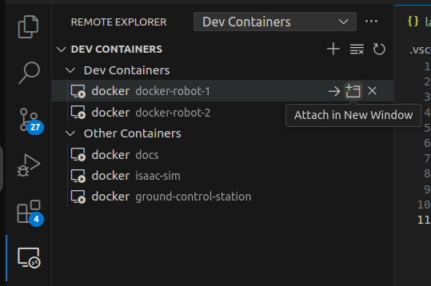
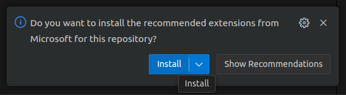
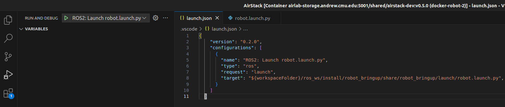
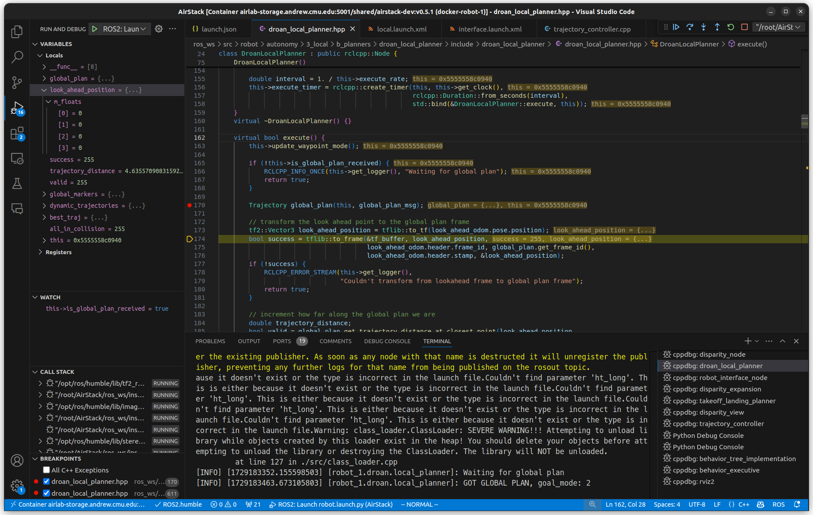

# VS Code: Docker Integration and Debugger Setup

Start containers
```bash
# optionally pass the --scale robot=N argument to start N robots
dc compose up -d  # --scale robot=2
```

Open AirStack folder

```bash
cd AirStack
code .
```

Install the ["Dev Containers" extension](https://marketplace.visualstudio.com/items?itemName=ms-vscode-remote.remote-containers).

Now click the "Remote Explorer" icon on the left side bar, hover over a robot container, and attach to the container.



Install recommended extensions within the image. This installs the `ROS`, `C++`, and `Python` extensions in the container.


## Build ROS Workspace
Hit `Ctrl-Shift-B` to build the project. This is a shortcut for `bws --cmake-args '-DCMAKE_BUILD_TYPE=Debug'`, which adds debug symbols to the build.

Build tasks are defined in `.vscode/tasks.json`.


## Launch

Hit `F5` to launch `robot.launch.xml`, or click the "Run and Debug" button on the left side of the screen and click the green play button.

Launch tasks are defined in `.vscode/launch.json`.



You can now set breakpoints, view variables, step-through code, and debug [as usual in VSCode](https://code.visualstudio.com/docs/editor/debugging).




!!! warning "Warning about file permissions"

    Folders and files created within the attached docker container will be owned by root. This can cause issues when trying to edit files from the host machine, especially when using git to switch branches.
    If you accidentally create files as root, you can change the owner to your user with the following command:
    ```bash
    sudo chown -R $USER:$USER .
    ```