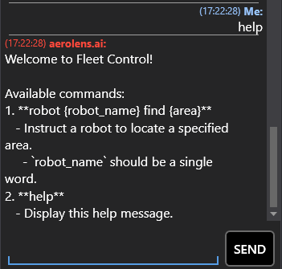
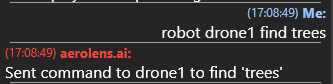

# Aerolens.ai - Talk to your robots

This configuration file defines the parameters for the `chat2ros_agent`, which connects to an MQTT topic, filters messages, and routes queries through ROS topics.
```yaml
chat2ros_agent:
  mqtt_subcribe_topic: aerolens-ai  # Topic name at MQTT for the subscriber service that sends COT messages subscribed from the TAK server.
  ros_query_text_topic: '/query/text'  # ROS Topic name to publish the chat queries.
  ros_query_response_topic: '/query/response'  # ROS Topic name to publish the chat responses.
  filter_name: <project>-operator
```


## Parameters

- **`mqtt_subscribe_topic`** (`aerolens-ai`):  
  The MQTT topic where messages containing COT data are received.

- **`ros_query_text_topic`** (`/query/text`):  
  The ROS topic where filtered queries are published.

- **`ros_query_response_topic`** (`/query/response`):  
  The ROS topic where responses to the queries are published.

- **`filter_name`** (`dsta-operator`):  
  A filter applied to incoming messages, selecting only those where `filter_messages.name` matches this value.

## Workflow

1. The service subscribes to the MQTT topic (`aerolens-ai`).
2. It filters messages based on `filter_name` (`<project>-operator`).
3. The extracted query is published to `<robot_name>/query/text`.
4. The response to the query is expected on `<robot_name>/query/response`.

This enables seamless integration between an MQTT-based message broker and ROS for structured communication.

## Commands:



`help` - Display the help message.



`robot <robot_name> find <object>` - Find an object using the robot.