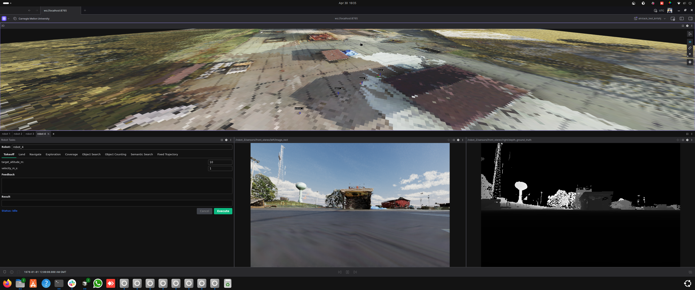

# GCS Foxglove Visualization

The GCS runs a **Foxglove Studio** browser interface backed by a single ROS 2 node — `foxglove_visualizer_node` — that gathers per-robot data from the cross-domain bridge and republishes it on a small set of GCS-side topics. Foxglove subscribes to those topics and shows the fleet in 3D.

This page describes what the node visualizes today, the topic naming convention, and where to edit when you want to change or add a marker type. For the gossip payload visualization (filtered rays, voxel maps, etc.) see [Coordination Payloads](../robot/autonomy/coordination/payloads.md).



## What gets visualized

The visualizer auto-discovers any robot whose topics match the AirStack convention (default prefix: `robot`). For each discovered robot it subscribes to a fixed set of suffixes:

| Suffix | Type | What it becomes on the GCS |
|---|---|---|
| `/interface/mavros/global_position/global` | `NavSatFix` | Robot location pin on the Map panel |
| `/odometry_conversion/odometry` | `Odometry` | Body-frame pose / orientation arrow |
| `/trajectory_controller/trajectory_vis` | `MarkerArray` | Live executing trajectory |
| `/global_plan` | `Path` | Global plan polyline |
| `/vdb_mapping/vdb_map_visualization` | `Marker` | Per-robot VDB occupancy mesh |

All of these are published by individual robots in their **local `map` frame** (origin = drone boot position). The visualizer translates them into a single global `map` frame on the GCS using each robot's GPS boot offset, and merges everything into one `MarkerArray`.

## Output topics

| Topic | Type | What it carries |
|---|---|---|
| `/gcs/robot_markers` | `MarkerArray`  | Combined per-robot markers (mesh, trajectory, plan, VDB) in global ENU |
| `/gcs/{robot_name}/location` | `NavSatFix` | Per-robot GPS rewritten to `frame_id='map'` — Foxglove's Map panel only accepts it that way |
| `/gcs/map_origin/location` | `NavSatFix` | Stationary fix at the configured `ORIGIN_LAT/LON` so the Map panel has a fixed reference |
| `/gcs/sim_ground` | `Marker` | Sim overhead-camera output rendered as a textured ground plane (sim only) |
| `/gcs/payload/{robot}/{name}` | varies  | Per-robot gossip-payload republish (one topic per registered handler) |


## Discovery loop

`_discover_robots` runs every 5 seconds. It calls `get_topic_names_and_types()`, regex-matches each suffix above, and creates a subscription if it sees a topic it doesn't already track. Robots that come online late are picked up on the next tick.

To change which prefix is matched (e.g. you renamed robots from `robot_*` to `drone_*`), set the `robot_name_prefix` parameter on the visualizer node.

## How to modify or add a marker type

The visualizer is designed to be extended in-place. The pattern, taken from `gcs/ros_ws/src/gcs_visualizer/gcs_visualizer/foxglove_visualizer_node.py`:

### 1. Add a suffix and regex

```python
PLAN_SUFFIX = '/global_plan'
self._plan_pattern = re.compile(rf'^/({re.escape(self._prefix)}_\w+){re.escape(PLAN_SUFFIX)}$')
```

### 2. Add state

```python
self._global_plans   = {}   # robot_name -> latest msg
self._subscribed_plan = set()
```

### 3. Subscribe in `_discover_robots`

```python
if topic not in self._subscribed_plan:
    m = self._plan_pattern.match(topic)
    if m and 'nav_msgs/msg/Path' in type_list:
        name = m.group(1)
        self.create_subscription(
            Path, topic,
            lambda msg, n=name: self._plan_callback(msg, n),
            10,   # 10 = default RELIABLE for planning topics;
                  # SENSOR_QOS for high-rate sensor streams
        )
        self._subscribed_plan.add(topic)
```


### 4. Add a callback

```python
def _plan_callback(self, msg: Path, robot_name: str):
    self._global_plans[robot_name] = msg
```

### 5. Render in `_publish_markers`

```python
plan = self._global_plans.get(robot_name)
boot = self._gps_boot.get(robot_name)
if plan is not None and boot is not None:
    bx, by, bz = boot
    line = Marker()
    line.header.frame_id = 'map'
    line.ns = f'{robot_name}_global_plan'
    line.type = Marker.LINE_STRIP
    for ps in plan.poses:
        p = ps.pose.position
        line.points.append(Point(x=p.x + bx, y=p.y + by, z=p.z + bz))
    array.markers.append(line)
```


### 6. Bridge the source topic across DDS domains

The visualizer can only subscribe to topics that crossed the DDS bridge. Add the source topic to `robot/ros_ws/src/autonomy_bringup/onboard_all/config/dds_router.yaml` under `allowlist`:

```yaml
allowlist:
  - name: "rt/$(env ROBOT_NAME)/your/new_topic"
```

Then restart the robot containers — the router only re-reads its allowlist on startup.

## Bridging a topic without writing a callback

If your topic is already in a Foxglove-native type (`nav_msgs/Path`, `sensor_msgs/PointCloud2`, `visualization_msgs/MarkerArray`) and doesn't need the GPS offset, you can skip the visualizer entirely — just bridge it through the DDS router and add a panel in Foxglove pointing at the topic. The visualizer is only required when you need georeferencing or want everything to flow through the combined `/gcs/robot_markers` namespace.

## Sim-only: textured overhead ground

When running in sim, the visualizer also subscribes to `/sim/overhead/image` + `/sim/overhead/spec`. On receiving both, it builds one `TRIANGLE_LIST` marker on `/gcs/sim_ground` (latched) and tears down its subscriptions. See [2D World Map in Foxglove](../simulation/isaac_sim/overhead_camera.md) for the producer side.

## Troubleshooting

| Symptom | Likely cause |
|---|---|
| Robot doesn't appear at all | Source topic isn't in the DDS router allowlist, or the GPS topic isn't publishing yet |
| Robot appears at the wrong global location | First GPS fix had wrong altitude datum, or PX4 home wasn't set (sim) |
| Markers double-offset (visibly twice as far from where they should be) | Both `pose.position` and `points[]` were offset in the render loop |
| New marker added but never shows up | Discovery hasn't fired yet (5 s interval), or topic name doesn't match the regex |
| Foxglove "frame `map` does not exist" | The static `world → map` TF didn't reach Foxglove — restart the GCS container |

## See also

- [Coordination Payloads](../robot/autonomy/coordination/payloads.md) — extending visualization with gossip-broadcast payloads
- [Adding Waypoints and Geofences](waypoints_and_geofences.md) — interactive click-to-place editors
- [Overhead Camera](../simulation/isaac_sim/overhead_camera.md) — sim-side ground texture producer
- [`.agents/skills/visualize-in-foxglove`](../../.agents/skills/visualize-in-foxglove/SKILL.md) — agent workflow for adding a topic
