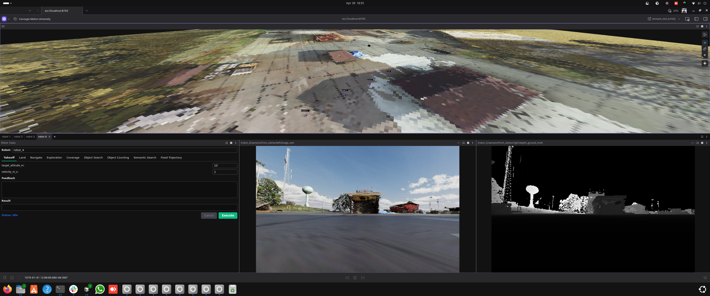

# GCS Foxglove Visualization

The GCS runs a **Foxglove Studio** interface backed by a single ROS 2 node — `foxglove_visualizer_node` — that gathers per-robot data from the cross-domain bridge and republishes it on a small set of GCS-side topics. Foxglove subscribes to those topics and shows the fleet in 3D.

This page describes what the node visualizes today and the topic naming convention. To change or add a marker type, see [Extending the Foxglove Visualizer](extending_foxglove.md). For the gossip payload visualization (filtered rays, voxel maps, etc.) see [Coordination Payloads](../robot/autonomy/coordination/payloads.md).

<video controls muted loop playsinline preload="metadata" style="max-width: 100%;">
  <source src="../../assets/media/foxglove_demo.mp4" type="video/mp4">
</video>
*Foxglove during a live 3-robot Isaac Sim run: the 3D panel draws each drone's trajectory (Circle / Figure-8 `FixedTrajectoryTask` patterns) while the per-robot tabs show Robot Tasks and live camera + depth feeds.*

## Connecting to Foxglove and loading the custom layout

**The `NUM_ROBOTS`-matched layout loads automatically — no manual import.** On every GCS container startup, `gcs/foxglove_extensions/render_layout.py` renders an `<N>`-robot layout from the single-robot template (`gcs/foxglove_extensions/airstack_default.json`) and seeds it straight into the Foxglove desktop app's local layout store (`/root/.config/Foxglove/studio-datastores/layouts-local/airstack_default_<N>_robots` — bind-mounted from `gcs/docker/Foxglove`, so it persists across container restarts). `gcs.launch.xml` then opens Foxglove with a deep link that both connects to `ws://localhost:8765` and selects that layout by id, so the app comes up showing **AirStack default (`<N>` robots)** immediately.

### Editing and saving the layout

The seeded layout is an ordinary local layout — edit it and use **Save** as usual. Your saved edits are preserved: the seeder detects that the layout no longer matches what it generated and will not overwrite it on later startups (this also means template updates stop propagating to an edited layout). Two ways to manage this:

- **Reset to the generated default:** delete the layout in Foxglove's **Layouts** menu — the next container start re-seeds a fresh copy.
- **Keep your own variant safe forever:** **Save As** a personal copy under a different name; the seeder never touches layouts it didn't create.

### Manual fallback

The rendered layout is also still written to `/root/airstack_layout_num_robots_<N>.json` inside the container, so **Layouts → Import from file...** keeps working — useful when running Foxglove on the host instead of in the container (connect to `ws://localhost:8766` in that case).

!!! note "Foxglove version pin"
    `Dockerfile.gcs` pins the Foxglove desktop version (`FOXGLOVE_VERSION` build arg) because the auto-load mechanism writes the app's on-disk local-layout record format directly. Before bumping the pin, verify the format in the new version's `studio-datastores/layouts-local/` still matches what `render_layout.py::seed_layout_store` writes.

!!! warning "Robot naming assumption"
    Layout rendering assumes robots are named `robot_1..robot_N` (the default robot-name map). Fleets with custom robot names (RFC #380) still get the default-named tabs; name-aware rendering is future work.

## What gets visualized

The visualizer auto-discovers any robot whose topics match the AirStack convention (default prefix: `robot`). For each discovered robot it subscribes to a fixed set of suffixes:

| Suffix | Type | What it becomes on the GCS |
|---|---|---|
| `/interface/mavros/global_position/global` | `NavSatFix` | Robot location pin on the Map panel |
| `/odometry_conversion/odometry` | `Odometry` | Body-frame pose / orientation arrow |
| `/trajectory_controller/trajectory_vis` | `MarkerArray` | Live executing trajectory |
| `/global_plan` | `Path` | Global plan polyline |
| `/vdb_mapping/vdb_map_visualization` | `Marker` | Per-robot VDB occupancy mesh |

All of these are published by individual robots in their **local `map` frame** (origin = drone boot position). The visualizer translates them into a single global `map` frame on the GCS using each robot's GPS boot offset, and merges everything into one `MarkerArray`.

## Output topics

| Topic | Type | What it carries |
|---|---|---|
| `/gcs/robot_markers` | `MarkerArray`  | Combined per-robot markers (mesh, trajectory, plan, VDB) in global ENU |
| `/gcs/{robot_name}/location` | `NavSatFix` | Per-robot GPS rewritten to `frame_id='map'` — Foxglove's Map panel only accepts it that way |
| `/gcs/map_origin/location` | `NavSatFix` | Stationary fix at the configured `ORIGIN_LAT/LON` so the Map panel has a fixed reference |
| `/gcs/sim_ground` | `Marker` | Sim overhead-camera output rendered as a textured ground plane (sim only) |
| `/gcs/payload/{robot}/{name}` | varies  | Per-robot gossip-payload republish (one topic per registered handler) |

## Discovery loop

`_discover_robots` runs every 5 seconds. It calls `get_topic_names_and_types()`, regex-matches each suffix above, and creates a subscription if it sees a topic it doesn't already track. Robots that come online late are picked up on the next tick.

To change which prefix is matched (e.g. you renamed robots from `robot_*` to `drone_*`), set the `robot_name_prefix` parameter on the visualizer node.

## Sim-only: textured overhead ground

When running in sim, the visualizer also subscribes to `/sim/overhead/image` + `/sim/overhead/spec`. On receiving both, it builds one `TRIANGLE_LIST` marker on `/gcs/sim_ground` (latched) and tears down its subscriptions. See [2D World Map in Foxglove](../simulation/isaac_sim/overhead_camera.md) for the producer side.

## Troubleshooting

| Symptom | Likely cause |
|---|---|
| Robot doesn't appear at all | Source topic isn't in the DDS router allowlist, or the GPS topic isn't publishing yet |
| Robot appears at the wrong global location | First GPS fix had wrong altitude datum, or PX4 home wasn't set (sim) |
| Markers double-offset (visibly twice as far from where they should be) | Both `pose.position` and `points[]` were offset in the render loop |
| New marker added but never shows up | Discovery hasn't fired yet (5 s interval), or topic name doesn't match the regex |
| Foxglove "frame `map` does not exist" | The static `world → map` TF didn't reach Foxglove — restart the GCS container |

## See also

- [Extending the Foxglove Visualizer](extending_foxglove.md) — maintainer guide: modifying or adding marker types, bridging topics
- [Coordination Payloads](../robot/autonomy/coordination/payloads.md) — extending visualization with gossip-broadcast payloads
- [Adding Waypoints and Geofences](waypoints_and_geofences.md) — interactive click-to-place editors
- [Overhead Camera](../simulation/isaac_sim/overhead_camera.md) — sim-side ground texture producer
