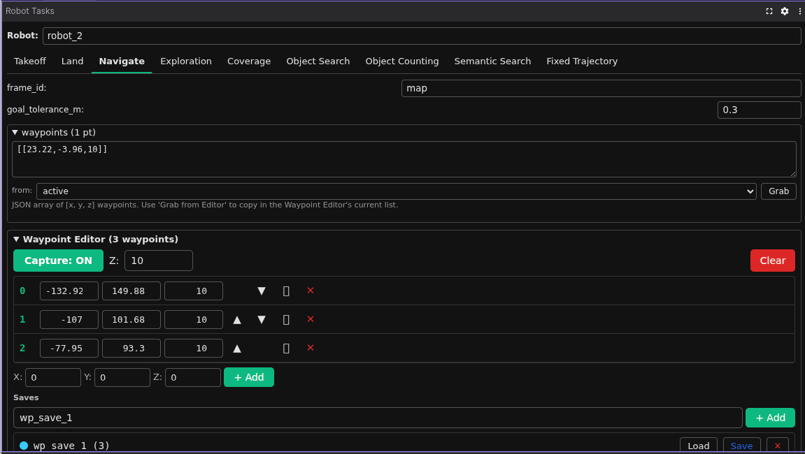
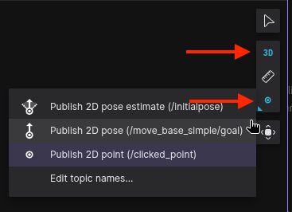

# Adding Waypoints and Geofences

The GCS has two click-to-place panels in Foxglove:

- **Waypoint Editor** — drop ordered 3D waypoints for the Navigate task.
- **Polygon Editor** — drop vertices of a 2D area to use as a **geofence** / search bounds for the Exploration and Coverage tasks.

Both panels work the same way: enable click capture then click in the 3D panel to place points.

The two editors live inside the **Robot Tasks** panel — the Waypoint Editor appears under the **Navigate** tab, and the Polygon Editor appears under the **Exploration** and **Coverage** tabs (where it feeds the `search_bounds` field).

<iframe src="https://drive.google.com/file/d/10DYLMBoDlFsCS5n-Sdk2HdDlPbERr_gi/preview" width="100%" height="480" allow="autoplay" allowfullscreen></iframe>

*End-to-end demo: enabling click capture, dropping points, saving the set, then sending it to a robot.*

## Place points

1. In the editor panel, toggle **Enable click capture** on.
2. (Optional) In the top right of the **3D** panel, switch the camera to a top-down view to make it easier to drop points on the ground plane.
3. In the 3D panel toolbar, click the **Publish** tool (top right, ▷ icon) and switch its mode to **Publish 2D point (/clicked_point)** — this is what sends clicks to the editor.

    { width="380" }

4. Click anywhere in the 3D panel. A red marker appears at the click location. The waypoint editor draws spheres in click order; the polygon editor draws a closed loop.
5. The **Default altitude** field controls the `z` coordinate that gets attached to each click — set it once, then click freely on the ground.

To add a point without clicking — e.g. for a precise coordinate — type values into the **+ Add** row and press Enter.

## Reorder, edit, delete or duplicate

- **Reorder** — drag a row up or down in the active list. The marker numbering updates immediately.
- **Edit a point** — click the row, edit the `x` / `y` / `z` fields, press Enter.
- **Delete a point** — click the ✕ on the row.
- **Clear all** — click **Clear**. Doesn't touch saved sets.
- **Duplicate** — click the ⧉ icon on a row to insert a copy of that point directly after it. Useful for laying down repeated patterns like a survey grid where each new point is a small offset from the previous one.

For polygons specifically, vertex order defines the perimeter — reorder rows to flip the polygon shape.

## Save and load

Saves let you name a set of points and bring them back later — the Robot Tasks panel reads the same saves, so a saved waypoint set can be selected as a Navigate target and a saved polygon can be selected as `search_bounds` for Exploration / Coverage.

Two-step save flow:

1. Type a name into the **save name…** field, then click **+ Add**. The save now exists in memory and shows up in the saves list.
2. Click **Save** on that row to persist it to disk. The button changes to **✓ Saved** when the file write succeeds.

Other actions per saved row:

- **Load** — replaces the active list with the saved one. Useful for re-editing a previously persisted set.
- **Delete** — removes the save from both memory and disk.

Saves are written to host-mounted JSON files inside the GCS container:

| Editor | File |
|---|---|
| Waypoints | `~/.airstack/gcs_waypoint_saves.json` |
| Polygons | `~/.airstack/gcs_polygon_saves.json` |

These survive container restarts and can be hand-edited or version-controlled if you want to ship a curated mission set.

## Use them in a task

- **Navigate** — in the Robot Tasks panel, select the **Navigate** tab, pick a saved waypoint set from the **from:** dropdown (or **active** to use whatever's currently in the editor), pick a robot, click **Send**. The **Grab** button copies the current selection into the JSON `waypoints` field below.
- **Exploration** / **Coverage** — same flow, but the polygon save fills the `search_bounds` field.

If a save doesn't appear in the dropdown after creating it, click the dropdown again to refresh — the Tasks panel re-reads the latched saves topic on focus.

## Troubleshooting

| Symptom | Likely cause |
|---|---|
| Clicks don't register | Click capture isn't enabled, or the Publish tool isn't set to **Click position** |
| Clicks register but no marker shows | The 3D panel doesn't have the editor's marker topic enabled — open its Topics list and toggle on `/gcs/waypoints/markers` (or `/gcs/polygon/markers`) |
| Saves don't persist | Host volume `~/.airstack` not mounted on the GCS container |
| Save name silently overwrites | Both **+ Add** and **Save** overwrite by name — pick a unique name |
| Tasks panel doesn't see a new save | Re-open the dropdown to refresh, or restart the panel |

## See also

- [GCS Foxglove Visualization](foxglove.md) — the multi-robot fleet view alongside these editors
- [Coordination Payloads](../robot/autonomy/coordination/payloads.md) — for sharing custom data fleet-wide
