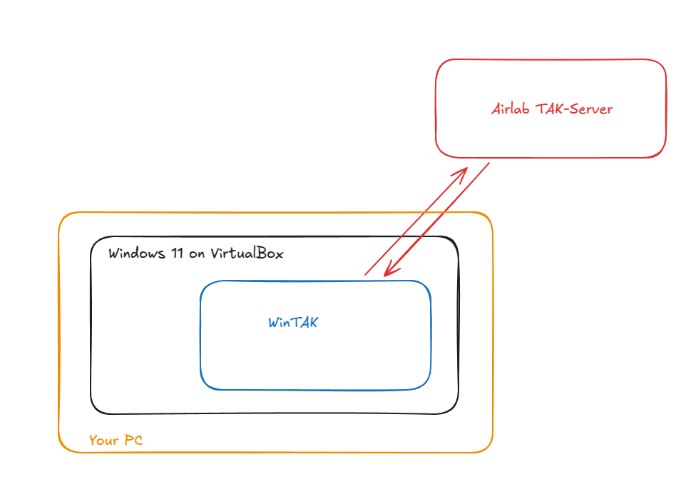

# WinTAK Installation

WinTAK provides integration with TAK (Team Awareness Kit) servers for situational awareness and coordination with ground teams. It runs in a Windows 11 VirtualBox virtual machine.

## Overview

WinTAK is configured to auto-start on boot and connects to the AirLab TAK Server. This integration enables:

- Sharing robot positions and status with TAK-enabled teams
- Receiving waypoints and mission data from TAK clients
- Coordinating multi-agent operations across air and ground assets
- Integration with existing TAK infrastructure



## Installation

### Using AirStack CLI (Recommended)

The recommended way to install WinTAK is using the AirStack CLI tool:

```bash
# From the AirStack root directory
airstack install --with-wintak
```

This will:

1. Download the necessary files from airlab-storage
2. Install VirtualBox
3. Import the WinTAK virtual machine
4. Configure the necessary credentials and settings

### Manual Installation

Alternatively, you can run the setup script directly:

```bash
# Move to the GCS installation directory
cd gcs/installation

# Execute the setup script
./setup_gcs.sh
```

## Usage

### Starting and Stopping WinTAK

Once installed, control WinTAK using the AirStack CLI:

```bash
# Start WinTAK virtual machine
airstack wintak:start

# Stop WinTAK virtual machine
airstack wintak:stop
```

### First Boot

!!! note "Password Reset"
    If prompted to reset the password on first boot, choose your own memorable password.


## System Requirements

**Host Machine:**

- **Virtualization:** VT-x/AMD-V enabled in BIOS
- **RAM:** Additional 4GB for VM (8GB total recommended)
- **Storage:** Additional 20GB for VM disk
- **Network:** Internet access for TAK server connection

**Software:**

- **VirtualBox:** Installed automatically via `airstack install --with-wintak`
- **OS:** Windows 11 (provided in VM image)

## Configuration

### TAK Server Connection

WinTAK is pre-configured to connect to the AirLab TAK Server. To modify the connection:

1. Start WinTAK VM
2. Open WinTAK application
3. Navigate to Settings → Server Configuration
4. Update server address, port, and credentials as needed

### ROS 2 Integration

The `ros2tak_tools` package bridges ROS 2 topics to TAK protocol:

**Location:** `gcs/ros_ws/src/ros2tak_tools/`

**Key topics:**

- Robot positions → TAK CoT (Cursor on Target) messages
- TAK waypoints → ROS 2 navigation goals
- Mission data synchronization

## Troubleshooting

**VM won't start:**

- Verify VT-x/AMD-V enabled in BIOS
- Check VirtualBox installation: `vboxmanage --version`
- Ensure sufficient RAM available (4GB+ free)

**TAK server connection issues:**

- Verify network connectivity to TAK server
- Check firewall settings
- Confirm TAK server credentials in WinTAK settings

**Performance issues:**

- Allocate more RAM to VM in VirtualBox settings (recommended: 4GB)
- Allocate more CPU cores (recommended: 2 cores)
- Close unnecessary applications on host machine

## Learn More About TAK

For background on TAK systems:

[](https://www.youtube.com/watch?v=fiBt0wEiKh8&t=1s)

## See Also

- [GCS Overview](../index.md) - Main Ground Control Station documentation
- [Command Center](../command_center/command_center.md) - Mission planning with TAK integration
- [ROS 2 TAK Tools Package](../../../gcs/ros_ws/src/ros2tak_tools/) - ROS 2 to TAK bridge implementation
