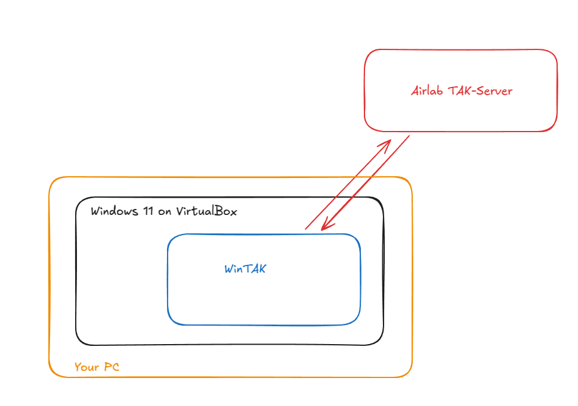

# Ground Control Station

The Ground Control Station (GCS) is for operators to monitor and control the robots.

Requirements: 
- 60GB Hard Disk Space
- min 8GB RAM
- min 4 CPU Cores
- Ubuntu 22.04

## Setup 
WinTAK is setup as auto start on boot and connects to Airlabs TAK-Server. Its run on Windows 11 VirtualBox Virtual Machine.



1. Set your `ANDREWID` as an environment variable.
```bash
export ANDREWID=<your_andrew_id>
```
2. Run the following commands to setup WinTAK running over Windows VirtualBox.
```bash
sudo mkdir -p "$HOME/vmware"
sudo chown -R $USER:$USER "$HOME/vmware"
sudo chmod -R 755 "$HOME/vmware"
sudo rsync --progress -avz ${ANDREWID}@airlab-storage.andrew.cmu.edu:/volume4/dsta/atak/setup/ "$HOME/vmware"
sudo dpkg -i "$HOME/vmware/virtualbox-7.1_7.1.6-167084~Ubuntu~jammy_amd64.deb"
sudo apt-get install -f
sudo /sbin/vboxconfig
VBoxManage import "$HOME/vmware/Windows11.ova" --vsys 0 --vmname "WinTAK"

```
3. Run WinTAK using the following commands.
```bash
VBoxManage startvm "WinTAK"
```

NOTE: If it asks to reset the password, please reset to current password.

