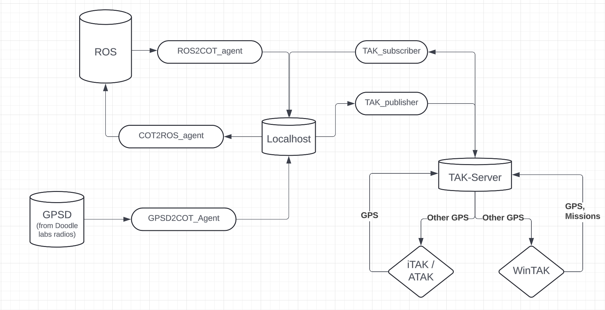

## The TAK Architecture looks like follows:


## Note: Please check out the config file at [config.yaml](../../../ground_control_station/ros_ws/src/ros2tak_tools/config/demo_config.yaml) to understand further on how things are setup.

## Learn how to use the TAK features:
### 1. Sending Robot Query from the TAK Chat.
[](https://www.youtube.com/watch?v=6YCHd70mCUY&list=PLpJxwrRy4QbtVD3XxVzg3CAsm-A279d28&index=2)

### 2. Displaying automated Casevac icons from the casualty inspections:
[](https://www.youtube.com/watch?v=J577FWRaipg&list=PLpJxwrRy4QbtVD3XxVzg3CAsm-A279d28&index=1)

# Debugging tips: 

launch just the ground-control-station container:
```bash
docker compose --profile deploy up ground-control-station
````

## 1. Running docker in interactive mode:
```bash
docker exec -it ground-control-station /bin/bash
```

## 2. Checking if the messages are being received by the MQTT broker:

```bash
mosquitto_sub -h localhost -t to_tak -u airlab # Default topic for sending messages to TAK
mosquitto_sub -h localhost -t healthcheck -u airlab # Default topic for sending healthcheck messages
```


