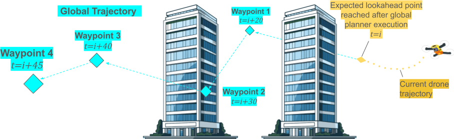
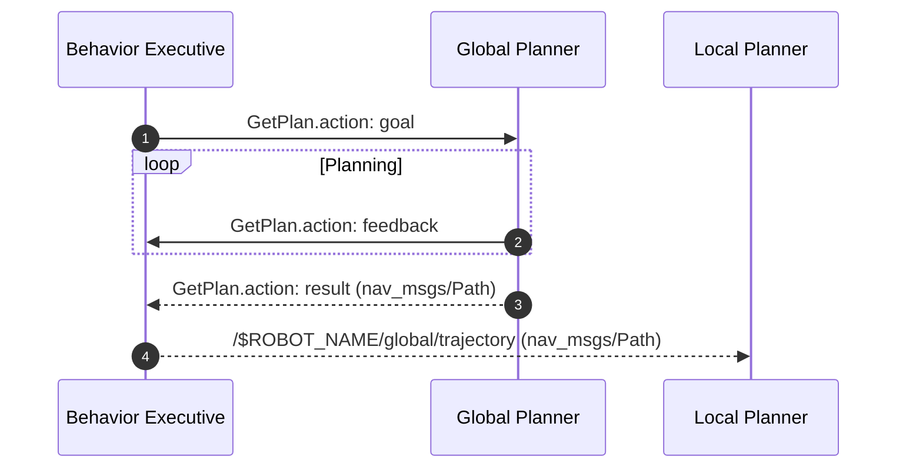

# Global Planning



Global planners output a high level, coarse trajectory for the robot to follow. 

A **trajectory** is a spatial path plus a schedule. 
This means each waypoint in the trajectory has a time associated with it, indicating when the robot should reach that waypoint.
These timestamps are fed to the local planner and controller to determine velocity and acceleration.

If a waypoint's header timestamp is empty, the local planner should assume there's no time constraint and follow the trajectory at its own pace.

The global planner should make a trajectory that is collision-free according to the global map.
However, avoiding fine obstacles is delegated to the local planner that operates at a faster rate.

For the structure of the package, the global planner node should not include any logic to generate the path. This should be located in a seperate logic class and be seperated from ROS. This will allow more modularity in the future for testing and easy interface changes.

### Actions Interface
The global planner should provide an action server for the topic `$(arg robot_name)/global_planner/plan` of message type `nav_msgs/GetPlan`. This should be triggered from the base station and should trigger a path generation based off a fed goal position and optionally a tolerance to the final goal, otherwise a default tolerance will be used. This will then trigger the global planner to generate a path and publish it to the gloabal trajectory topic. 
=======
We intend the global planners to be modular. _AirStack_ implements a basic Random Walk planner as a baseline. 
Feel free to implement your own through the following interfaces.

## ROS Interfaces

Global planners are meant to be modules that can be swapped out easily. 
They can be thought of as different high level behaviors for the robot to follow.
The Behavior Executive may run multiple global planners in parallel and choose the best plan for the current situation.

As such, the global planner should be implemented as a ROS2 action server that can be queried for a plan.
The Behavior Executive will then publish the best plan to `/$(arg robot_name)/global/trajectory` for the local planner to follow.



### Actions Interface

Global Planner implementations should define a custom **GetPlan** action server and associated `GetPlan.action` message. 
The action message may be defined with whatever input parameters necessary for the planner to generate a plan.
Your `GetPlan.action` _must_ return a `nav_msgs/Path` message.

An example `GetPlan.action` message is shown below.
```
# Define a goal
std_msgs/Duration timeout  # maximum time to spend planning
geometry_msgs/Polygon bounds # boundary that the plan must stay within
---
# Define the result that will be published after the action execution ends.
{==nav_msgs/Path trajectory  # REQUIRED FIELD==}
---
# Define a feedback message that will be published during action execution.
float32 percent_complete
```


#### Goal
The goal defines the parameters that the global planner needs to generate a plan. All fields are optional.


#### Result
The global planner must have a return field `trajectory` of message type `nav_msgs/Path`.
`trajectory` defines high level waypoints to reach by a given time.

The `nav_msgs/Path` message type contains a `header` field and `poses` field.

- The top level header of `nav_msgs/Path` message should contain the coordinate frame of the trajectory, and its timestamp should indicate when the trajectory was published.
- Within the `poses` field, each `geometry_msgs/PoseStamped`'s header should contain a timestamp that indicates when that waypoint should be reached

```
nav_msgs/Path.msg
    - std_msgs/Header header
        - time stamp: when the trajectory was generated
        - frame_id: the coordinate frame of the trajectory
    - geometry_msgs/PoseStamped[] poses: the trajectory
        - geometry_msgs/PoseStamped pose
            - std_msgs/Header header
                - time stamp: when the waypoint should be reached
                - string frame_id: the coordinate frame of the waypoint
            - geometry_msgs/Pose pose: the position and orientation of the waypoint
```
#### Feedback
All other fields are optional.

## Global Planners
### Random Walk Planner

More info about ROS2 actions may be found in the official [tutorial](https://docs.ros.org/en/humble/Tutorials/Beginner-CLI-Tools/Understanding-ROS2-Actions/Understanding-ROS2-Actions.html) and [design philosophy](https://design.ros2.org/articles/actions.html) documents.


### Subscribers
In general, the global planner needs to access components of the world model such as the map and drone state.

The most common map is Occupancy Grids that is published by {==TODO==} node.

The global planner can also access the robot's current state and expected state in the future. For example, if the global planner takes 20 seconds to plan a trajectory, 
it can query where the robot expects to be in 20 seconds. This ROS2 service is available under {==TODO==}.

The global planner can do whatever it wants internally with this information.

## Example Planners

### Random Walk planner

The random walk planner replans when the robot is getting close to the goal. The random walk planner is a trivial planner that generates a plan by randomly selecting a direction to move in. The random walk planner is useful for testing the robot's ability to follow a plan.

