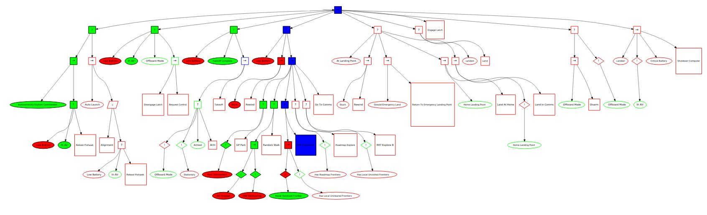
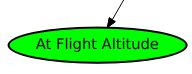
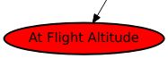
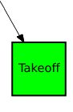
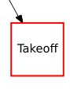
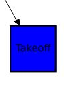
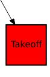
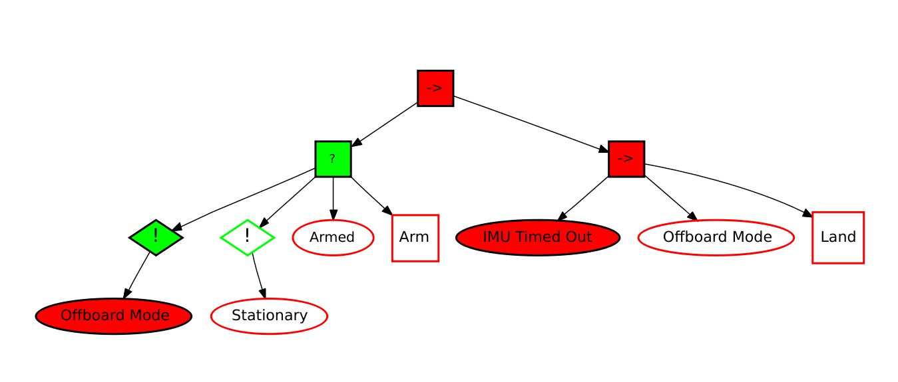

# Behavior Trees

Defines how a task in terms of conditions and actions which the user
implements.

Other types of nodes, control flow and decorator nodes, control which
conditions will be checked and which actions will be activated.

Nodes have statuses of either SUCCESS, RUNNING or FAILURE.

## Why Behavior Trees?

Maintainable - Easy to modify

Scalable - Parts of sub-trees are modular and can be encapsulated

Reusable - Sub-trees can be reused in different places

Clear visualization and interpretation

## Types of Nodes

- **Execution Nodes**
    - Condition Nodes
    - Action Nodes
- **Decorator Nodes**
    - Not Node
- **Control Flow Nodes**
    - Sequence Nodes
    - Fallback Nodes

### Execution Nodes - Condition Nodes

Condition nodes have a status of either SUCCESS or FAILURE

 

### Execution Nodes - Action Nodes

Action nodes can either be active or inactive

An inactive node's status is not checked by the behavior tree, it is
shown in white

below

An active node's status is checked, it can either be SUCCESS (green),
RUNNING (blue) or FAILURE (red)

 

### Decorator Nodes - Not Nodes

The not node must have one condition node has a child and inverts the
status of the child.

If the child's status is SUCCESS, the not node's status will be FAILURE.

If the child's status is FAILURE, the not node's status will be SUCCESS.

### Control Flow Nodes - Fallback Nodes

These nodes are shown with a ?

This node returns FAILURE if and only if all of its children return
FAILURE

If one of its children return RUNNING or SUCCESS, it returns RUNNING or
SUCCESS and no subsequent children's statuses are check

Below shows a typical example, where an action will only be performed if
all of the preceding conditions are false. In this case a drone will only be
armed if it is not already armed, it is in offboard mode and it is stationary

### Control Flow Nodes - Sequence Nodes

These nodes are shown with a "-\>"

This node returns SUCCESS if and only if all of its children return
SUCCESS

If one of its children return RUNNING or FAILURE, it returns RUNNING or
FAILURE and no subsequent children's statuses are check

Below shows a typical example where preceding conditions must be true in
order for an action to be performed. In this case the drone will land if the IMU
times out and it is in offboard mode

