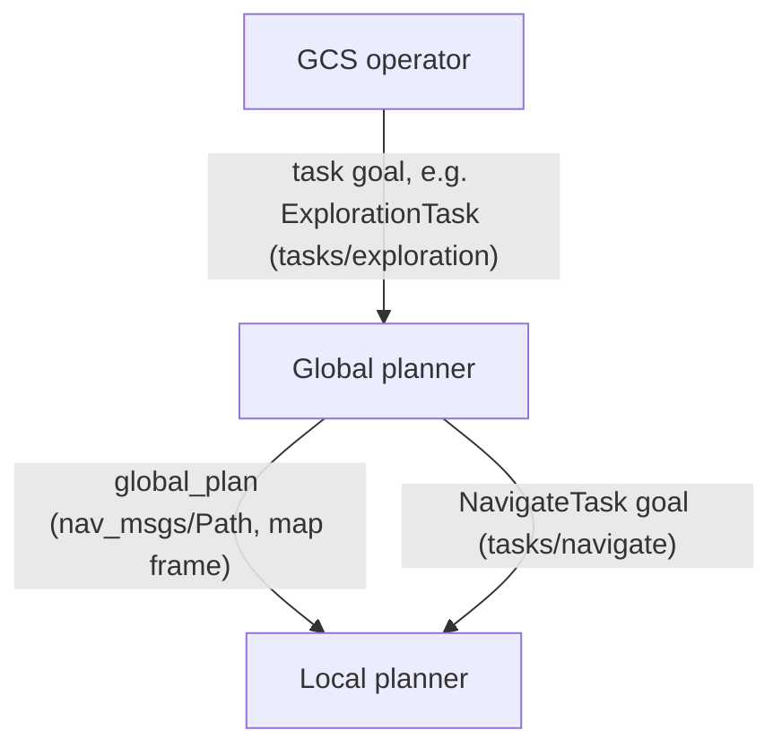

[//]: # "global"
# Planning

Global planners output a high-level, coarse path for the robot to follow.

The global planner should make a path that is collision-free according to the
global map ([`global_map`, spec §3](../../interface_conventions.md#3-global_map-global-world-model)).
However, avoiding fine obstacles is delegated to the local planner, which
operates at a faster rate.

For the structure of the package, the global planner node should not include
any logic to generate the path. This should be located in a separate logic
class, separated from ROS. This allows more modularity for testing and easy
interface changes.

We intend the global planners to be modular. _AirStack_ implements a basic
Random Walk planner as a baseline, plus a frontier-based Exploration planner.
Feel free to implement your own through the following interfaces.

## ROS Interfaces

Global planners are meant to be modules that can be swapped out easily.
They can be thought of as different high-level behaviors for the robot to
follow.

A global planner sits at the top of the [task cascade](../../tasks.md#task-cascade):
it is a **task executor** — a ROS 2 action server that only plans while a goal
is active — invoked by the operator from the GCS (Foxglove robot-commands
panel or RViz Tasks Panel), and it delegates navigation to the local planner.

### Task-executor action server

Each global planner exposes its action server at the canonical
`/{robot_name}/tasks/<task_name>` name — see
[`tasks/*` — task action servers (spec §8)](../../interface_conventions.md#8-tasks-task-action-servers).
Action types live in the shared `task_msgs` package; the per-task goal,
feedback, and result fields are documented in
[Task Executors](../../tasks.md#task-action-types).
For example, the random walk planner serves
`tasks/exploration` (`task_msgs/action/ExplorationTask`) and, while the goal
is active, sends the generated path to the local planner as a
`NavigateTask` goal on `tasks/navigate`.

### Publish: Global Plan

The global planner publishes its path as a `nav_msgs/Path` on its local
`~/global_plan` topic, remapped in the module launch file to the canonical
`/{robot_name}/global_plan` — see
[`global_plan` — global waypoint path (spec §4)](../../interface_conventions.md#4-global_plan-global-waypoint-path).
The path is in the `map` frame (ENU, meters), and its last pose is the
navigation goal. The local planner consumes it and handles fine obstacle
avoidance along the way. `global_plan` is the one interchange that may cross
a machine boundary, which is what makes the global-offload split stack
(`lite_offload_global`) possible.

Where applicable, plan publication can be toggled at runtime: the exploration
planner exposes a `~/global_plan_toggle` service (`std_srvs/Trigger`,
remapped to `/{robot_name}/behavior/global_plan_toggle`) to turn planning on
and off from the RViz Tasks Panel or the GCS.

### Subscribe: World Model and State

In general, the global planner needs the global map and the robot state:

- **Map:** today's de facto map interchange is the VDB map visualization
  topic published by `vdb_mapping` — see
  [`global_map` (spec §3)](../../interface_conventions.md#3-global_map-global-world-model).
  The random walk planner collision-checks its segments against it.
- **State estimate:** the canonical odometry topic
  `odometry_conversion/odometry` — see
  [`odometry` (spec §2)](../../interface_conventions.md#2-odometry-primary-state-estimate).

Both are declared as launch arguments (defaulting to the canonical names) in
the module launch file, so a stack entry file can rewire them without
touching the module.

## Example Planners

### Random Walk planner

The [random walk planner](../../../../../robot/ros_ws/src/global/planners/random_walk/README.md)
replans when the robot is getting close to the goal. It is a trivial planner
that generates a plan by randomly selecting a direction to move in, and is
useful for testing the robot's ability to follow a plan. It is the reference
task-executor implementation, serving `tasks/exploration`.

### Exploration planner

The [exploration planner](../../../../../robot/ros_ws/src/global/planners/exploration/README.md)
(`robot/ros_ws/src/global/planners/exploration`) is a frontier-based
geometric exploration planner — an alternative to `random_walk`. To use it,
swap the `random_walk_planner.launch.xml` include in your stack's entry
launch file for `exploration_launch.xml`, as described in its README.

## Writing Your Own Global Planner

1. Follow the [Module Integration Checklist](../../integration_checklist.md)
   for package structure, launch-file conventions, and wiring.
2. Implement the planner as a task executor: see
   [Adding a New Task Executor](../../tasks.md#adding-a-new-task-executor)
   and the
   [add-task-executor](https://github.com/castacks/AirStack/blob/develop/.agents/skills/add-task-executor/SKILL.md)
   skill for the step-by-step action-server pattern.
3. Publish `global_plan` and delegate navigation to `tasks/navigate`
   per the interfaces above, defaulting every endpoint to its canonical name
   from the [Interface Conventions Specification](../../interface_conventions.md).
