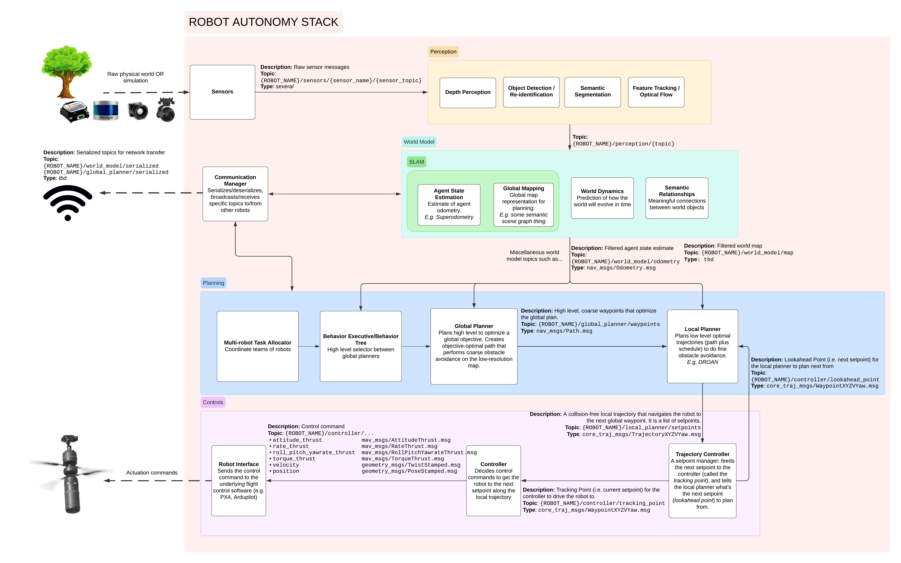

# Autonomy Modules

## Modules

- [0_interface](0_interface/index.md)
- [1_sensors](1_sensors/index.md)
- [2_perception](2_perception/README.md)
- [3_local](3_local/README.md)
- [4_global](4_global/README.md)
- [5_behavior](5_behavior/README.md)

## System Diagram

