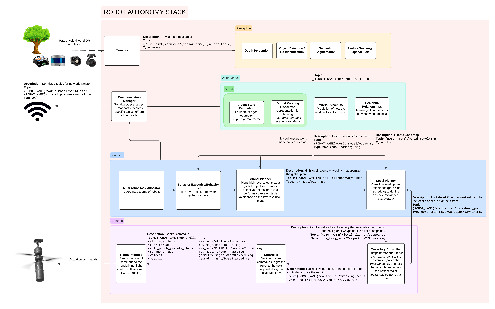

# Autonomy Modules

## Overview

The AirStack autonomy stack is organized into modular layers that work together to enable autonomous operation. Each layer has specific responsibilities and communicates with adjacent layers through well-defined ROS 2 interfaces.

## Modules

- [**Interface**](interface/index.md) - Hardware interface and safety systems
- [**Sensors**](sensors/index.md) - Sensor integration and data processing
- [**Perception**](perception/index.md) - State estimation and environment understanding
- [**Local**](local/index.md) - Local planning, world models, and control
- [**Global**](global/index.md) - Global planning and mapping
- [**Behavior**](behavior/index.md) - High-level mission execution and decision making

## Key Resources

- [**System Architecture**](system_architecture.md) - Detailed architecture diagrams and data flow
- [**Integration Checklist**](integration_checklist.md) - Guide for adding new modules

## System Diagram

