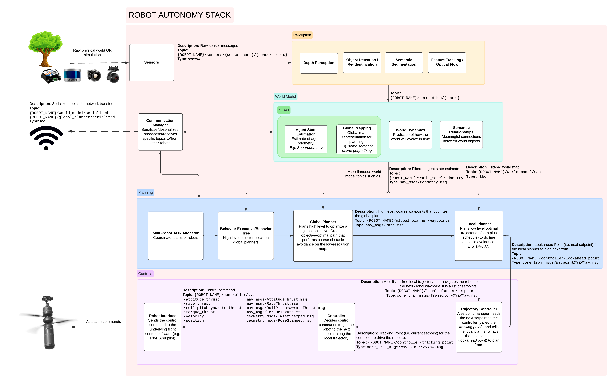

# Autonomy Modules

The onboard autonomy stack is organized into **layers**: data flows from sensors through perception and world models into planners, then down through controllers to the hardware interface. Each layer is a set of swappable ROS 2 packages that meet at the narrow interchange points defined in the [Interface Conventions Specification](interface_conventions.md), so an individual module (a planner, a controller, a mapper) can be replaced without rewiring its neighbors.

## The Six Layers

- [**Interface**](interface/index.md) — the bridge to the flight controller: command authority, arming, and MAVLink/MAVROS translation
- [**Sensors**](sensors/index.md) — driver/bridge topic normalization and robot-side preprocessing (e.g. LiDAR near-range filtering)
- [**Perception**](perception/index.md) — state estimation: the odometry every downstream module consumes
- [**Local**](local/index.md) — short-range world model, reactive local planner, and the trajectory + PID controllers
- [**Global**](global/index.md) — persistent 3D mapping (VDB) and coarse global planning
- [**Behavior**](behavior/index.md) — the onboard safety executive

Alongside the layers, [**Coordination**](coordination/index.md) lets robots gossip state to each other and the GCS.

## Perpetual Nodes vs Task Executors

Modules run in one of two styles. **Perpetual nodes** (state estimation, world models, controllers) run continuously from launch to shutdown. **Task executors** are action servers that only work when the operator sends a goal from the GCS — takeoff, land, navigate, explore — cascading from global-layer to local-layer executors. See [System Architecture — Node Types](system_architecture.md#node-types-perpetual-vs-task-executor) and [Task Executors](tasks.md).

## Where Stacks Fit

Which modules run, and how they are wired, is decided by the selected **stack**: each layer's modules are composed by the stack's entry launch file (`stacks/<name>/launch/*.launch.xml`, e.g. `stacks/full_default/launch/stack.launch.xml`). See [Stacks](../../development/stacks.md).

## Key Resources

- [**System Architecture**](system_architecture.md) — architecture diagrams and data flow
- [**Interface Conventions Specification**](interface_conventions.md) — the versioned contract at every module boundary
- [**Integration Checklist**](integration_checklist.md) — guide for adding new modules

## System Diagram

