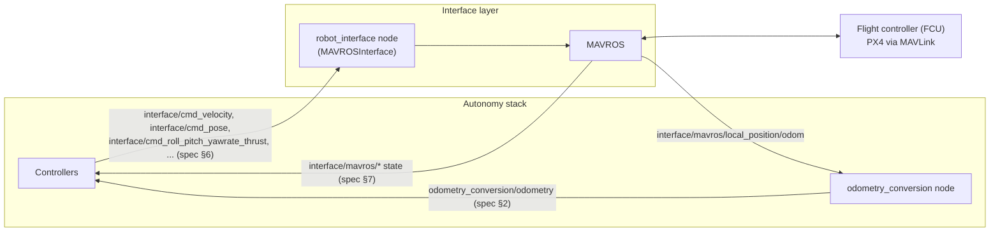

# Robot Interface

The interface defines the communication between the autonomy stack running on the onboard computer and the robot's control unit.
For example, for drones it converts the control commands from the autonomy stack into MAVLink messages for the flight controller.

Command topics are the [`control_setpoint` interchange (spec §6)](../interface_conventions.md#6-control_setpoint-controller-interface-command-onboard-only); vehicle state comes back out through the [`interface_status` group (spec §7)](../interface_conventions.md#7-interface_status-group-vehicle-state-out-of-the-interface-layer) and the canonical [`odometry` topic (spec §2)](../interface_conventions.md#2-odometry-primary-state-estimate).

The code is located under `robot/ros_ws/src/interface/`.

## Launch

Launch files are under `robot/ros_ws/src/interface/interface_bringup/launch`.

The main launch command is `ros2 launch interface_bringup interface.launch.py`.
It starts MAVROS (under the `interface` namespace), the `robot_interface` node, the position setpoint publisher, and the `odometry_conversion` node.

### FCU URL and Target System

The launch file dynamically computes the MAVROS connection parameters at launch time.
If `FCU_URL` or `TGT_SYSTEM` environment variables are already set, those values are used directly.
Otherwise they are derived from `ROS_DOMAIN_ID`:

| Variable | Calculation |
|---|---|
| `OFFBOARD_PORT` | `OFFBOARD_BASE_PORT` + `ROS_DOMAIN_ID` |
| `ONBOARD_PORT` | `ONBOARD_BASE_PORT` + `ROS_DOMAIN_ID` |
| `FCU_URL` | `udp://:<OFFBOARD_PORT>@172.31.0.200:<ONBOARD_PORT>` |
| `TGT_SYSTEM` | `1 + ROS_DOMAIN_ID` |

Default base port values (from `.env`): `OFFBOARD_BASE_PORT=14540`, `ONBOARD_BASE_PORT=14580`.

MAVROS is skipped entirely when `SIM_TYPE=simple`.

## RobotInterface

Package `robot_interface` is a ROS2 node that interfaces with the robot's hardware.
The `RobotInterface` _translates control commands_ from the autonomy stack into the command for the underlying hardware, and reports arming/control status back to the stack.
Note the base class is unimplemented.
Specific implementations should extend `class RobotInterface` in `robot_interface.hpp`, for example `class MAVROSInterface`.

### State

Vehicle state flows out of the interface layer on two paths:

- The `robot_interface` node publishes `interface/is_armed` and `interface/has_control` (`std_msgs/Bool`), and MAVROS itself publishes the vehicle state topics under `interface/mavros/*` (e.g. `state`, `extended_state`, `global_position/global`) — see [spec §7](../interface_conventions.md#7-interface_status-group-vehicle-state-out-of-the-interface-layer).
- The canonical odometry is **not** produced by `RobotInterface` implementations. A separate `odometry_conversion` node (also in the `robot_interface` package) subscribes to `interface/mavros/local_position/odom`, republishes it as the canonical `odometry_conversion/odometry` (`nav_msgs/Odometry`, `map` frame — see [spec §2](../interface_conventions.md#2-odometry-primary-state-estimate)), and broadcasts the corresponding `map → base_link` TF (plus a stabilized variant).

### Commands

The commands are variations of the two main command modes: Attitude control and Position control.
These are reflected in [MAVLink](https://mavlink.io/en/messages/common.html#SET_POSITION_TARGET_LOCAL_NED) and supported by both PX4 and [Ardupilot](https://ardupilot.org/dev/docs/copter-commands-in-guided-mode.html#movement-commands).

The RobotInterface node subscribes to:

- `/$(env ROBOT_NAME)/interface/cmd_attitude_thrust` of type `mav_msgs/AttitudeThrust.msg`
- `/$(env ROBOT_NAME)/interface/cmd_rate_thrust` of type `mav_msgs/RateThrust.msg`
- `/$(env ROBOT_NAME)/interface/cmd_roll_pitch_yawrate_thrust` of type `mav_msgs/RollPitchYawrateThrust.msg`
- `/$(env ROBOT_NAME)/interface/cmd_torque_thrust` of type `mav_msgs/TorqueThrust.msg`
- `/$(env ROBOT_NAME)/interface/cmd_velocity` of type `geometry_msgs/TwistStamped.msg`
- `/$(env ROBOT_NAME)/interface/cmd_pose` of type `geometry_msgs/PoseStamped.msg`

All messages are in the robot's body frame, except `cmd_velocity` and `cmd_pose` which use the frame specified by the message header.

## MAVROSInterface

The available implementation in AirStack is called `MAVROSInterface` implemented in `mavros_interface.cpp`. It forwards the control commands over MAVROS to any MAVLink-compatible flight controller (PX4 in simulation).

## Custom Robot Interface

If you're using a different robot control unit with its own custom API, then you need to create an associated RobotInterface. Implementations should do the following:

### Provide State

Your interface (or its underlying driver, as MAVROS does) should publish the robot's native odometry.
Do not broadcast pose TF or publish the canonical odometry topic from the interface itself — that is the job of the existing `odometry_conversion` node.
Instead, point the `interface_odometry_in_topic` launch argument of `interface.launch.py` (default: `/$(env ROBOT_NAME)/interface/mavros/local_position/odom`) at your interface's odometry output.
The `odometry_conversion` node then produces the canonical `odometry_conversion/odometry` in the `map` frame and broadcasts the `map → base_link` transform, so every downstream consumer works unchanged.

### Override Command Handling

Should override all `virtual` functions in `robot_interface.hpp`:

- `attitude_thrust_callback`
- `rate_thrust_callback`
- `roll_pitch_yawrate_thrust_callback`
- `torque_thrust_callback`
- `velocity_callback`
- `pose_callback`
- `request_control`
- `arm`
- `disarm`
- `is_armed`
- `has_control`
- `takeoff`
- `land`
