# System Architecture

This document provides a comprehensive overview of the AirStack autonomy system architecture, data flow, and module interactions.

## Overview

AirStack follows a **layered autonomy architecture** where data flows through hierarchical processing stages from low-level sensor data to high-level mission execution.

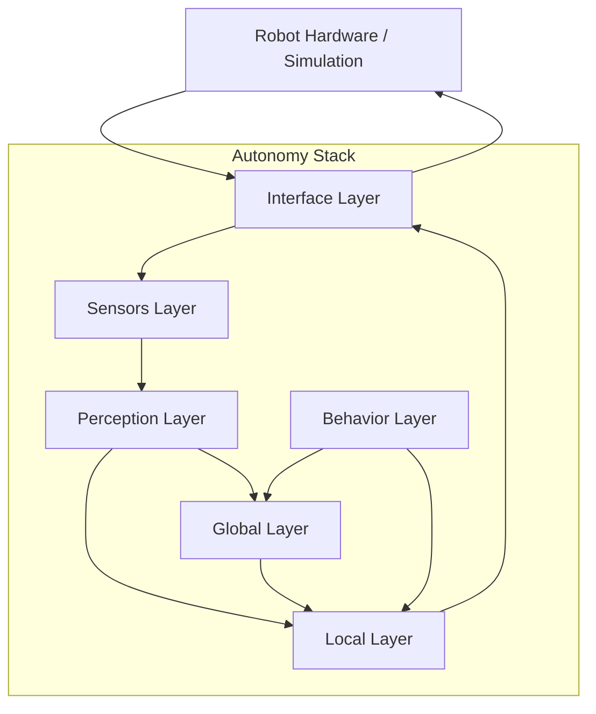

## Layer Architecture

### Hierarchical Organization

The autonomy stack is organized into six layers, each with specific responsibilities:

| Layer | Responsibility | Input | Output |
|-------|---------------|-------|--------|
| **Interface** | Hardware abstraction, safety monitoring | Commands from control | Robot state, raw sensor data |
| **Sensors** | Sensor processing, calibration | Raw sensor data | Processed sensor data |
| **Perception** | State estimation, environment understanding | Sensor data | Odometry, depth, features |
| **Local** | Reactive planning and control | Odometry, local sensors, global plan | Local trajectories, control commands |
| **Global** | Strategic planning and mapping | Global map, robot pose, goals | Global plans, map updates |
| **Behavior** | Mission execution, decision making | Mission commands, autonomy state | High-level goals, mode changes |

### Data Flow Diagram

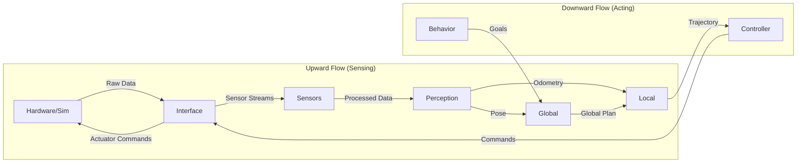

## Detailed Layer Architecture

### Interface Layer

**Purpose:** Abstract hardware/simulation and provide safety monitoring.

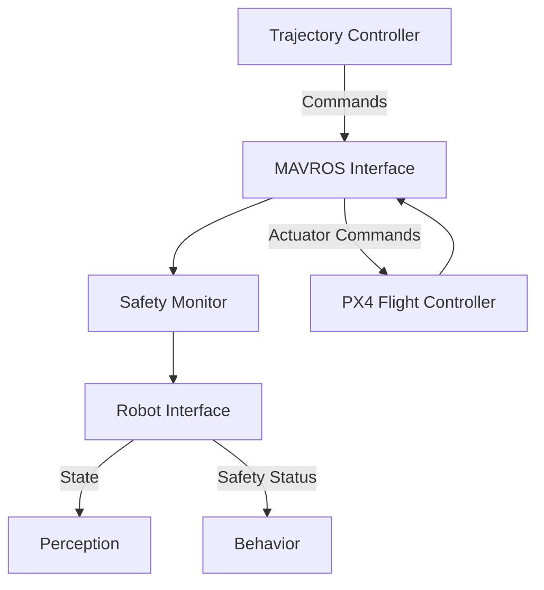

**Key Modules:**

- `mavros_interface`: MAVLink communication with flight controller
- `drone_safety_monitor`: Safety checks and emergency handling
- `robot_interface`: High-level robot state abstraction

**Topics:**

- **Published:**
  - `/[robot]/interface/mavros/state`
  - `/[robot]/interface/mavros/local_position/pose`
  - `/[robot]/interface/battery_state`
- **Subscribed:**
  - `/[robot]/trajectory_controller/cmd_vel`

### Sensors Layer

**Purpose:** Process and calibrate sensor data.

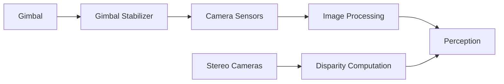

**Key Modules:**

- `camera_param_server`: Camera calibration management
- `gimbal_stabilizer`: Gimbal control and stabilization
- Sensor drivers and processors

**Topics:**

- **Published:**
  - `/[robot]/sensors/[sensor_name]/image`
  - `/[robot]/sensors/[sensor_name]/camera_info`
  - `/[robot]/sensors/front_stereo/disparity`

### Perception Layer

**Purpose:** Estimate robot state and understand environment.

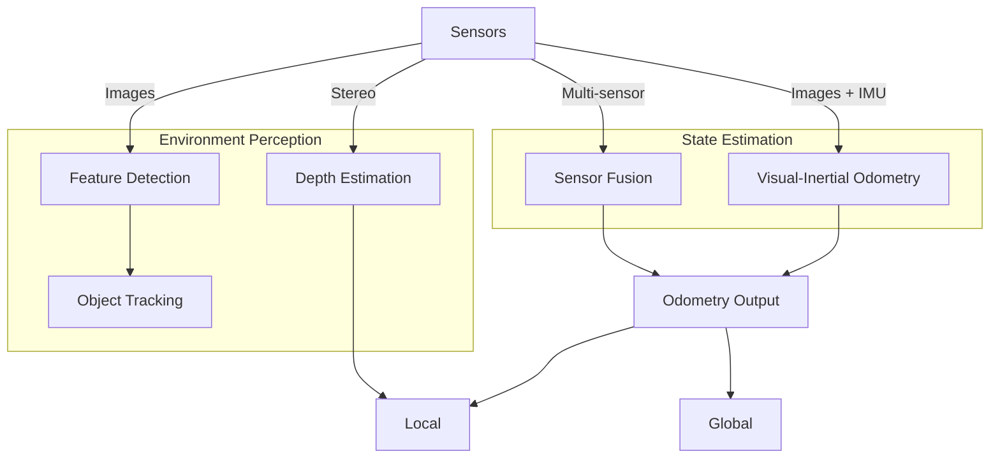

**Key Modules:**

- `macvo_ros2`: Visual-inertial odometry system

**Topics:**

- **Published:**
  - `/[robot]/odometry` - Primary state estimate
  - `/[robot]/perception/macvo/depth`
  - `/[robot]/perception/macvo/features`
- **Subscribed:**
  - `/[robot]/sensors/*/image`
  - `/[robot]/sensors/*/camera_info`
  - `/[robot]/interface/mavros/imu`

### Local Layer

**Purpose:** Reactive obstacle avoidance and trajectory control.

The local layer has three sub-layers:

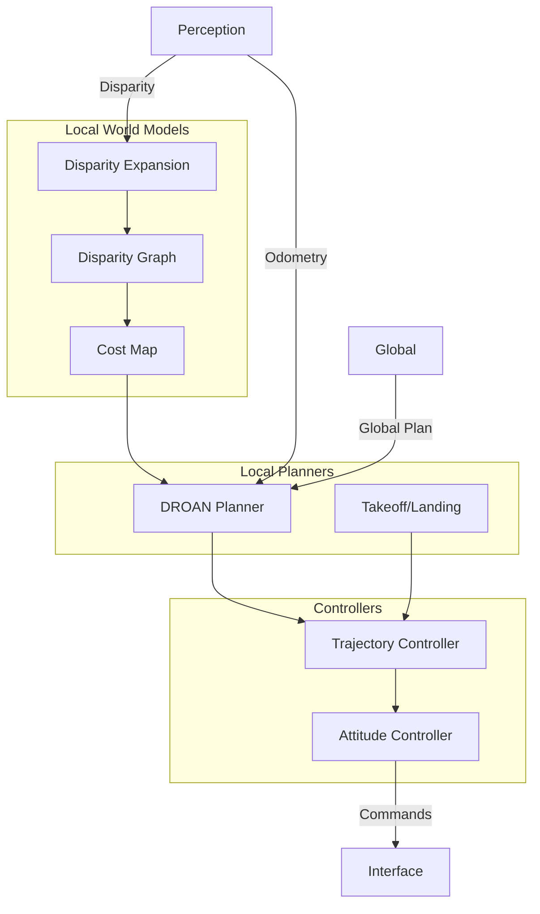

**Key Modules:**

- **World Models:**
  - `disparity_expansion`: Obstacle detection from stereo
  - `disparity_graph`: Graph-based obstacle representation
  - `disparity_graph_cost_map`: Cost map generation
- **Planners:**
  - `droan_local_planner`: DROAN obstacle avoidance
  - `takeoff_landing_planner`: Specialized maneuvers
  - `trajectory_library`: Trajectory generation utilities
- **Controllers:**
  - `trajectory_controller`: Trajectory tracking
  - `attitude_controller`: Attitude control

**Topics:**

- **Subscribed:**
  - `/[robot]/odometry`
  - `/[robot]/global_plan`
  - `/[robot]/sensors/front_stereo/disparity`
- **Published:**
  - `/[robot]/trajectory_controller/trajectory_segment_to_add`
  - `/[robot]/trajectory_controller/look_ahead`
  - `/[robot]/trajectory_controller/tracking_point`
  - `/[robot]/local/cost_map`

### Global Layer

**Purpose:** Strategic path planning and global mapping.

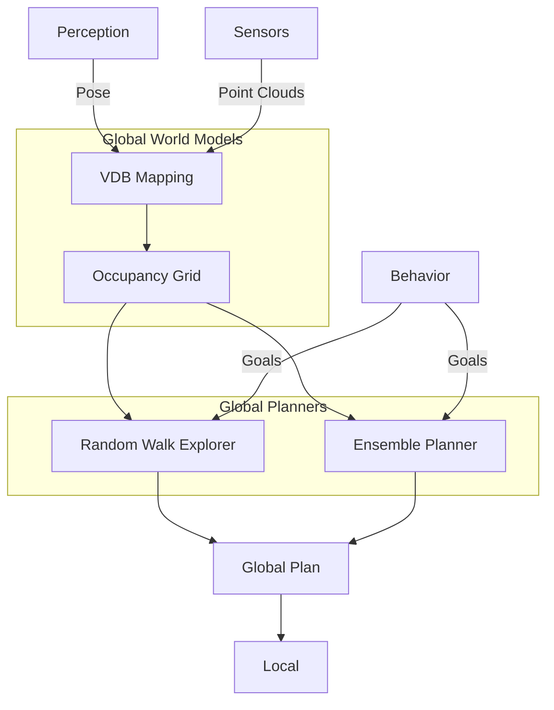

**Key Modules:**

- **World Models:**
  - `vdb_mapping_ros2`: VDB-based 3D mapping
- **Planners:**
  - `random_walk`: Random exploration planner
  - `ensemble_planner`: Multi-planner coordination

**Topics:**

- **Subscribed:**
  - `/[robot]/odometry`
  - `/[robot]/sensors/*/pointcloud`
  - `/[robot]/behavior/mission_goal`
- **Published:**
  - `/[robot]/global_plan`
  - `/[robot]/global/map`
  - `/[robot]/global/occupancy`

### Behavior Layer

**Purpose:** High-level mission execution and decision making.

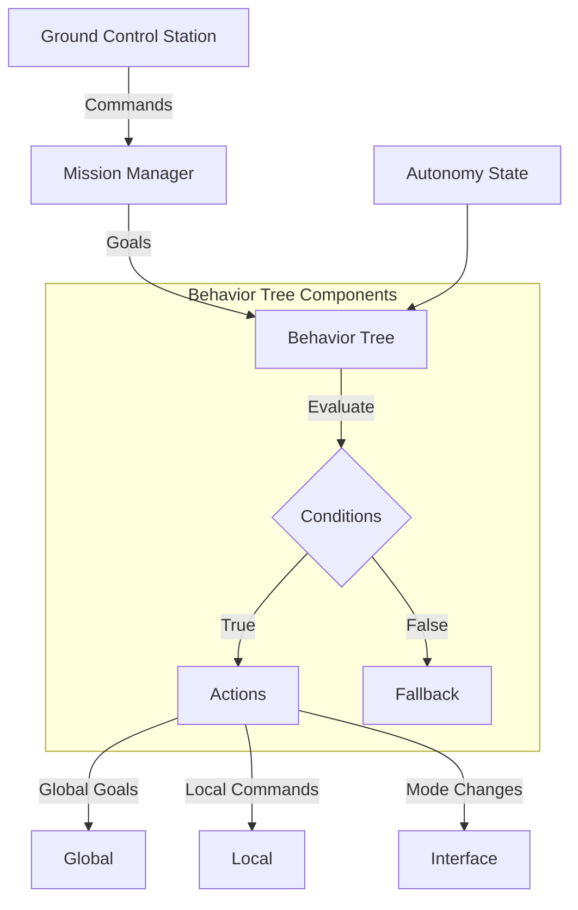

**Key Modules:**

- `behavior_tree`: Behavior tree framework
- `behavior_executive`: Mission execution engine
- `rqt_behavior_tree_command`: GUI for behavior tree control

**Topics:**

- **Subscribed:**
  - `/[robot]/odometry`
  - `/[robot]/interface/mavros/state`
  - `/[robot]/trajectory_controller/trajectory_completion_percentage`
- **Published:**
  - `/[robot]/global/goal`
  - `/[robot]/trajectory_controller/trajectory_override`
  - `/[robot]/behavior/mission_state`

## Complete Data Flow

### Autonomous Flight Scenario

Here's the complete data flow for an autonomous flight with obstacle avoidance:

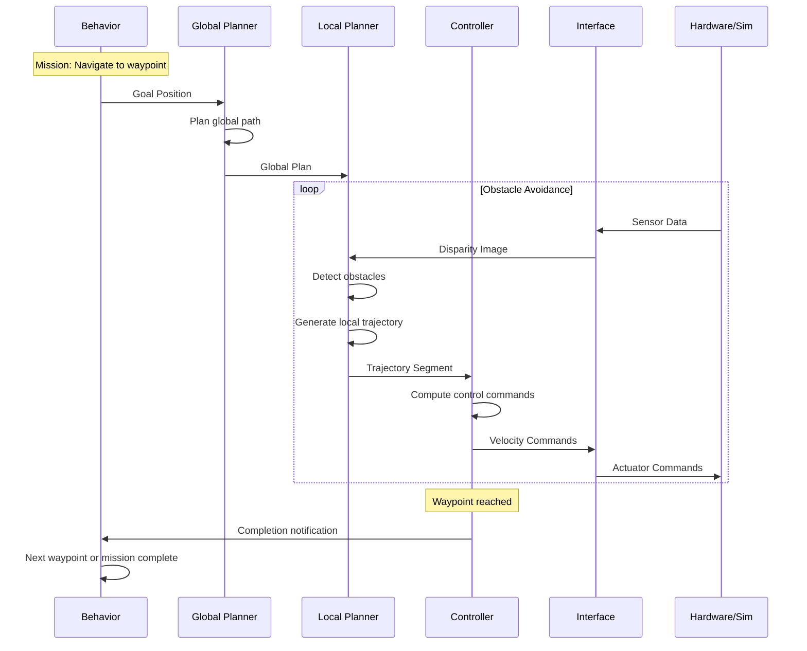

## Module Communication Patterns

### Standard Communication Flow

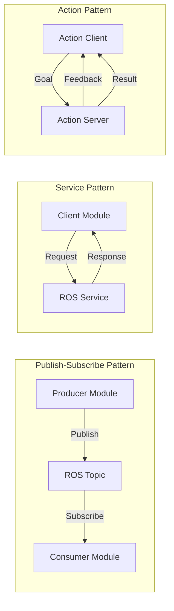

### Topic Remapping Strategy

Modules use generic topic names internally, which are remapped in launch files:

```xml
<!-- In module code: subscribe to "odometry" -->
<!-- In launch file: remap to actual topic -->
<remap from="odometry" to="/$(env ROBOT_NAME)/odometry" />
```

This enables:

- **Flexibility:** Easy to swap modules
- **Multi-robot:** Each robot has its own namespace
- **Testing:** Mock different topic sources

## Coordinate Frames

### Frame Hierarchy

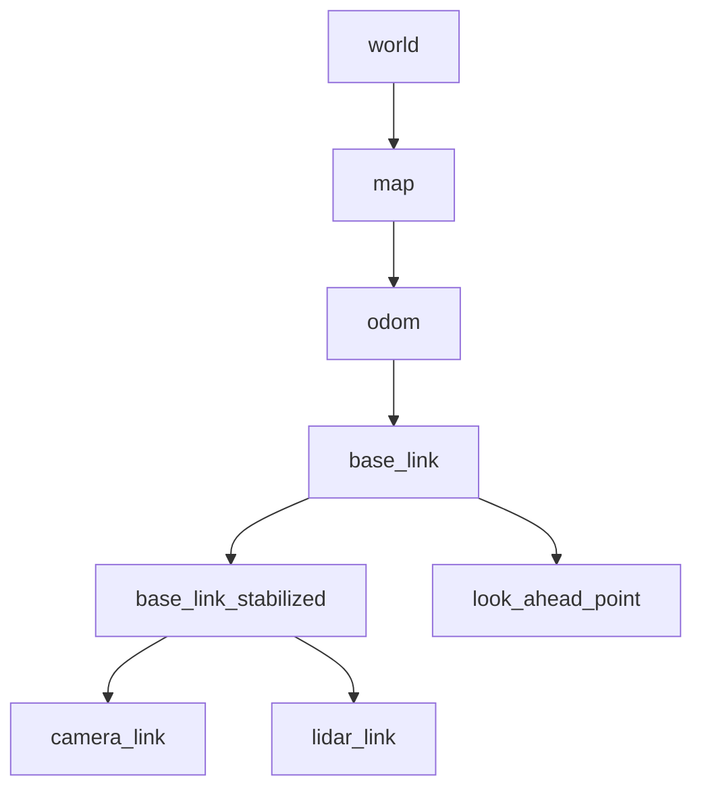

**Standard Frames:**

- `world`: Fixed world frame
- `map`: Global map frame (may drift from world)
- `odom`: Odometry frame (continuous, may drift)
- `base_link`: Robot body frame
- `base_link_stabilized`: Stabilized body frame (yaw-only)
- `camera_link`: Camera sensor frame
- `look_ahead_point`: Trajectory tracking reference

## Performance Characteristics

### Typical Update Rates

| Layer | Module | Rate | Latency |
|-------|--------|------|---------|
| Interface | MAVROS | 50 Hz | <5 ms |
| Sensors | Camera | 30 Hz | <10 ms |
| Sensors | Disparity | 15 Hz | <30 ms |
| Perception | VIO | 30 Hz | <20 ms |
| Local Planner | DROAN | 10 Hz | <50 ms |
| Local Controller | Trajectory | 50 Hz | <10 ms |
| Global Planner | Path | 1 Hz | <500 ms |
| Behavior | BT Tick | 10 Hz | <5 ms |

### Resource Usage (Typical)

| Component | CPU | Memory | GPU |
|-----------|-----|--------|-----|
| Full Stack | 60-80% | 4-6 GB | 20-40% |
| Perception | 15-20% | 500 MB | 10-20% |
| Local Planning | 10-15% | 300 MB | 5-10% |
| Global Planning | 5-10% | 200 MB | 0% |
| Simulation | 30-40% | 2-3 GB | 60-80% |

## Module Integration Guidelines

When adding a new module, follow these integration patterns:

### 1. Determine Layer Placement

Place module in appropriate layer based on its function:

- Real-time obstacle avoidance? → Local planning
- State estimation? → Perception
- Path planning? → Global planning
- Mission logic? → Behavior

### 2. Define Interfaces

Specify input and output topics:

- Use standard topics when available
- Create custom topics with appropriate namespaces
- Document expected message rates and latencies

### 3. Configure Launch Integration

Add module to layer bringup with:

- Topic remapping
- Namespace configuration
- Parameter loading
- Conditional launching (if needed)

### 4. Test Integration

Verify:

- Topics connect correctly
- Data flows as expected
- Performance meets requirements
- Works with other modules

See [Integration Checklist](integration_checklist.md) for detailed steps.

## Multi-Robot Architecture

### Robot Namespacing

Each robot operates in its own namespace:

```
/drone0/
  ├── odometry
  ├── global_plan
  ├── trajectory_controller/...
  └── sensors/...

/drone1/
  ├── odometry
  ├── global_plan
  ├── trajectory_controller/...
  └── sensors/...
```

### Inter-Robot Communication

Robots can share information through:

- Shared topics (e.g., `/team/formation`)
- ROS 2 Domain Bridge
- DDS Router for cross-domain communication

### Domain Isolation

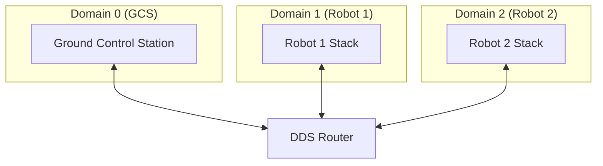

## References

- [Integration Checklist](integration_checklist.md) - Module integration guidelines
- [AI Agent Guide](../../development/ai_agent_guide.md) - Guide for AI agents
- [Layer Documentation](index.md) - Detailed layer descriptions
- Skills:
  - [add-ros2-package](../../../.agents/skills/add-ros2-package) - Creating packages
  - [integrate-module-into-layer](../../../.agents/skills/integrate-module-into-layer) - Integration workflow
