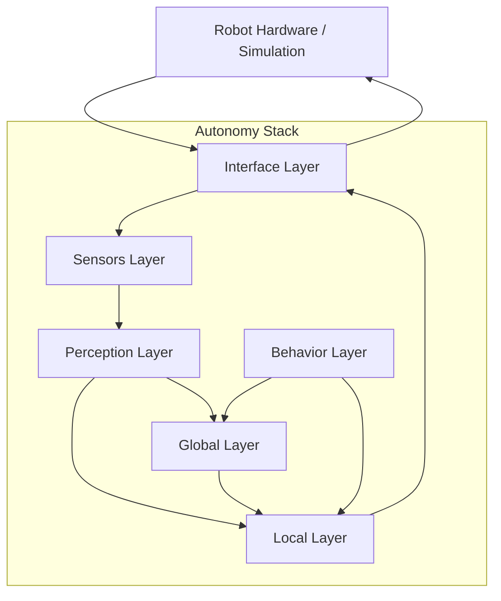
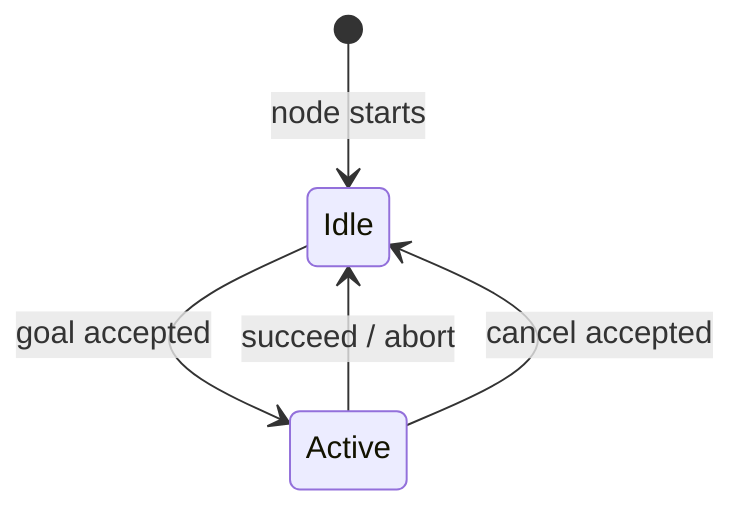
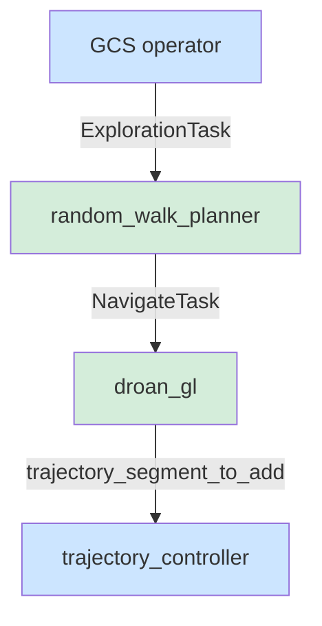
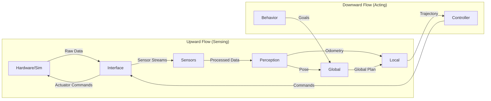
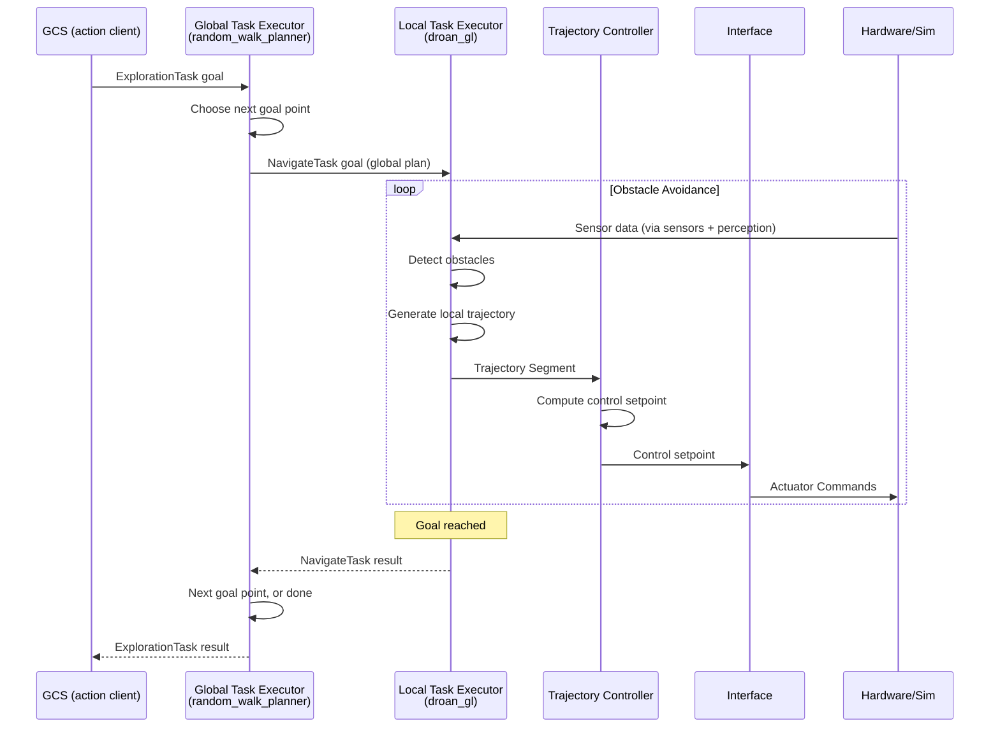
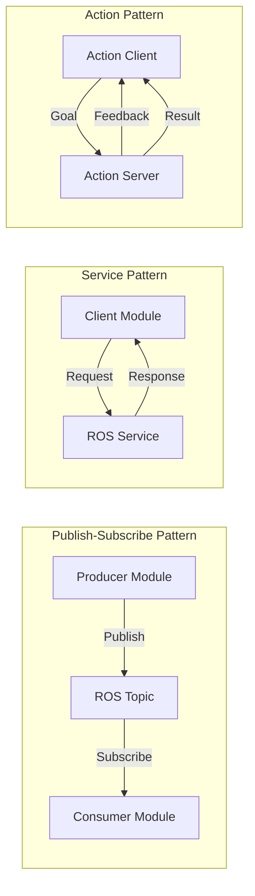
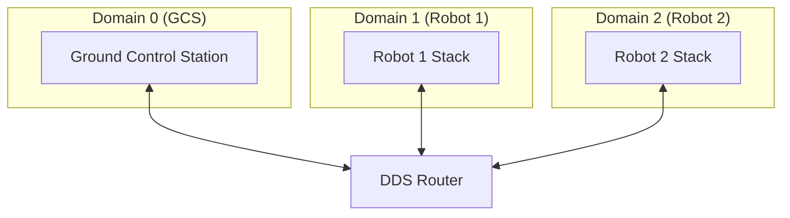

# System Architecture

This document explains the AirStack autonomy architecture: how the layers relate, the two kinds of nodes the stack is built from, and how data and task goals flow through the system.

## Overview

AirStack follows a **layered autonomy architecture** where data flows through hierarchical processing stages from low-level sensor data to high-level mission execution.


```mermaid
graph TB
    Hardware[Robot Hardware / Simulation] --> Interface
    
    subgraph "Autonomy Stack"
        Interface[Interface Layer]
        Sensors[Sensors Layer]
        Perception[Perception Layer]
        Local[Local Layer]
        Global[Global Layer]
        Behavior[Behavior Layer]
        
        Interface --> Sensors
        Sensors --> Perception
        Perception --> Local
        Perception --> Global
        Global --> Local
        Local --> Interface
        Behavior --> Local
        Behavior --> Global
    end
    
    Interface --> Hardware
```

## Node Types: Perpetual vs Task Executor

AirStack nodes fall into two categories that differ in lifecycle,
activation, and interface:

### Perpetual Nodes

Perpetual nodes start at launch and run continuously until shutdown.
They receive data over topics and publish results immediately — there
is no external activation step. Most of the autonomy stack consists
of perpetual nodes.

Examples: state estimator, VDB mapper, disparity expander, trajectory controller, safety monitor.

### Task Executors

Task executors are **ROS 2 action servers** that only do work when an
action client sends them a goal. They have a well-defined lifecycle:


```mermaid
stateDiagram-v2
    [*] --> Idle: node starts
    Idle --> Active: goal accepted
    Active --> Idle: succeed / abort
    Active --> Idle: cancel accepted
```

| Property | Perpetual Node | Task Executor |
| -------- | -------------- | ------------- |
| Activation | Always running | On demand via action goal |
| Interface | ROS topics | ROS 2 action (goal / feedback / result) |
| Cancellation | N/A | Caller can cancel mid-flight |
| Progress reporting | N/A | Feedback streamed ~1 Hz |
| Completion condition | Never | Time limit, area covered, object found, etc. |
| Typical layer | Perception, Control, World Models | Global/Local Planning |

All task action servers are remapped to `/{robot_name}/tasks/{task_name}` by convention.

### Task Cascade

High-level task goals (sent by the operator from the GCS — the Foxglove
robot-commands panel or the RViz Tasks Panel) cascade down through the stack:


```mermaid
graph TD
    GCS[GCS operator] -->|ExplorationTask| RW[random_walk_planner]
    RW -->|NavigateTask| DG[droan_gl]
    DG -->|trajectory_segment_to_add| TC[trajectory_controller]

    style GCS fill:#cce5ff
    style TC fill:#cce5ff
    style RW fill:#d4edda
    style DG fill:#d4edda
```

*Blue = perpetual node / external client, green = task executor.*

The global-layer task executor (e.g. `random_walk_planner`) decides
*where* to go and delegates the actual flying to the local-layer task
executor (`droan_gl` or `droan_local_planner`) via a `NavigateTask`
action, which feeds trajectory segments to the perpetual trajectory
controller.

See [Task Executors](tasks.md) for the full list of task action types
and their interfaces.

---

## Layer Architecture

### Hierarchical Organization

The autonomy stack is organized into six layers, each with specific responsibilities:

| Layer | Responsibility | Input | Output |
|-------|---------------|-------|--------|
| **Interface** | Hardware abstraction, safety monitoring | Commands from control | Robot state, raw sensor data |
| **Sensors** | Sensor processing, calibration | Raw sensor data | Processed sensor data |
| **Perception** | State estimation, environment understanding | Sensor data | Odometry, depth, features |
| **Local** | Reactive planning and control | Odometry, local sensors, global plan | Local trajectories, control commands |
| **Global** | Strategic planning and mapping | Global map, robot pose, goals | Global plans, map updates |
| **Behavior** | Mission execution, decision making | Mission commands, autonomy state | High-level goals, mode changes |

### Data Flow Diagram


```mermaid
graph LR
    subgraph "Upward Flow (Sensing)"
        HW[Hardware/Sim] -->|Raw Data| IF[Interface]
        IF -->|Sensor Streams| SEN[Sensors]
        SEN -->|Processed Data| PER[Perception]
        PER -->|Odometry| LOC[Local]
        PER -->|Pose| GLO[Global]
    end
    
    subgraph "Downward Flow (Acting)"
        BEH[Behavior] -->|Goals| GLO
        GLO -->|Global Plan| LOC
        LOC -->|Trajectory| CTRL[Controller]
        CTRL -->|Commands| IF
        IF -->|Actuator Commands| HW
    end
```

## Detailed Layer Architecture

The exact topic names, message types, and QoS settings that connect the layers
are specified once, normatively, in the
[Interface Conventions Specification](interface_conventions.md) — the
subsections below describe each layer's *role* and link to its documentation
rather than restating that data.

### Interface Layer

The interface layer abstracts the flight controller behind a stable
command/status boundary: it converts controller setpoints into vehicle
commands (MAVROS ↔ PX4 in the trunk) and publishes vehicle state — arming,
flight mode, battery — back up to the rest of the stack. Nothing above this
layer talks to hardware directly, which is what makes simulation and real
vehicles interchangeable.

See the [Interface layer documentation](interface/index.md); the
command and status contracts are
[`control_setpoint` (§6)](interface_conventions.md#6-control_setpoint-controller-interface-command-onboard-only)
and the
[`interface_status` group (§7)](interface_conventions.md#7-interface_status-group-vehicle-state-out-of-the-interface-layer).

### Sensors Layer

The sensors layer wraps drivers and low-level processing (e.g. point-cloud
filtering) so that downstream layers consume calibrated, consistently named
streams instead of device-specific topics.

See the [Sensors layer documentation](sensors/index.md) and the
[`sensors/*` naming convention (§1)](interface_conventions.md#1-sensors-sensor-naming-convention).

### Perception Layer

The perception layer turns sensor streams into the robot's estimate of itself
and its surroundings: the primary state estimate (`odometry`) and depth /
point-cloud products consumed by the world models. The trunk default stereo
pipeline is `stereo_image_proc`; learned visual odometry (MAC-VO) is available
as the external [asm_macvo](https://github.com/castacks/asm_macvo) module
rather than in the trunk.

See the [Perception layer documentation](perception/index.md) and the
[`odometry` contract (§2)](interface_conventions.md#2-odometry-primary-state-estimate).

### Local Layer

The local layer is the reactive, short-horizon part of the stack, organized in
three sub-layers: **world models** (e.g. disparity expansion) maintain an
obstacle representation around the robot, **planners** (DROAN, takeoff/landing)
generate collision-free trajectories through it, and **controllers**
(trajectory controller, PID controller) track those trajectories at high rate
and hand setpoints to the interface layer.

See the [Local layer documentation](local/index.md); the handoff between
planners and the trajectory controller is the
[`trajectory` group (§5)](interface_conventions.md#5-trajectory-group-the-trajectory-controllers-contract-onboard-only).

### Global Layer

The global layer is the strategic counterpart: it maintains a persistent 3D
map of everywhere the robot has been (VDB mapping) and decides where to go
next — exploration and global path planning — handing global plans down to the
local layer for execution.

See the [Global layer documentation](global/index.md) and the
[`global_plan` contract (§4)](interface_conventions.md#4-global_plan-global-waypoint-path).

### Behavior Layer

Onboard safety supervision. Mission-level sequencing is driven
by the operator from the GCS through [task executors](tasks.md); the
behavior layer's job is the part that must never depend on a ground link —
watching the robot's health and forcing a safe reaction when something
breaks (the `drone_safety_monitor` watches the state estimate and issues
safety commands when it times out).

See the [Behavior layer documentation](behavior/index.md) and the
[`safety` contract (§9)](interface_conventions.md#9-safety-safety-executive-onboard-only).

## Complete Data Flow

### Autonomous Flight Scenario

An autonomous flight is a [task cascade](tasks.md#task-cascade). The GCS
operator is an **action client**: they send a task goal (e.g.
`ExplorationTask`) to a global-layer task executor, which decides where to go
and delegates the flying to the local-layer task executor via `NavigateTask`.
The local planner feeds trajectory segments to the perpetual trajectory
controller, which produces setpoints for the interface layer. Each action
**result returns to the client that sent the goal** — `NavigateTask` results
to the global executor, and the top-level task result (with ~1 Hz feedback
along the way) to the GCS:


```mermaid
sequenceDiagram
    participant GCS as GCS (action client)
    participant GLO as Global Task Executor<br/>(random_walk_planner)
    participant LOC as Local Task Executor<br/>(droan_gl)
    participant CTL as Trajectory Controller
    participant IF as Interface
    participant HW as Hardware/Sim
    
    GCS->>GLO: ExplorationTask goal
    GLO->>GLO: Choose next goal point
    GLO->>LOC: NavigateTask goal (global plan)
    
    loop Obstacle Avoidance
        HW->>LOC: Sensor data (via sensors + perception)
        LOC->>LOC: Detect obstacles
        LOC->>LOC: Generate local trajectory
        LOC->>CTL: Trajectory Segment
        CTL->>CTL: Compute control setpoint
        CTL->>IF: Control setpoint
        IF->>HW: Actuator Commands
    end
    
    Note over LOC: Goal reached
    LOC-->>GLO: NavigateTask result
    GLO->>GLO: Next goal point, or done
    GLO-->>GCS: ExplorationTask result
```

## Module Communication Patterns

### Standard Communication Flow


```mermaid
graph LR
    subgraph "Publish-Subscribe Pattern"
        Producer[Producer Module] -->|Publish| Topic[ROS Topic]
        Topic -->|Subscribe| Consumer[Consumer Module]
    end
    
    subgraph "Service Pattern"
        Client[Client Module] -->|Request| Service[ROS Service]
        Service -->|Response| Client
    end
    
    subgraph "Action Pattern"
        ActionClient[Action Client] -->|Goal| ActionServer[Action Server]
        ActionServer -->|Feedback| ActionClient
        ActionServer -->|Result| ActionClient
    end
```

### Topic Remapping Strategy

Modules use generic topic names internally, which are remapped in launch files:

```xml
<!-- In module code: subscribe to "odometry" -->
<!-- In launch file: remap to actual topic -->
<remap from="odometry" to="/$(env ROBOT_NAME)/odometry" />
```

This enables:

- **Flexibility:** Easy to swap modules
- **Multi-robot:** Each robot has its own namespace
- **Testing:** Mock different topic sources

## Coordinate Frames

The frame tree, units, and the ENU convention are specified normatively in
[Interface Conventions — TF frames and units](interface_conventions.md#tf-frames-and-units).
For the reasoning behind the conventions — including the NED↔ENU conversion at
the PX4/MAVROS boundary and Isaac Sim's FLU convention — see the
[Frame Conventions](../../development/intermediate/frame_conventions.md)
concept page.

## Integrating a New Module

When adding a new module to the stack — choosing its layer, defining its topic
interfaces, wiring it into a stack entry launch file, and verifying the
connections — follow the [Integration Checklist](integration_checklist.md),
which is the canonical step-by-step guide.

## Multi-Robot Architecture

### Robot Namespacing

Each robot operates in its own namespace:

```
/robot_1/
  ├── odometry
  ├── global_plan
  ├── trajectory_controller/...
  └── sensors/...

/robot_2/
  ├── odometry
  ├── global_plan
  ├── trajectory_controller/...
  └── sensors/...
```

### Inter-Robot Communication

Robots can share information through:

- Shared topics (e.g., `/team/formation`)
- ROS 2 Domain Bridge
- DDS Router for cross-domain communication

### Domain Isolation


```mermaid
graph TB
    subgraph "Domain 0 (GCS)"
        GCS[Ground Control Station]
    end
    
    subgraph "Domain 1 (Robot 1)"
        R1[Robot 1 Stack]
    end
    
    subgraph "Domain 2 (Robot 2)"
        R2[Robot 2 Stack]
    end
    
    Router[DDS Router]
    
    GCS <--> Router
    R1 <--> Router
    R2 <--> Router
```

## References

- [Interface Conventions Specification](interface_conventions.md) - Normative topic, action, and frame contracts
- [Integration Checklist](integration_checklist.md) - Module integration guidelines
- [AI Agent Guide](../../development/advanced/ai_agent_guide.md) - Guide for AI agents
- [Layer Documentation](index.md) - Detailed layer descriptions
- Skills:

    - [add-ros2-package](../../../.agents/skills/add-ros2-package) - Creating packages
    - [integrate-module-into-layer](../../../.agents/skills/integrate-module-into-layer) - Integration workflow
