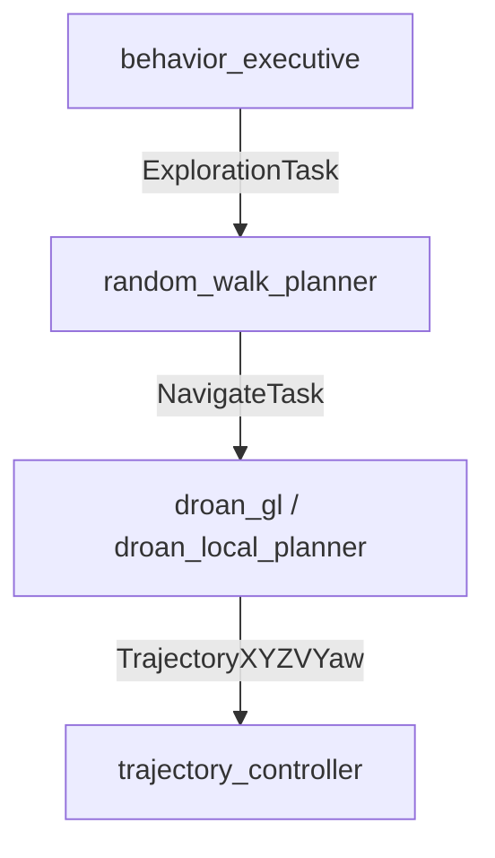

# Task Executors

## Overview

Task executors are ROS 2 action servers that carry out discrete, goal-directed missions for the drone. Unlike perpetual nodes (state estimation, controllers, world models) that run continuously from launch to shutdown, a task executor only does work when an action client sends it a goal. The caller receives streaming feedback while the task runs, and a final result when it completes or is cancelled.

See [System Architecture — Node Types](system_architecture.md#node-types-perpetual-vs-task-executor) for the broader context.

## Task Cascade

Behavior sends high-level task goals to global-layer task executors, which in turn delegate navigation to local-layer task executors:



All task action servers are remapped to `/{robot_name}/tasks/{task_name}` in the bringup launch files.

## Task Action Types

Task action types are defined in the shared `task_msgs` package (`common/ros_packages/msgs/task_msgs/`) and are used by both the robot stack and the GCS. All action messages follow the same structure:

```
# Goal — parameters the caller sets when activating the task
...
---
# Result — returned once when the task ends
bool success
string message
...
---
# Feedback — streamed ~1 Hz while the task is active
string status
float32 progress     # 0.0–1.0, or 0.0 if no natural completion metric
geometry_msgs/Point current_position
...
```

---

### NavigateTask

**File:** `action/NavigateTask.action`
**Action server:** `/{robot_name}/tasks/navigate`
**Implemented by:** `droan_gl`, `droan_local_planner`

Navigate along a global plan path using local obstacle avoidance. This is the lowest-level task action — it is the sink for all higher-level tasks that involve flying somewhere.

#### Goal

| Field | Type | Description |
| ----- | ---- | ----------- |
| `global_plan` | nav_msgs/Path | Path to follow; the last pose is the navigation goal |
| `goal_tolerance_m` | float32 | Distance from the goal pose at which the task is considered complete (m) |

#### Result

| Field | Type | Description |
| ----- | ---- | ----------- |
| `success` | bool | True if the drone reached the goal; false if cancelled or error |
| `message` | string | `"Goal reached"`, `"Cancelled"`, or `"Node shutting down"` |

#### Feedback

| Field | Type | Description |
| ----- | ---- | ----------- |
| `status` | string | `"navigating"` |
| `distance_to_goal` | float32 | 3D Euclidean distance to the goal pose (m) |
| `current_position` | geometry_msgs/Point | Current tracking point position |

---

### ExplorationTask

**File:** `action/ExplorationTask.action`
**Action server:** `/{robot_name}/tasks/exploration`
**Implemented by:** `random_walk_planner`

Explore an area using random or systematic flight patterns. The task runs until the time limit is reached or it is cancelled; there is no natural spatial completion condition.

#### Goal

| Field | Type | Description |
| ----- | ---- | ----------- |
| `search_bounds` | geometry_msgs/Polygon | Bounding polygon for exploration (empty = unbounded) |
| `min_altitude_agl` | float32 | Minimum flight altitude above ground (m) |
| `max_altitude_agl` | float32 | Maximum flight altitude above ground (m) |
| `min_flight_speed` | float32 | Minimum flight speed (m/s) |
| `max_flight_speed` | float32 | Maximum flight speed (m/s) |
| `time_limit_sec` | float32 | Maximum task duration in seconds (0 = no limit) |

#### Result

| Field | Type | Description |
| ----- | ---- | ----------- |
| `success` | bool | True if time limit reached normally; false if cancelled or error |
| `message` | string | `"Time limit reached"`, `"Task cancelled"`, or error description |

#### Feedback

| Field | Type | Description |
| ----- | ---- | ----------- |
| `status` | string | `"planning"` or `"navigating"` |
| `progress` | float32 | Elapsed / time_limit (0 if no time limit) |
| `current_position` | geometry_msgs/Point | Current robot position |

#### CLI test

```bash
ros2 action send_goal /robot_1/tasks/exploration task_msgs/action/ExplorationTask \
  '{min_altitude_agl: 3.0, max_altitude_agl: 8.0, min_flight_speed: 1.0, max_flight_speed: 3.0, time_limit_sec: 30.0}' \
  --feedback
```

---

### CoverageTask

**File:** `action/CoverageTask.action`
**Action server:** `/{robot_name}/tasks/coverage`
**Implemented by:** *(not yet implemented)*

Perform a systematic lawnmower-pattern coverage survey of a polygonal area. Completes when the entire area has been overflown.

#### Goal

| Field | Type | Description |
| ----- | ---- | ----------- |
| `coverage_area` | geometry_msgs/Polygon | Polygon defining the area to cover |
| `min_altitude_agl` | float32 | Minimum flight altitude above ground (m) |
| `max_altitude_agl` | float32 | Maximum flight altitude above ground (m) |
| `min_flight_speed` | float32 | Minimum flight speed (m/s) |
| `max_flight_speed` | float32 | Maximum flight speed (m/s) |
| `line_spacing_m` | float32 | Distance between parallel coverage passes (m) |
| `heading_deg` | float32 | Direction of coverage passes in degrees (0 = north) |

#### Result

| Field | Type | Description |
| ----- | ---- | ----------- |
| `success` | bool | True if area fully covered; false if cancelled |
| `message` | string | Completion reason |
| `coverage_percentage` | float32 | Fraction of area covered at task end (0–100) |

#### Feedback

| Field | Type | Description |
| ----- | ---- | ----------- |
| `status` | string | Task status string |
| `progress` | float32 | Coverage completion fraction (0.0–1.0) |
| `coverage_percentage` | float32 | Area covered so far (0–100) |
| `current_position` | geometry_msgs/Point | Current robot position |

---

### ObjectSearchTask

**File:** `action/ObjectSearchTask.action`
**Action server:** `/{robot_name}/tasks/object_search`
**Implemented by:** *(not yet implemented)*

Search an area for instances of a named object class. Stops early when `target_count` objects have been found (or 0 to search until time limit or full coverage).

#### Goal

| Field | Type | Description |
| ----- | ---- | ----------- |
| `object_class` | string | Object class to search for (e.g. `"person"`, `"vehicle"`) |
| `search_area` | geometry_msgs/Polygon | Area to search |
| `min_altitude_agl` | float32 | Minimum flight altitude above ground (m) |
| `max_altitude_agl` | float32 | Maximum flight altitude above ground (m) |
| `min_flight_speed` | float32 | Minimum flight speed (m/s) |
| `max_flight_speed` | float32 | Maximum flight speed (m/s) |
| `time_limit_sec` | float32 | Maximum task duration in seconds (0 = no limit) |
| `target_count` | int32 | Stop after finding this many objects (0 = search all) |

#### Result

| Field | Type | Description |
| ----- | ---- | ----------- |
| `success` | bool | True if target count reached or area exhausted; false if cancelled |
| `message` | string | Completion reason |
| `objects_found` | int32 | Total number of objects found |
| `object_poses` | geometry_msgs/PoseArray | Poses of all detected objects |

#### Feedback

| Field | Type | Description |
| ----- | ---- | ----------- |
| `status` | string | Task status string |
| `progress` | float32 | Search area fraction covered (0.0–1.0) |
| `objects_found_so_far` | int32 | Objects detected so far |
| `current_position` | geometry_msgs/Point | Current robot position |

---

### ObjectCountingTask

**File:** `action/ObjectCountingTask.action`
**Action server:** `/{robot_name}/tasks/object_counting`
**Implemented by:** *(not yet implemented)*

Count all instances of a named object class within a defined area. Unlike `ObjectSearchTask`, this task always covers the full area regardless of how many objects are found.

#### Goal

| Field | Type | Description |
| ----- | ---- | ----------- |
| `object_class` | string | Object class to count (e.g. `"car"`, `"tree"`) |
| `count_area` | geometry_msgs/Polygon | Area to survey |
| `min_altitude_agl` | float32 | Minimum flight altitude above ground (m) |
| `max_altitude_agl` | float32 | Maximum flight altitude above ground (m) |
| `min_flight_speed` | float32 | Minimum flight speed (m/s) |
| `max_flight_speed` | float32 | Maximum flight speed (m/s) |

#### Result

| Field | Type | Description |
| ----- | ---- | ----------- |
| `success` | bool | True if area fully surveyed; false if cancelled |
| `message` | string | Completion reason |
| `count` | int32 | Total number of objects counted |
| `object_poses` | geometry_msgs/PoseArray | Poses of all detected objects |

#### Feedback

| Field | Type | Description |
| ----- | ---- | ----------- |
| `status` | string | Task status string |
| `progress` | float32 | Survey coverage fraction (0.0–1.0) |
| `current_count` | int32 | Objects counted so far |
| `current_position` | geometry_msgs/Point | Current robot position |

---

### FixedTrajectoryTask

**File:** `action/FixedTrajectoryTask.action`
**Action server:** `/{robot_name}/tasks/fixed_trajectory`
**Implemented by:** *(not yet implemented)*

Follow a pre-defined `TrajectoryXYZVYaw` waypoint trajectory. With `loop: true`, the trajectory repeats until the task is cancelled.

#### Goal

| Field | Type | Description |
| ----- | ---- | ----------- |
| `trajectory` | airstack_msgs/TrajectoryXYZVYaw | Waypoint trajectory to execute |
| `loop` | bool | If true, repeat trajectory indefinitely until cancelled |

#### Result

| Field | Type | Description |
| ----- | ---- | ----------- |
| `success` | bool | True if trajectory completed (or cancelled normally when looping); false on error |
| `message` | string | Completion reason |

#### Feedback

| Field | Type | Description |
| ----- | ---- | ----------- |
| `status` | string | Task status string |
| `progress` | float32 | Fraction of waypoints completed (0.0–1.0) in current pass |
| `current_waypoint_index` | int32 | Index of current waypoint |
| `total_waypoints` | int32 | Total number of waypoints in trajectory |
| `current_position` | geometry_msgs/Point | Current robot position |

---

### SemanticSearchTask

**File:** `action/SemanticSearchTask.action`
**Action server:** `/{robot_name}/tasks/semantic_search`
**Implemented by:** *(not yet implemented)*

Search for a location or object described in natural language. Uses a vision-language model to match the query against observations during flight.

#### Goal

| Field | Type | Description |
| ----- | ---- | ----------- |
| `query` | string | Natural-language description of the target (e.g. `"a red truck near a building"`) |
| `search_area` | geometry_msgs/Polygon | Area to search |
| `min_altitude_agl` | float32 | Minimum flight altitude above ground (m) |
| `max_altitude_agl` | float32 | Maximum flight altitude above ground (m) |
| `min_flight_speed` | float32 | Minimum flight speed (m/s) |
| `max_flight_speed` | float32 | Maximum flight speed (m/s) |
| `time_limit_sec` | float32 | Maximum task duration in seconds (0 = no limit) |
| `confidence_threshold` | float32 | Minimum confidence to accept a match (0.0–1.0) |

#### Result

| Field | Type | Description |
| ----- | ---- | ----------- |
| `success` | bool | True if a match above threshold was found; false if cancelled or not found |
| `message` | string | Completion reason |
| `found_pose` | geometry_msgs/Pose | Pose of the best match (if found) |
| `confidence` | float32 | Confidence of the best match (0.0–1.0) |

#### Feedback

| Field | Type | Description |
| ----- | ---- | ----------- |
| `status` | string | Task status string |
| `progress` | float32 | Search coverage fraction (0.0–1.0) |
| `best_confidence_so_far` | float32 | Highest confidence match seen so far |
| `current_position` | geometry_msgs/Point | Current robot position |

---

## Adding a New Task Executor

See the [add-task-executor](../../../.agents/skills/add-task-executor) skill for a complete step-by-step guide.

**Quick summary:**

1. Pick or create the right `.action` type in `task_msgs`
2. Create a new package under `robot/ros_ws/src/global/planners/` (or `local/planners/` if it is a navigation executor)
3. Implement the four action server callbacks: `handle_goal`, `handle_cancel`, `handle_accepted`, `execute`
4. In `execute()`, delegate navigation to `/{robot_name}/tasks/navigate` (NavigateTask) via an action client
5. Add a remap in the layer bringup launch file: `<remap from="~/your_task" to="/$(env ROBOT_NAME)/tasks/your_task_name" />`
6. Document the node with a **Task Executor** section in its `README.md`

Reference implementation: [random_walk_planner](../../../robot/ros_ws/src/global/planners/random_walk/README.md)
