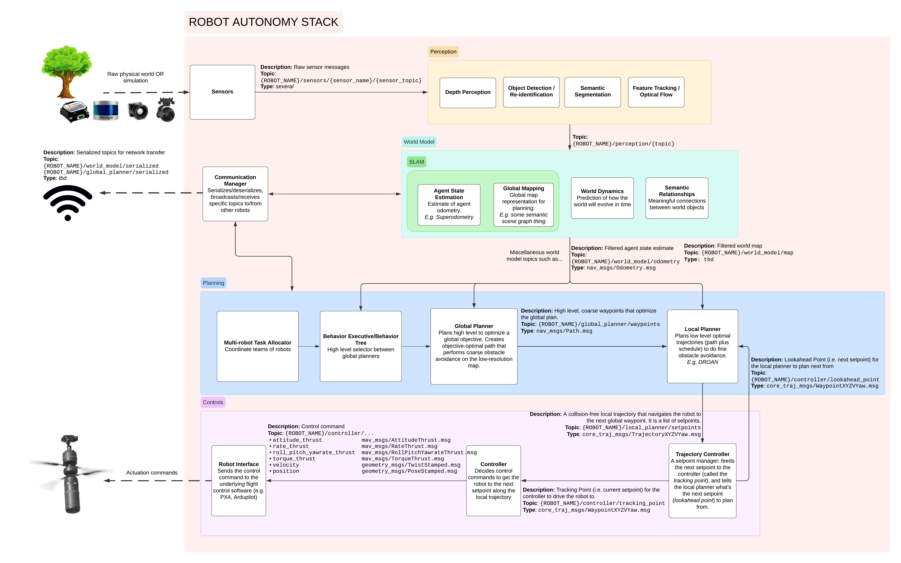

| Topic                          | Type              | Description                                                                                                                             |
| -------------------------------| ------------------| ---------------------------------------------------------------------------------------------------------------------------|
| `/$ROBOT_NAME/odometry`        | [nav_msgs/Odometry](https://docs.ros.org/en/rolling/p/nav_msgs/interfaces/msg/Odometry.html) | Best estimate of robot odometry
| `/$ROBOT_NAME/global_plan`     | [nav_msgs/Path](https://docs.ros.org/en/rolling/p/nav_msgs/interfaces/msg/Path.html)     | Current target global trajectory for the robot to follow. See [global planning](4_global/planning.md) for more details.

## System Diagram
