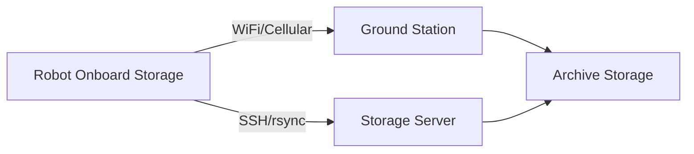

# Data Offloading

Automatic transfer of ROS bags, logs, and other data from robots to ground stations or storage servers. Critical for managing limited onboard storage and enabling post-mission analysis.

## Overview

Data offloading in AirStack:

- **Automatic synchronization** when robot connects to network
- **Bandwidth-aware transfers** to avoid interfering with operations
- **Compression** to reduce transfer time
- **Verification** to ensure data integrity
- **Storage management** to free onboard space after successful transfer

## Architecture



Data flows from robot to either:
1. **Ground Control Station** during or after mission
2. **Storage Server** for long-term archival
3. **Cloud Storage** for team-wide access

## Quick Start

### Basic Offload

Manual offload via rsync:
```bash
# From robot to ground station
rsync -avz --progress /opt/airstack/bags/ user@groundstation:/data/robot1/
```

### Automatic Offload

Configure automatic offloading by setting up:

1. **SSH key authentication** (no password required)
2. **Offload script** that runs on network connection
3. **Cron job** or systemd timer for periodic sync

## Configuration

### Setting Up SSH Keys

On robot:
```bash
ssh-keygen -t ed25519 -f ~/.ssh/id_offload
ssh-copy-id -i ~/.ssh/id_offload.pub user@groundstation
```

### Offload Script

Create `/opt/airstack/scripts/offload_data.sh`:

```bash
#!/bin/bash
# Offload data from robot to ground station

ROBOT_NAME=${ROBOT_NAME:-"robot1"}
GROUND_STATION="user@groundstation"
REMOTE_DIR="/data/${ROBOT_NAME}"
LOCAL_BAGS="/opt/airstack/bags"
LOCAL_LOGS="/opt/airstack/logs"

# Check if ground station is reachable
if ! ping -c 1 -W 5 groundstation > /dev/null 2>&1; then
    echo "Ground station not reachable, skipping offload"
    exit 0
fi

# Sync bags
echo "Syncing bags..."
rsync -avz --progress --remove-source-files \
    ${LOCAL_BAGS}/ \
    ${GROUND_STATION}:${REMOTE_DIR}/bags/

# Sync logs
echo "Syncing logs..."
rsync -avz --progress \
    ${LOCAL_LOGS}/ \
    ${GROUND_STATION}:${REMOTE_DIR}/logs/

echo "Offload complete"
```

Make executable:
```bash
chmod +x /opt/airstack/scripts/offload_data.sh
```

### Automatic Scheduling

**Option 1: Cron (periodic)**
```bash
# Run every hour
0 * * * * /opt/airstack/scripts/offload_data.sh >> /var/log/offload.log 2>&1
```

**Option 2: Systemd (on network up)**

Create `/etc/systemd/system/airstack-offload.service`:
```ini
[Unit]
Description=AirStack Data Offload
After=network-online.target
Wants=network-online.target

[Service]
Type=oneshot
ExecStart=/opt/airstack/scripts/offload_data.sh
User=airstack
StandardOutput=journal
StandardError=journal

[Install]
WantedBy=multi-user.target
```

Enable:
```bash
sudo systemctl enable airstack-offload.service
sudo systemctl start airstack-offload.service
```

## Storage Management

### Monitoring Disk Space

Check available space:
```bash
df -h /opt/airstack
```

Monitor during mission:
```bash
watch -n 10 "df -h /opt/airstack | tail -1"
```

### Automatic Cleanup

After successful offload, free space:

```bash
# Remove successfully transferred bags (already done if using --remove-source-files)
# Or delete bags older than 7 days after verification
find /opt/airstack/bags -name "*.db3" -mtime +7 -delete
```

### Storage Quotas

On Jetson/VOXL with limited storage:

- **Reserve 10GB minimum** free space for system
- **Set bag size limits** in recording configuration
- **Prioritize critical topics** over full recording
- **Enable automatic offload** to prevent filling disk

## Bandwidth Optimization

### Compression

Compress before transfer:
```bash
# Compress bags
cd /opt/airstack/bags
tar -czf bags_$(date +%Y%m%d_%H%M%S).tar.gz *.db3

# Transfer compressed archive
rsync -avz --progress bags_*.tar.gz user@groundstation:/data/robot1/
```

### Transfer Scheduling

Avoid transferring during active operations:

- **Pre-flight**: Offload before mission
- **Post-flight**: Offload after mission completes
- **Off-hours**: Schedule large transfers overnight
- **Bandwidth limiting**: Use `rsync --bwlimit=1000` (KB/s)

### Delta Sync

Only transfer new/changed files:
```bash
rsync -avz --update --progress /opt/airstack/bags/ user@groundstation:/data/robot1/bags/
```

## Security Considerations

- **Use SSH keys** instead of passwords
- **Restrict key permissions**: `chmod 600 ~/.ssh/id_offload`
- **Limit SSH key scope** using `command=` in authorized_keys
- **Use VPN** for remote offloading over internet
- **Encrypt sensitive data** before transfer

## Multi-Robot Scenarios

For multiple robots offloading to same ground station:

### Unique Robot Directories

```bash
ROBOT_NAME="robot1"
REMOTE_DIR="/data/${ROBOT_NAME}"
rsync -avz /opt/airstack/bags/ user@groundstation:${REMOTE_DIR}/bags/
```

### Coordinated Transfers

Prevent bandwidth saturation:

```bash
# Robot 1: offload immediately after landing
# Robot 2: offload 10 minutes after Robot 1
# Robot 3: offload 10 minutes after Robot 2
```

Use file locks to serialize:
```bash
flock /var/lock/offload.lock /opt/airstack/scripts/offload_data.sh
```

## Ground Station Setup

### Receiving Data

On ground station, create directory structure:
```bash
sudo mkdir -p /data/{robot1,robot2,robot3}/{bags,logs}
sudo chown -R user:user /data
```

### Archive Management

Organize by date and mission:
```bash
/data/
├── robot1/
│   ├── bags/
│   │   ├── 2024-03-17_mission1/
│   │   ├── 2024-03-18_mission2/
│   │   └── ...
│   └── logs/
└── robot2/
    └── ...
```

Automated archival script:
```bash
#!/bin/bash
# Archive and compress old mission data

SOURCE="/data/robot1/bags"
ARCHIVE="/archive/robot1"
DAYS_OLD=30

find ${SOURCE} -name "*.db3" -mtime +${DAYS_OLD} -exec tar -czf {}.tar.gz {} \; -delete
mv ${SOURCE}/*.tar.gz ${ARCHIVE}/
```

## Troubleshooting

**Transfer fails with SSH error**:
- Verify SSH keys are set up correctly
- Test manual SSH connection: `ssh user@groundstation`
- Check network connectivity

**Transfer is too slow**:
- Use compression: `tar -czf` before transfer
- Check network bandwidth and latency
- Use `--bwlimit` to avoid saturating connection
- Transfer during off-peak hours

**Disk full on robot**:
- Manually offload immediately
- Delete old/unnecessary bags
- Reduce recording topic list
- Increase offload frequency

**Data corruption during transfer**:
- Use rsync's built-in checksums
- Verify file sizes after transfer
- Use `--checksum` flag for rsync
- Implement post-transfer validation script

## Monitoring and Alerts

### Check Offload Status

View offload logs:
```bash
journalctl -u airstack-offload.service -f
```

### Disk Space Alerts

Alert when disk is >80% full:
```bash
#!/bin/bash
USAGE=$(df /opt/airstack | tail -1 | awk '{print $5}' | sed 's/%//')
if [ $USAGE -gt 80 ]; then
    echo "WARNING: Disk usage at ${USAGE}% on $(hostname)" | mail -s "Disk Alert" ops@example.com
fi
```

## See Also

- [ROS Bags](rosbags.md) - Recording data
- [Logging Overview](index.md) - AirStack logging infrastructure  
- [Real World Data Offloading](../../real_world/data_offloading/index.md) - Field-specific offload procedures
- [Robot Configuration](../configuration/index.md) - Configuring robot identity and network