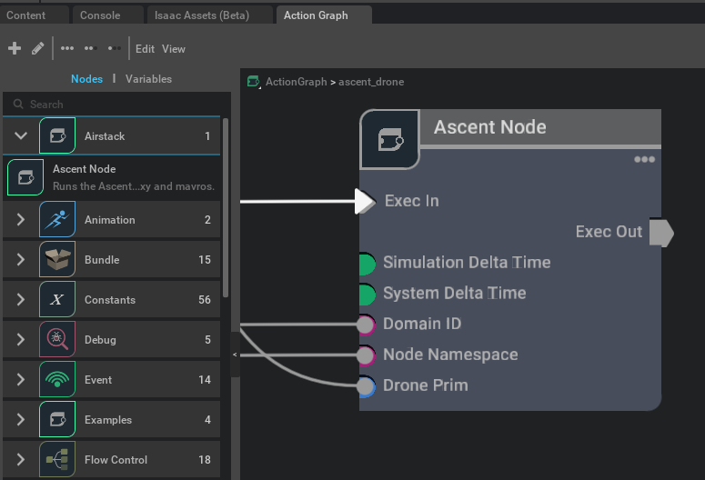
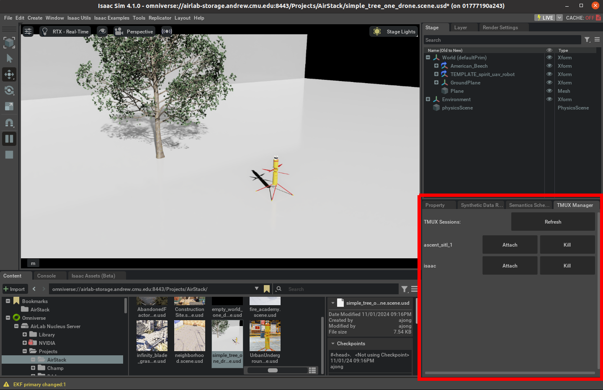

# AirLab AirStack Extension

The AirStack extension for IsaacSim does two main things. It creates an Ascent Omnigraph Node which runs the Ascent SITL and updates the position of a drone model in IsaacSim based on the SITL. It also creates a panel for listing, attaching to, and killing tmux sessions.

## Ascent OmniGraph Node

The Ascent OmniGraph node takes as input a domain id, node namespace and drone prim. It runs the Ascent SITL, mavproxy, and mavros and takes care of keeping the SITL time synced with IsaacSim's time. Mavros is run using the inputted domain id and node namespace. The drone prim's position is set based off of the position of the drone in the SITL. The drone prim doesn't do collision and will pass through objects in the IsaacSim world.

The way the SITL is synced with IsaacSim is by running the SITL in gdb with a breakpoint on the functin that advances the SITL time. Every time this function is called, our code is run by injecting a library using the LD_PRELOAD trick. Our code runs a client socket that talks to a server socket running in the AirStack IsaacSim extension which tells it how long to sleep based off the current SITL and IsaacSim time.

The Ascent OmniGraph node is shown below:

## TMUX Panel

This is a panel for listing, attaching to, and killing any running TMUX sessions. The Ascent SITL, mavproxy, and mavros are run in a TMUX sesion, so this is mainly for debugging those and probably doesn't need to be interacted with by most users. A list of TMUX sessions is displayed in the panel. It doesn't auto refresh so you have to manually click the refresh button to display any changes in the list of sessions. For each session, there is an `Attach` button and a `Kill` button. The `Attach` button will bring up an `xterm` window with the TMUX session. The `Kill` button will kill the TMUX session.

The TMUX panel is shown below:

