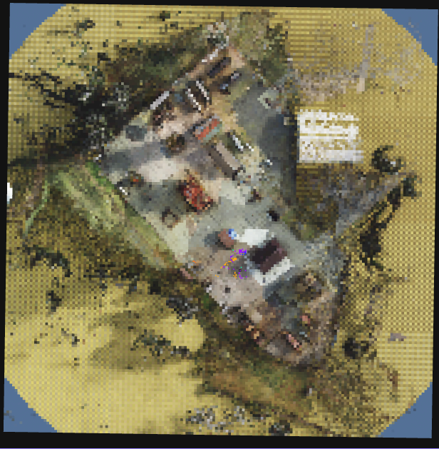

# 2D World Map in Foxglove

There are two ways to render a 2D ground reference under your fleet in Foxglove's 3D panel:

1. **Real-world satellite images** — for outdoor flights. Foxglove's built-in **Map** panel fetches satellite/road tiles from an online tile provider and pins your robots on them via GPS.
2. **Simulated overhead camera** — for sim. A static top-down orthographic camera captures the scene once and publishes it as an aerial image; the GCS renders it as a textured ground plane.

Both paths render into the same global `map` frame, so robot markers, trajectories, and gossip payloads sit correctly on top in either case.

## Real-World Satellite Images

For outdoor flights, no special AirStack configuration is needed — the GCS publishes everything Foxglove's Map panel needs:

- Each robot's GPS gets republished on `/gcs/{robot_name}/location` (with `frame_id='map'` so the Map panel accepts it).
- A stationary fix at `ORIGIN_LAT/LON` is published on `/gcs/map_origin/location` so the panel has a fixed anchor and doesn't auto-recenter on whichever robot moves first.

In Foxglove:

1. Add a **Map** panel.
2. Open its settings and pick a tile layer (e.g. **Custom (URL template)** with a satellite tile provider — Foxglove ships with OpenStreetMap by default; for satellite imagery you can use any standard `{z}/{x}/{y}` URL such as Esri's World Imagery).
3. Add `/gcs/map_origin/location` and each `/gcs/{robot}/location` topic.

The Map panel will draw satellite tiles around the origin and show robot pins as they move.

## Simulated Overhead Camera

The overhead camera is a static, top-down orthographic camera that renders the simulated scene once and publishes it as an aerial image. The GCS picks it up and renders it as a textured ground plane in Foxglove's 3D panel — useful as a visual reference behind the robot markers, especially in scenes that don't have ground-truth satellite imagery.

The scene is static, so the camera publishes briefly at startup, the GCS catches one valid frame, and both sides tear down their subscriptions. After that, the overhead is essentially free.



## Enabling it in a sim launch script

Two helpers from `simulation/isaac-sim/utils/scene_prep.py` do all the work. Call both inside the post-load callback (after the stage is loaded but before drones spawn):

```python
from utils.scene_prep import (
    add_orthographic_camera, add_overhead_camera_publisher,
    get_stage_meters_per_unit,
)

mpu, scene_scale_factor = get_stage_meters_per_unit(stage)

cam_path = add_orthographic_camera(
    stage,
    prim_path="/World/MapCamera",
    altitude_m=OVERHEAD_ALTITUDE_M,
    coverage_m=OVERHEAD_COVERAGE_M,
    scene_scale_factor=scene_scale_factor,
)

add_overhead_camera_publisher(
    parent_graph_path="/World/MapCameraGraph",
    camera_prim_path=cam_path,
    topic="/sim/overhead/image",
    spec_topic="/sim/overhead/spec",
    frame_id="map",
    coverage_m=OVERHEAD_COVERAGE_M,
    pixels_per_meter=OVERHEAD_PX_PER_METER,
    domain_id=0,
)
```

The three constants (`OVERHEAD_ALTITUDE_M`, `OVERHEAD_COVERAGE_M`, `OVERHEAD_PX_PER_METER`) are the only knobs you typically need to adjust. Defaults and effect:

| Constant | Default | What it controls |
|---|---|---|
| `OVERHEAD_ALTITUDE_M` | `150.0` | Camera height above world origin (m). |
| `OVERHEAD_COVERAGE_M` | `200.0` | Side length of the captured square (m). |
| `OVERHEAD_PX_PER_METER` | `4.0` | Texture density. Increase for sharper text/markings; capped at `max_resolution=2048`. |

The camera is positioned at world origin `(0, 0)`. If your scene's points of interest are off-origin, shift the camera's `prim_path` xform after `add_orthographic_camera` returns:

```python
from pxr import Gf, UsdGeom

cam_path = add_orthographic_camera(stage, prim_path="/World/MapCamera", ...)

# Re-center the camera over (CENTER_X_M, CENTER_Y_M) instead of world origin.
CENTER_X_M, CENTER_Y_M = 50.0, -25.0
xform = UsdGeom.Xformable(stage.GetPrimAtPath(cam_path))
xform.ClearXformOpOrder()
xform.AddTranslateOp().Set(Gf.Vec3d(
    CENTER_X_M     * scene_scale_factor,
    CENTER_Y_M     * scene_scale_factor,
    OVERHEAD_ALTITUDE_M * scene_scale_factor,
))
```


## GCS side

The GCS rendering is handled by `_build_sim_ground_marker` in `gcs/ros_ws/src/gcs_visualizer/gcs_visualizer/foxglove_visualizer_node.py`. It:

1. Downsamples the source image to a coarse triangle grid (default 0.8 cells/m, capped at 384×384) — Foxglove's 3D panel struggles with dense per-pixel meshes, but a coarse triangle grid renders smoothly.
2. Publishes one `Marker` of type `TRIANGLE_LIST` on `/gcs/sim_ground`.

### Hide the overhead in Foxglove

The ground plane is just a marker on `/gcs/sim_ground`, so you can toggle it on or off in the 3D panel settings without touching any code:

1. Click the gear icon on the **3D** panel.
2. Open **Topics → `/gcs/sim_ground`**.
3. Toggle visibility off to hide it.

### Sharper rendering

The default downsample (0.8 cells/m, cap 384) is conservative. To raise the rendered resolution, override two parameters on `foxglove_visualizer_node` in `gcs/ros_ws/src/gcs_visualizer/launch/gcs_visualizer.launch.xml`:

```xml
<param name="overhead_grid_per_m"           value="3.0" />
<param name="overhead_max_grid_resolution"  value="1024" />
```

`1024` over a 200 m scene gives ~5 cells/m. If the 3D panel slows down, drop back toward `768`. Any change here also requires bumping `OVERHEAD_PX_PER_METER` on the sim side (otherwise you're sampling a low-resolution source more densely).

To change other rendering behavior (alpha, lighting), edit `_build_sim_ground_marker` directly. To force a re-render, restart the GCS visualizer.

## See also

- [Spawning Drones](spawning_drones.md) — authoring a full multi-drone launch script
- [Pegasus Scene Setup](pegasus_scene_setup.md) — single-drone scene authoring
- [GCS Foxglove Visualization](../../gcs/foxglove.md) — what the visualizer publishes alongside the ground marker
