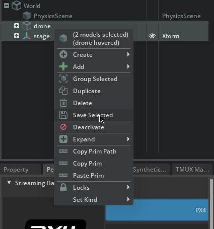

# Pegasus Simulator

Pegasus Simulator is a high-fidelity multirotor simulation and control framework built on top of NVIDIA Isaac Sim’s physics engine.
While Isaac Sim provides the underlying physics and rendering, Pegasus Simulator implements the drone flight dynamics, control algorithms, and PX4 integration that enable realistic autonomous flight simulation.

Pegasus Sim focuses on accurate modeling of multirotor dynamics and environment interaction, providing a physically grounded foundation for UAV testing and validation.
Through its integration with PX4 MAVLink, Pegasus connects directly to the AirStack autonomy stack, allowing AirStack’s higher-level planning and perception components to control a realistically simulated drone as if it were a physical vehicle.

## Custom Pegasus Node in AirStack

AirStack extends the core Pegasus Simulator through a Custom Pegasus OmniGraph Node.
This node serves as an Isaac Sim OmniGraph action graph wrapper, encapsulating both:

- The Pegasus simulation code, and

- The drone primitive within the USD scene.

This design allows Pegasus-based simulations to be defined entirely in USD, enabling scenario reusability and modular composition.
Users can drop the same Pegasus node into different environments or swap robots while maintaining consistent physics and control behavior.

Through this approach, AirStack leverages Pegasus to create a flexible, reusable, and realistic simulation framework for aerial robotics research and development.

## Launch Configuration

Launch Configuration

At the top level of the AirStack simulation environment, a `.env` file controls how Pegasus and Isaac Sim are launched:
```bash
ISAAC_SIM_GUI="omniverse://airlab-nucleus.andrew.cmu.edu/Library/Assets/Pegasus/iris_with_sensors.pegasus.robot.usd"
# Set to "true" to launch Isaac Sim using a standalone Python script instead of a USD file
ISAAC_SIM_USE_STANDALONE_SCRIPT="true"  # "true" or "false"
# Script name (must be in /AirStack/simulation/isaac-sim/launch_scripts/)
ISAAC_SIM_SCRIPT_NAME="example_one_px4_pegasus_launch_script.py"
PLAY_SIM_ON_START="false"  # Not supported in standalone script mode
```

There are *two modes* for launching Pegasus simulations:
- Load an existing USD file (e.g. *.pegasus.robot.usd) — to simulate a prebuilt robot/environment setup.
- Use a standalone Python script — to dynamically generate a USD and configure the world from scratch.

## Scripted Scene Generation

In AirStack, users can either load a pre-existing USD file or use a launch script to generate a new simulation scene programmatically.

Example scripts for spawning vehicles are provided in `AirStack/simulation/isaac-sim/launch_scripts/`
You can also write your own scripts for your own custom scenarios.

When using the scripted launch method:

1. Define your desired script in the `.env` file and run
```bash
airstack up isaac-sim
```
This will start Isaac Sim and generate the drone(s) within the scene.

2. Stop the simulation by pressing the square “Stop” button on the left side of the Isaac Sim interface.
This is necessary before editing the OmniGraph.


3. Open and connect the OmniGraph:
  - Right-click the graph and choose “Open Graph.”
  - Connect the ROS2Context node so that it feeds into all desired sensor subgraphs (e.g., cameras, LiDARs).  
  
  > This manual step is temporarily required due to a known bug. Automation is planned in a future update.

4. Save the scene and drones once everything is connected.
  - You can save both the stage and the drone USDs for future reuse.  
  

5. Update your environment variables:
  - Set the ISAAC_SIM_GUI variable to point to your newly saved .usd file (make sure to put the path within the docker container or in the omniverse server)
  - Set ISAAC_SIM_USE_STANDALONE_SCRIPT to "false" to load this saved environment directly next time.

## Known bugs and workarounds for Scripted Scene Generation

- **Stage Offset Bug**  
In some cases, the saved USD file may contain an offset in the stage transform.
  - After launching the stage, manually set all position offsets to zero in the Property panel of Isaac Sim.

- **Pegasus Physics Update Prompt**  
When reloading a saved stage, Isaac Sim may display a popup asking to update to new Pegasus Physics.
  - Accept the update to ensure compatibility with the new Pegasus physics scene.  
  

- **Stereo Camera Initialization**  
Occasionally, the right camera in a stereo camera pair may fail to initialize.
  - When starting the sim, press Start → Stop → Start again in the Isaac Sim toolbar.
  - This will refresh the right camera node and restore proper stereo output.

- **Pegasus Node Not Recognized (Drone Not Arming/Taking Off)**
The drone not arming/taking off can be a symptom of the PX4Multirotor Node not being recognized in omnigraph. This may be due the `pegasus.simulator` extension not being loaded.
  - To fix, launch the simulator with `airstack up isaac-sim`, in the toolbar, click Window -> Extensions -> Third Party, serach for "pegasus", select the "PEGASUS SIMULATOR" and enable "AUTOLOAD"
  - Restart your docker container by running `airstack down isaac-sim && airstack up isaac-sim` and the extension should load every time now.