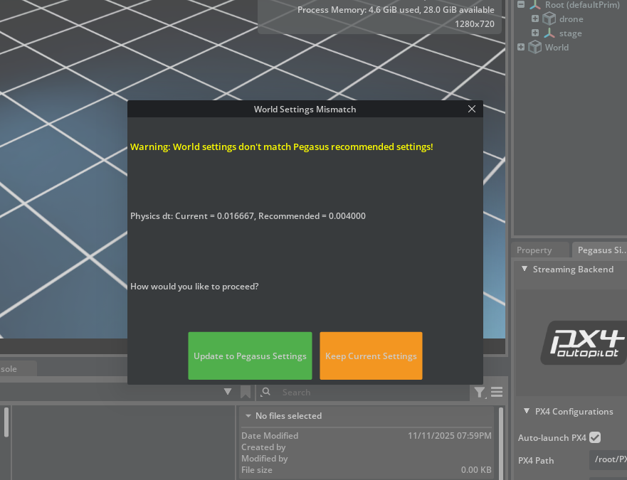

# Aerial Robot Simulation via the Pegasus Extension

[Pegasus Simulator](https://pegasussimulator.github.io/PegasusSimulator/) is a multirotor simulation and control framework built on top of NVIDIA Isaac Sim’s physics engine.
Isaac Sim provides the underlying physics and rendering and Pegasus Simulator implements the drone flight dynamics, control algorithms, and PX4 integration.

Pegasus Sim accurately models multirotor dynamics and environment interaction, providing a physically grounded foundation for UAV simulation.
Pegasus connects directly to the AirStack autonomy stack with its PX4 MAVLink integration, allowing AirStack’s higher-level planning and perception components to control a realistically simulated drone as if it were a physical vehicle.

## Custom Pegasus Node in AirStack

By default, Pegasus Simulator only supports Isaac's [standalone python workflow](https://docs.isaacsim.omniverse.nvidia.com/latest/introduction/workflows.html). 
This means your scene cannot be edited and saved through the GUI.

To make things more GUI-friendly for the user,
AirStack maintains a [fork of Pegasus Simulator](https://github.com/castacks/PegasusSimulator-AirStack-Integration) that enables Pegasus's features from an [Omnigraph node](https://docs.omniverse.nvidia.com/extensions/latest/ext_omnigraph/tutorials/gentle_intro.html).
This node serves as an Isaac Sim OmniGraph action graph wrapper around the Pegasus Sim code which can then be saved in Universal Scene Description (USD) format which are easily readable in Isaac-Sim. This design allows Pegasus-based simulations to be defined entirely in USD, enabling scenario reusability and modular composition.
Users can drop the same Pegasus node into different environments or swap robots while maintaining consistent physics and control behavior.

Through this approach, AirStack leverages Pegasus to create a flexible, reusable, and realistic simulation framework for aerial robotics research and development.

## Launch Configuration

Launch Configuration

At the top level of the AirStack simulation environment, a `.env` file controls how Pegasus and Isaac Sim are launched:
```bash
ISAAC_SIM_GUI="omniverse://airlab-nucleus.andrew.cmu.edu/Library/Assets/Pegasus/iris_with_sensors.pegasus.robot.usd"
# Set to "true" to launch Isaac Sim using a standalone Python script instead of a USD file
ISAAC_SIM_USE_STANDALONE="false"  # "true" or "false"
# Script name (must be in /AirStack/simulation/isaac-sim/launch_scripts/)
ISAAC_SIM_SCRIPT_NAME="example_one_px4_pegasus_launch_script.py"
PLAY_SIM_ON_START="false"  # Not supported in standalone script mode
```

There are *two modes* for launching Pegasus simulations:

- Load an existing USD file (e.g. *.pegasus.robot.usd) — to simulate a prebuilt robot/environment setup.
- Use a standalone Python script — to dynamically generate a USD and configure the world from scratch.

This is toggled by the `ISAAC_SIM_USE_STANDALONE` variable in the `.env` file. If set to `false`, the file specified by `ISAAC_SIM_GUI` is loaded directly. If set to `true`, the script named in `ISAAC_SIM_SCRIPT_NAME` is executed to generate the scene. It is generally recommended to use the scripted approach to generate new scenes (or at least the pegasus drone) since it handles a lot of the OmniGraph and sensor configurations automatically, then saving it, for future reuse and setting `ISAAC_SIM_USE_STANDALONE` to `false` afterwards with `ISAAC_SIM_GUI` pointing to your saved file.

## Scripted Scene Generation

Python scripts give full programmatic control over every aspect of scene construction at startup, making them especially useful for:

- **Reproducible scenarios** — the entire scene is defined in code, not a saved USD file.
- **Nucleus asset integration** — loading `omniverse://` assets that need unit conversion or collision baking before use.
- **Multi-robot setups** — dynamically spawning N drones with distinct IDs and positions.
- **CI / headless testing** — running without a GUI.

Example scripts are provided in `simulation/isaac-sim/launch_scripts/`.

### Scene Preparation Utilities

**Location:** `simulation/isaac-sim/utils/scene_prep.py`

`scene_prep.py` provides helpers that are shared across all example launch scripts:

| Function | Purpose |
|----------|---------|
| `scale_stage_prim(stage, prim_path, scale_factor)` | Applies a uniform XYZ scale transform to the prim at `prim_path`, clearing any existing xform ops first. Use `0.01` for Nucleus assets authored in centimetres; use `1.0` for assets already in metres. |
| `add_colliders(stage_prim)` | Recursively walks every child of `stage_prim` and applies `UsdPhysics.CollisionAPI` to each `UsdGeom.Mesh`. **Must be called or drones fall through the floor.** Skips prims that already have the API. |
| `add_dome_light(stage, intensity=3500, exposure=-3)` | Adds a hemisphere light at `/World/DomeLight` (or updates it if it already exists). Pass `intensity` / `exposure` keyword arguments to override the defaults. |
| `save_scene_as_contained_usd(source_usd_url, output_dir)` | Copies the stage and all its dependencies (textures, MDL materials) from a Nucleus `omniverse://` URL into a local directory via `omni.kit.usd.collect.Collector`. Set `SAVE_SCENE_TO = None` in your script to skip this step. |
| `get_stage_meters_per_unit(stage)` | Returns `(meters_per_unit, scene_scale_factor)`. Multiply metric coordinates by `scene_scale_factor` to convert them into stage-space units. Useful for computing drone spawn heights when `STAGE_SCALE != 1.0`. |

#### Loading `scene_prep`

`scene_prep.py` lives in `utils/`, which is not on `sys.path` by default. The example scripts add it at runtime before importing:

```python
import sys
import os

sys.path.insert(0, os.path.normpath(os.path.join(os.path.dirname(os.path.abspath(__file__)), "..", "utils")))
import scene_prep
from scene_prep import scale_stage_prim, add_colliders, add_dome_light, save_scene_as_contained_usd
```


### Running a Standalone Script

Set the following variables in the top-level `.env` file and then launch as normal:

```bash
# .env
ISAAC_SIM_USE_STANDALONE=true
ISAAC_SIM_SCRIPT_NAME=example_one_px4_pegasus_launch_script.py
```

```bash
# Start Isaac Sim with the selected script
airstack up isaac-sim

```

Scripts must live in `simulation/isaac-sim/launch_scripts/`. Set `ISAAC_SIM_SCRIPT_NAME` to the filename only (no path).

---

### Common Pitfalls

| Symptom | Cause | Fix |
|---------|-------|-----|
| Drone falls through the floor immediately | `add_colliders` was not called | Call `add_colliders(stage_prim)` after loading the environment |
| Colliders applied to wrong-scale geometry | `add_colliders` called before `scale_stage_prim` | Always call `scale_stage_prim` first, then `add_colliders` |
| Physics behaves erratically after colliders added | Update frames not pumped after `add_colliders` | Pump at least 10 `omni.kit.app.get_app().update()` calls after `add_colliders` |
| `ImportError: No module named 'omni'` at script top | `omni` imported before `SimulationApp()` | Move all `omni.*` imports to after the `SimulationApp(...)` line |
| `scene_prep` not found / `ModuleNotFoundError` | `utils/` not on `sys.path` in Isaac Sim's Python | Use `sys.path.insert` to add the `utils/` directory before importing `scene_prep` |
| Drone spawns at wrong height in cm-scale scene | Spawn coordinates not converted to stage space | Multiply metric `init_pos` values by `scene_scale` from `get_stage_meters_per_unit` |


## Known bugs and workarounds for Scripted Scene Generation

- **Stage Offset Bug**  
In some cases, the saved USD file may contain an offset in the stage transform.

  - After launching the stage, manually set all position offsets to zero in the Property panel of Isaac Sim.

- **Pegasus Physics Update Prompt**  
When reloading a saved stage, Isaac Sim may display a popup asking to update to new Pegasus Physics.

  - Accept the update to ensure compatibility with the new Pegasus physics scene.  
  

- **Stereo Camera Initialization**  
Occasionally, the right camera in a stereo camera pair may fail to initialize.

  - When starting the sim, press Start → Stop → Start again in the Isaac Sim toolbar.
  - This will refresh the right camera node and restore proper stereo output.

- **Pegasus Node Not Recognized (Drone Not Arming/Taking Off)**
The drone not arming/taking off can be a symptom of the PX4Multirotor Node not being recognized in omnigraph. This may be due the `pegasus.simulator` extension not being loaded.

  - To fix, launch the simulator with `airstack up isaac-sim`, in the toolbar, click Window -> Extensions -> Third Party, serach for "pegasus", select the "PEGASUS SIMULATOR" and enable "AUTOLOAD"
  - Restart your docker container by running `airstack down isaac-sim && airstack up isaac-sim` and the extension should load every time now.

---

## Physics Rate and IMU_INTEG_RATE

The Isaac Sim physics step rate is the dominant factor in simulation performance. Pegasus defaults to **250 Hz**, which runs well below real-time when a full sensor suite is active. AirStack lowers this to **100 Hz** by reducing PX4's `IMU_INTEG_RATE` to match — since `IMU_INTEG_RATE` controls how often Isaac Sim steps the physics world in lockstep with PX4. 100 Hz is the minimum viable rate: PX4's EKF2 estimator has a fixed 10 ms update period, so `IMU_INTEG_RATE` must be at least 100 Hz or the state estimator falls behind sensor data.

### Configuration

Two variables in the top-level `.env` control the rates:

```bash
# Pegasus physics/rendering rates (read by params.py; PX4_IMU_INTEG_RATE synced automatically).
# Minimum frequency supported by PX4 is 100 Hz.
PX4_PHYSICS_HZ="100"
PX4_RENDERING_HZ="30"
```

- **`PX4_PHYSICS_HZ`** — Sets `physics_dt = 1 / PX4_PHYSICS_HZ` in Isaac Sim's physics scene, and automatically syncs PX4's `IMU_INTEG_RATE` parameter to the same value via `PX4LaunchTool` → `px4-rc.simulator`. Patched within the Docker image to read the environment variable and set the IMU_INTEG_RATE parameter.
- **`PX4_RENDERING_HZ`** — Sets the rendering frame rate independently of physics. 30 Hz rendering has no effect on physics accuracy or PX4 behavior, but does slightly affect performance due to resource usage.

### Valid values

PX4's documented presets for `IMU_INTEG_RATE` are **100, 200, 250, 400 Hz**. The minimum is **100 Hz** — the EKF2 estimator runs at 100 Hz (10 ms period) and `IMU_INTEG_RATE` must be at least this fast. Values below 100 Hz are accepted by the firmware but cause attitude controller oscillation and are not recommended.

- `100` — AirStack default; stable, best real-time performance with sensors
- `200` — good balance, but will get slower
- `250` — Pegasus/PX4 SITL default; best control quality but slower than real-time with sensors
- `400` — maximum recommended. Untested

---

## Performance Benchmarking

A benchmarking suite in `simulation/isaac-sim/extensions/PegasusSimulator/benchmarking/` measures the real-time factor (RTF = simulated seconds / wall-clock seconds) across physics rates, scene complexities, and drone backends.

### Running the suite

```bash
# Full suite (24 scripts) — from outside the container
docker exec isaac-sim bash -c \
  "/isaac-sim/python.sh /isaac-sim/AirStack/simulation/isaac-sim/extensions/PegasusSimulator/benchmarking/run_all.py"

# Single script
docker exec isaac-sim bash -c \
  "/isaac-sim/python.sh /isaac-sim/AirStack/simulation/isaac-sim/extensions/PegasusSimulator/benchmarking/1_cube_no_pegasus.py"

# Subset by number
docker exec isaac-sim bash -c \
  "/isaac-sim/python.sh /isaac-sim/AirStack/simulation/isaac-sim/extensions/PegasusSimulator/benchmarking/run_all.py --scripts 1-8"
```

See `benchmarking/README.md` for the full script inventory, output format, and analysis plots.