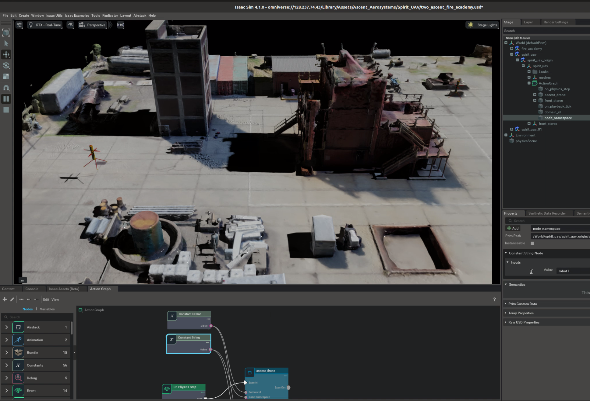

# AirStack Scene Setup

## Creating a New Scene with Robots
The easiest way is to reference and copy an existing scene.

## ROS Publishers Through OmniGraph

### Configure Robot Name, ROS_DOMAIN_ID, and Topic Namespaces

Under the Spirit drone prim is an `ActionGraph` component, which is an [Omnigraph](https://docs.omniverse.nvidia.com/extensions/latest/ext_omnigraph.html). This component is used to configure the ROS publishers for the robot. The `ActionGraph` component has the following fields to configure:

- `robot_name`: The name of the robot. This is used as the top-level namespace for ROS topics.
- `domain_id`: The ROS domain ID. This is used as the `ROS_DOMAIN_ID` for DDS networking.

The Omnigraph has subgraphs for each ROS publisher type. For example, TFs, Images, and PointClouds. The top-level `robot_name` and `domain_id` fields get fed into the subgraphs. The `Topic Namespaces` field should be set to the topic namespace in the subgraphs. This is used to namespace the ROS topics.

### Customizing the Omnigraph

Common pre-built graphs for ROS may be added through the top menu bar: `Isaac Utils > Common OmniGraphs`.
This is helpful for creating various sensor publishers.

We recommend organizing your work into sub-graphs.
Copy your omnigraph template them into the top-level `Omnigraph` component, named "ActionGraph". Connect the `robot_name` and `domain_id` fields to your workflow. Then, select all the nodes in your workflow, right-click, and create a subgraph.