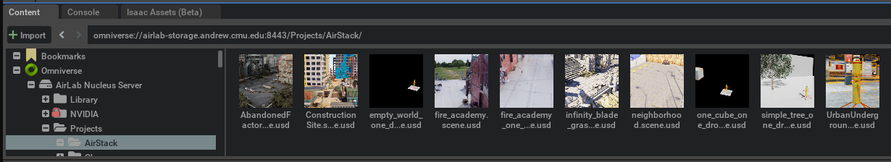
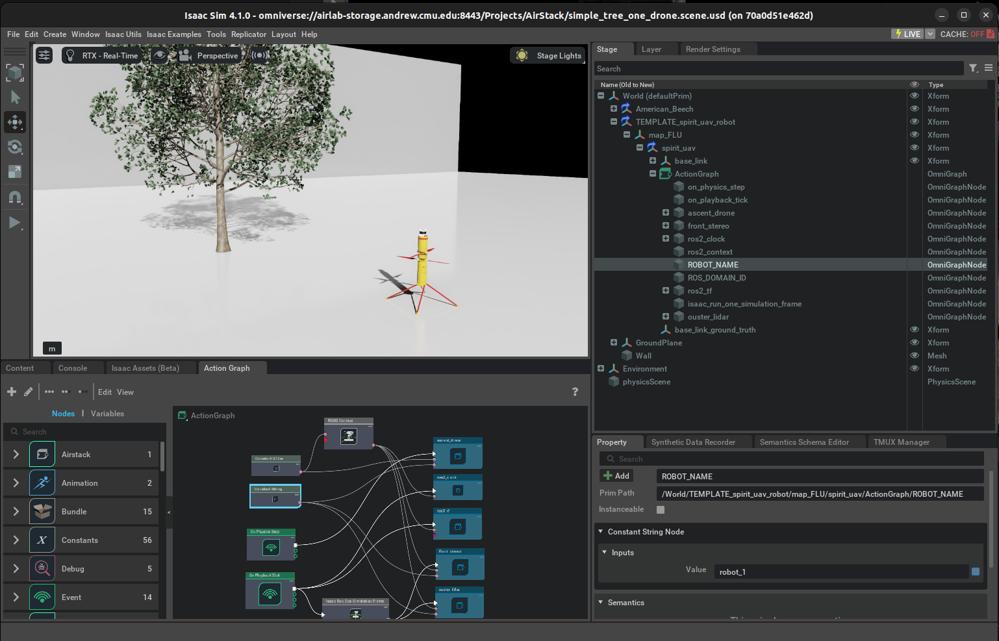
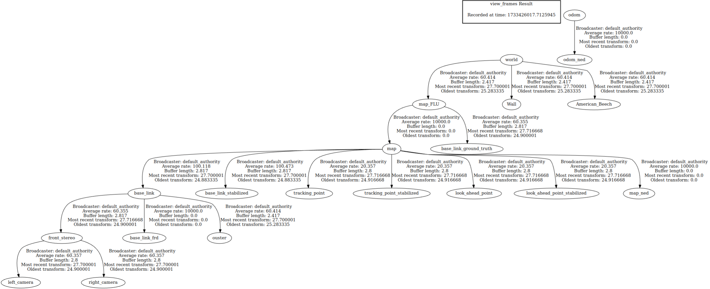

# AirStack Scene Setup

## Creating a New Scene with Robots
The easiest way to create a scene is to copy and customize an existing scene.

Example scenes are located on the AirLab Nucleus Server under [Projects > AirStack](https://airlab-storage.andrew.cmu.edu:8443/omni/web3/omniverse://airlab-storage.andrew.cmu.edu:8443/Projects/AirStack/).
This can be opened in Isaac's Content Browser:

For example, `simple_tree_one_drone.scene.usd` looks like this:

The example scenes are setup with the following:

- A "World" prim, which is the root of the scene
- The Root layer is set to use meters as the unit of length
- Prims that make up the scene. Scene prims should have collision physics enabled with Colliders Preset (Property > Add > Physics > Collider Preset)
- Robot instances, added to the scene as a reference to the robot USD file. Currently this file is [Library > Assets > Ascent_Aerosystems > TEMPLATE_spirit_uav.robot.usd](https://airlab-storage.andrew.cmu.edu:8443/omni/web3/omniverse://airlab-storage.andrew.cmu.edu:8443/Library/Assets/Ascent_Aerosystems/Spirit_UAV/TEMPLATE_spirit_uav.robot.usd)
  - The robot has default sensors added, including a LiDAR and stereo cameras
  - Sensors publish to ROS using the attached ActionGraph
  - Robot dynamics are controlled by the [AirStack Extension](ascent_sitl_extension.md)

### Configure Robot Name and ROS_DOMAIN_ID

Under the Spirit drone prim is an `ActionGraph` component, which is an [Omnigraph](https://docs.omniverse.nvidia.com/extensions/latest/ext_omnigraph.html). This component is used to configure the ROS publishers for the robot. The `ActionGraph` component has the following fields to configure:

- `ROBOT_NAME`: The name of the robot. This is used as the top-level namespace for ROS topics.
- `ROS_DOMAIN_ID`: The ROS domain ID. This sets the `ROS_DOMAIN_ID` environment variable for DDS networking.

The Omnigraph has subgraphs for each ROS publisher type. For example, TFs, Images, and PointClouds. The top-level `robot_name` and `domain_id` fields get fed into the subgraphs. 

To create a new robot, duplicate the drone prim instance and adjust the `ROBOT_NAME` and `ROS_DOMAIN_ID` fields to be unique.

### Customizing the Omnigraph

Common pre-built graphs for ROS may be added through the top menu bar: `Isaac Utils > Common OmniGraphs`.
This is helpful for creating various sensor publishers.

We recommend organizing your work into sub-graphs.
Copy your omnigraph template them into the top-level `Omnigraph` component, named "ActionGraph". Connect the `robot_name` and `domain_id` fields to your workflow. Then, select all the nodes in your workflow, right-click, and create a subgraph.

## Frame Conventions
Isaac Sim uses Forward-Left-Up (FLU) coordinate frame conventions.  However, MAVROS and AirStack use East-North-Up (ENU). 

To address this, the origin of the robot lives under a prim called `map_FLU`. Then AirStack publishes a static transform (`static_transforms.launch.xml`) from `map_FLU` to `map`, which is in ENU. The transform is a 90 degree rotation about the Z-axis. 

The resulting TF tree looks like this:
