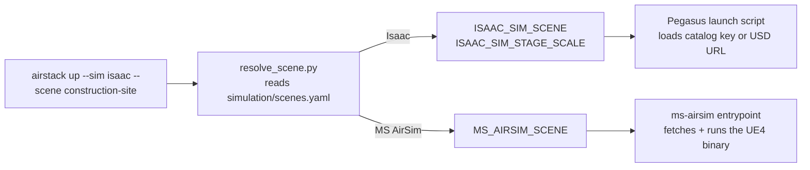

# Simulation Scenes

Every simulator names its environments differently — Isaac Sim loads Pegasus
catalog entries or USD stages from an Omniverse Nucleus server, while
Microsoft AirSim (legacy) runs pre-built Unreal Engine binaries. So that
developers don't have to know each simulator's addressing scheme, AirStack
keeps one simulator-agnostic **scene catalog** and a single launch flag:
`airstack up --scene <shortname>` maps the shortname to whatever the selected
simulator understands.

## Quick Example

```bash
# Isaac Sim: fly in the construction site stage from the AirLab Nucleus server
airstack up --sim isaac --scene construction-site

# Isaac Sim: an NVIDIA warehouse from the Pegasus catalog
airstack up --sim isaac --scene warehouse

# Microsoft AirSim (legacy): the Blocks UE4 scene
airstack up --sim airsim --scene blocks
```

Passing an unknown scene — or one the selected simulator doesn't have —
prints a table of every available scene per simulator:

```bash
airstack up --sim isaac --scene blocks
# ERROR: scene 'blocks' is not available for Isaac (only: MS AirSim). Available scenes:
# SCENE                      ISAAC                                  MS AIRSIM
# abandoned-factory          nucleus:AbandonedFactory.stage.usd     -
# blocks                     -                                      blocks
# ...
```

The same table is available any time via:

```bash
python3 simulation/resolve_scene.py --table
```

## How It Works

The catalog lives in [`simulation/scenes.yaml`](https://github.com/castacks/AirStack/blob/main/simulation/scenes.yaml).
Each shortname declares the scene reference per simulator, so the same name can
exist for both simulators without ambiguity — resolution always follows the
simulator selected by `--sim` (or the active compose profile):

```yaml
scenes:
  construction-site:
    isaac:
      ref: omniverse://airlab-nucleus.andrew.cmu.edu:443/Public/AirStack/Stages/ConstructionSite/ConstructionSite.stage.usd
      stage_scale: 0.01      # this stage is authored in centimeters
  warehouse:
    isaac: Warehouse         # bare string = Pegasus catalog key (or a USD URL)
  blocks:
    msairsim: blocks         # fetch_scene.sh key (pre-built UE4 binary)
```

`airstack up --scene` resolves the shortname host-side
(`simulation/resolve_scene.py`) and exports plain environment variables; the
simulator containers do the final loading:



The exported variables are ordinary launch config — they appear in the
effective launch config printout and can also be set directly (in `.env`, an
`--env-file`, or the shell) without using `--scene` at all:

```bash
# Bypass the catalog entirely: any Nucleus/HTTP USD URL works
ISAAC_SIM_SCENE="omniverse://my-server/My/Stage.usd" airstack up --sim isaac
```

| Variable | Simulator | Meaning |
|----------|-----------|---------|
| `ISAAC_SIM_SCENE` | Isaac | A Pegasus `SIMULATION_ENVIRONMENTS` key (e.g. `Warehouse`) or a USD reference (`omniverse://`/`https://` URL or `*.usd` path). Empty = the launch script's default (`Default Environment`). |
| `ISAAC_SIM_STAGE_SCALE` | Isaac | Scale applied to the loaded `/World/stage` prim. `0.01` converts centimeter-authored stages to meters; default `1.0`. |
| `MS_AIRSIM_SCENE` | MS AirSim | A `fetch_scene.sh` catalog key (e.g. `blocks`, `airsimnh`). Empty = `blocks`. Ignored when `MS_AIRSIM_BINARY_PATH` is set. |

Fleets can pin a scene in their fleet file (`sim.scene`); a `--scene` flag on
the command line overrides it, with a log line noting the override.

## Scene Catalog

### Isaac Sim — Pegasus catalog

These map to Pegasus Simulator's built-in `SIMULATION_ENVIRONMENTS` (NVIDIA
Isaac assets, streamed from the Nucleus mount configured in `omni_pass.env`):

| Shortname | Pegasus environment |
|-----------|---------------------|
| `default` | Default Environment |
| `black-gridroom`, `curved-gridroom` | Black / Curved Gridroom |
| `hospital`, `office`, `simple-room` | Hospital, Office, Simple Room |
| `warehouse`, `warehouse-forklifts`, `warehouse-shelves`, `full-warehouse` | Warehouse variants |
| `flat-plane`, `rough-plane`, `slope-plane`, `stairs-plane` | Terrain planes |
| `exhibition-hall` | Exhibition Hall (NVIDIA cloud asset) |

### Isaac Sim — AirLab public stages

Full environments exported from Unreal Engine, hosted on the AirLab Nucleus
server under a **publicly readable** folder:

```
omniverse://airlab-nucleus.andrew.cmu.edu:443/Public/AirStack/Stages/
```

Anyone can browse and load these with the guest account (username `guest`,
password `guest`) — the default `omni_pass.env` credentials work out of the
box. Log in at <https://airlab-nucleus.andrew.cmu.edu/omni/web3/> to browse
from a web browser.

| Shortname | Stage USD | Size | Units |
|-----------|-----------|------|-------|
| `abandoned-factory` | `AbandonedFactory/AbandonedFactory.stage.usd` | 38 MB | m |
| `abandoned-warehouse-night` | `AbandonedWarehouse/Warehouse_01_night.stage.usd` | 7 MB | cm |
| `abandoned-warehouse-day` | `AbandonedWarehouse/Warehouse_02_day.stage.usd` | 4 MB | cm |
| `chemical-plant` | `ChemicalPlant/Map_ChemicalPlant_2.stage.usd` | 549 MB | m |
| `construction-site` | `ConstructionSite/ConstructionSite.stage.usd` | 44 MB | cm |
| `retro-neighborhood` | `RetroNeighborhood/RetroNeighborhood.stage.usd` | 193 KB (+props) | cm |

!!! note "Units and `stage_scale`"
    Each catalog entry's `stage_scale` mirrors the stage's authored
    `metersPerUnit` (`0.01` for centimeter-authored stages, `1.0` for
    meter-authored ones), so scenes load at real-world scale without manual
    tuning. When loading a stage by raw URL instead of shortname, set
    `ISAAC_SIM_STAGE_SCALE` yourself.

!!! note "Internet access for skies"
    These stages reference dome-light skies on NVIDIA's public S3 bucket
    (`omniverse-content-production.s3.us-west-2.amazonaws.com`). All geometry
    and materials are self-contained on the AirLab server; only the sky needs
    general internet access. On an air-gapped machine the stage still loads,
    minus the sky.

### Microsoft AirSim (legacy) — pre-built UE4 scenes

These map to `fetch_scene.sh` keys; the pre-built binaries come from the
[AirSim v1.8.1 release](https://github.com/microsoft/AirSim/releases/tag/v1.8.1):

| Shortname | UE4 scene | Download size |
|-----------|-----------|---------------|
| `blocks` (also `default`) | Blocks | 135 MB |
| `neighborhood` | AirSimNH | 2.0 GB |
| `abandoned-park` | AbandonedPark | 1.6 GB |
| `landscape-mountains` | LandscapeMountains | 1.1 GB |
| `zhangjiajie` | ZhangJiajie | 840 MB |
| `africa-savannah` | Africa_Savannah | 1.1 GB |
| `msbuild2018` | MSBuild2018 | 754 MB |

Scenes download on first use into `simulation/ms-airsim/assets/scenes/`
(bind-mounted into the container). When `--scene` selects a scene that isn't
present locally, an interactive `airstack up` asks before downloading (the
binaries are large — hundreds of MB to several GB); a non-interactive run
proceeds and the container auto-fetches it inside the `airsim` tmux window.
You can also pre-fetch manually:

```bash
./simulation/ms-airsim/assets/scenes/fetch_scene.sh forest
```

An explicit `MS_AIRSIM_BINARY_PATH` (pointing at any extracted UE4 binary)
always wins over `--scene`.

## Using a Stage Directly in a Launch Script

The example Pegasus launch scripts resolve their scene from the environment,
so `--scene` needs no code changes. A custom launch script can do the same, or
pass any USD reference verbatim:

```python
from pegasus.simulator.params import SIMULATION_ENVIRONMENTS
from pegasus_app import PegasusApp, resolve_scene_from_env

# Honor `airstack up --scene` / ISAAC_SIM_SCENE, with a custom default:
env_url, stage_scale = resolve_scene_from_env(
    SIMULATION_ENVIRONMENTS, default_key="Warehouse")

# ...or hardcode a public stage by URL:
PegasusApp(
    env_url="omniverse://airlab-nucleus.andrew.cmu.edu:443/Public/AirStack/Stages/ConstructionSite/ConstructionSite.stage.usd",
    stage_scale=0.01,   # match the stage's metersPerUnit
    ...
)
```

## Adding a Scene to the Catalog

1. For Isaac: host the stage somewhere reachable by the container's Nucleus
   credentials — for team-wide scenes, a folder under
   `Public/AirStack/Stages/` keeps it guest-accessible. See
   [Export Stages from Unreal](isaac_sim/export_stages_from_unreal.md) for
   producing the USD.
2. Add an entry to `simulation/scenes.yaml`. Set `stage_scale` to the stage's
   `metersPerUnit` (`0.01` if authored in centimeters).
3. Verify: `python3 simulation/resolve_scene.py --sim isaac --scene <name>`,
   then `airstack up --dry-run --sim isaac --scene <name>`.

For MS AirSim, the catalog can only reference scenes `fetch_scene.sh` knows
how to download (the v1.8.1 release binaries); add the key to both files.

**Learn more:** [Pegasus scene setup](isaac_sim/pegasus_scene_setup.md) ·
[Spawning drones](isaac_sim/spawning_drones.md) ·
[Microsoft AirSim setup](ms-airsim/index.md)
